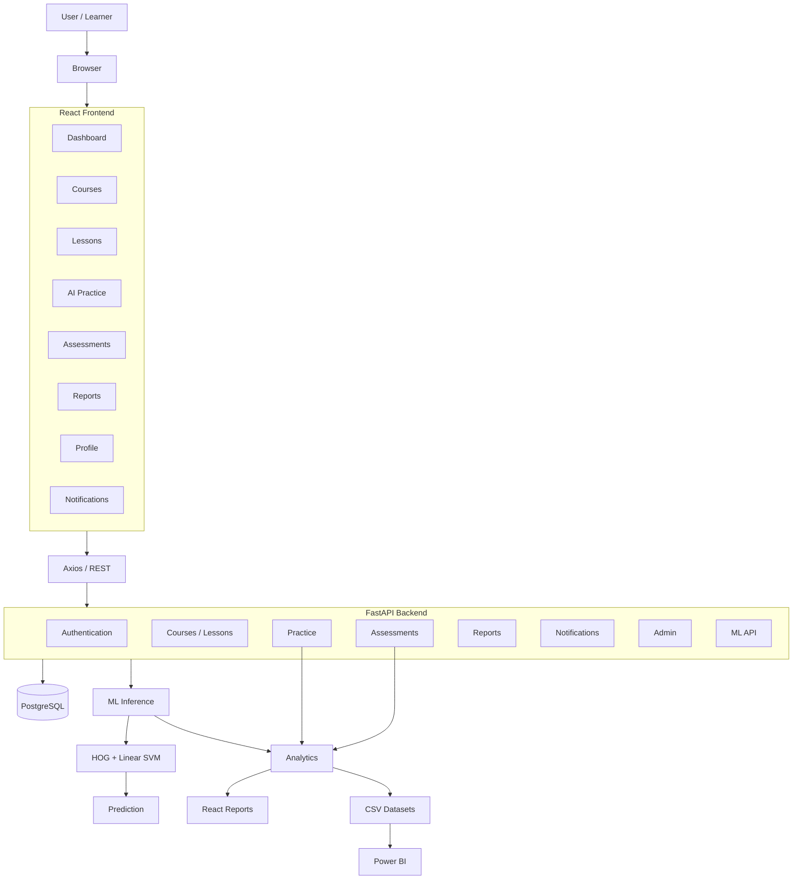
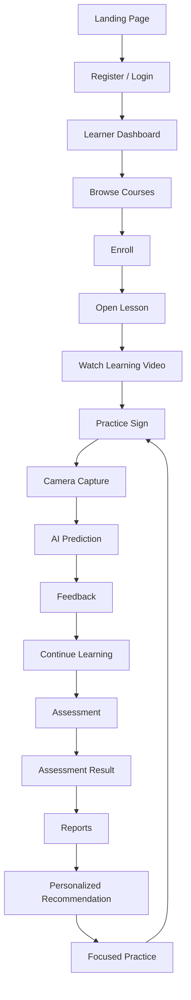
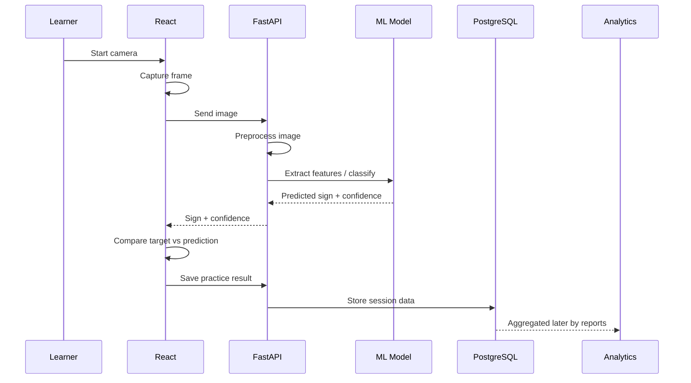
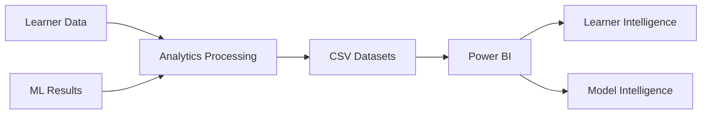
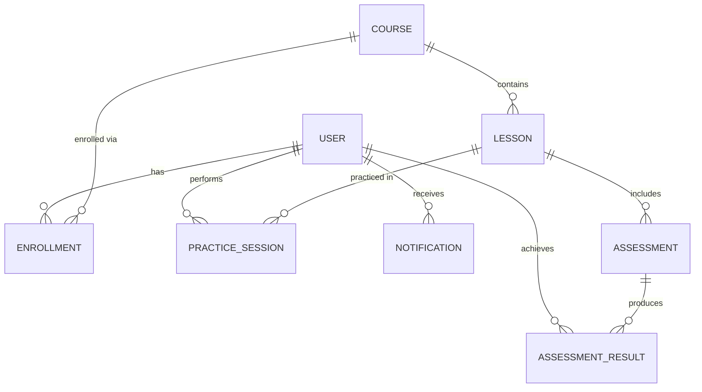
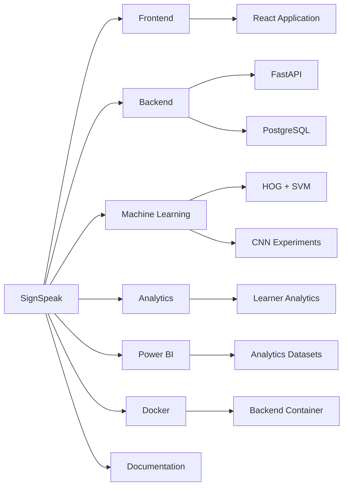

<div align="center">

# 🤟 SignSpeak

## AI-Powered Sign Language Learning & Assessment Platform

**Learn • Practice • Recognize • Analyze • Improve**

> An intelligent full-stack learning platform that combines interactive ASL education, computer-vision-based sign recognition, personalized feedback, assessments, and learner analytics.


</div>

---

## ✨ Project Snapshot

| Area | Implementation |
|---|---|
| Frontend | React + Vite |
| Backend | FastAPI |
| Database | PostgreSQL |
| AI Recognition | HOG + Linear SVM |
| Deep Learning Experiment | CNN + Data Augmentation |
| Analytics | Backend Reports + React Dashboards |
| Business Intelligence | Power BI-ready datasets |
| Infrastructure | Docker |
| Learning Focus | American Sign Language (ASL) |

---

## 🌟 Overview

SignSpeak is a complete AI-assisted learning ecosystem for American Sign Language. Learners can create accounts, explore ASL courses, watch lessons, and practice signs using a camera — submitting captured sign images for ML prediction and receiving confidence-scored feedback in return. Learners complete assessments, track progress, identify priority signs, review strong signs, examine confusion patterns, and receive personalized practice recommendations. Administrators manage platform users and roles through a dedicated admin surface.

Beyond the live application, the project includes ML experimentation and model evaluation, analytics datasets, Power BI-ready data exports, Dockerized backend infrastructure, and a full set of technical documentation across every module.

---

## 🎯 Problem Statement

Sign-language learners typically need repeatable practice, visual learning material, immediate feedback, progress tracking, structured assessment, and personalized guidance. Traditional self-study often lacks machine-assisted feedback on a learner's *attempted* sign — leaving learners uncertain whether their practice is actually correct.

SignSpeak explores how computer vision, machine learning, interactive learning design, and analytics can be combined into a single cohesive platform to close that feedback gap.

**SignSpeak does not claim to replace teachers, certified interpreters, or sign-language experts.** It is a supplementary, AI-assisted practice and learning tool.

---

## 💡 The SignSpeak Solution

```
Learn
  ↓
Watch
  ↓
Practice
  ↓
Capture Sign
  ↓
AI Prediction
  ↓
Feedback
  ↓
Assessment
  ↓
Analytics
  ↓
Personalized Focus
  ↓
Practice Again
```

This feedback loop is the core of the platform: every practice attempt feeds analytics, every analytics insight feeds personalization, and every personalized recommendation drives the learner back into focused practice.

---

## 🚀 Platform Capabilities

| Module | Capability |
|---|---|
| Authentication | Registration, login, role-aware session management |
| Learner Dashboard | Unified view of performance, activity, and recommendations |
| Course Catalogue | Browse available ASL courses |
| Course Enrollment | Enroll in and track course progress |
| Lessons | Structured, sequential learning content |
| Video Learning | Lesson-integrated video material |
| AI Practice | Camera-based sign practice with ML feedback |
| Camera Capture | In-browser frame capture for prediction |
| Sign Prediction | HOG + SVM sign classification |
| Confidence Feedback | Prediction confidence surfaced to the learner |
| Practice Persistence | Practice attempts stored for analytics |
| Assessments | Multiple question types with scoring |
| Assessment Results | Pass/retry outcomes and history |
| Learner Reports | Accuracy, activity, and progress reporting |
| Sign Performance | Per-sign accuracy and attempt tracking |
| Weak / Priority Signs | Signs flagged for additional practice |
| Strong Signs | Signs the learner has mastered |
| Confusion Analysis | Actual vs. predicted sign confusion patterns |
| Personalized Learning Plans | Performance-driven practice recommendations |
| Profile Management | Editable learner profile and preferences |
| Settings | Account and application preferences |
| Notifications | In-app notification inbox |
| Admin Dashboard | Platform statistics and user management |
| ML Experimentation | SVM and CNN model research |
| Power BI Analytics Data | Prepared BI-ready datasets |
| Dockerized Backend | Containerized backend runtime |

---

## 🏗️ System Architecture



### 🧱 Platform Layers

```
┌──────────────────────────────────────────────────────────────┐
│                     EXPERIENCE LAYER                         │
│ React • Dashboard • Courses • Practice • Reports             │
├──────────────────────────────────────────────────────────────┤
│                     SERVICE LAYER                             │
│ Axios • Authentication • Courses • Reports • ML               │
├──────────────────────────────────────────────────────────────┤
│                     API LAYER                                 │
│ FastAPI • REST • Validation • Authorization                   │
├──────────────────────────────────────────────────────────────┤
│                     DATA LAYER                                 │
│ PostgreSQL • SQLAlchemy • Alembic                              │
├──────────────────────────────────────────────────────────────┤
│                      AI LAYER                                  │
│ OpenCV • HOG • Linear SVM • CNN Experiments                    │
├──────────────────────────────────────────────────────────────┤
│                  ANALYTICS / BI LAYER                          │
│ Reports • Learner Analytics • CSV • Power BI                   │
├──────────────────────────────────────────────────────────────┤
│                INFRASTRUCTURE LAYER                            │
│ Docker                                                          │
└──────────────────────────────────────────────────────────────┘
```

---

## 🧭 Learner Journey



---

## 🤖 AI-Powered Practice

```
Target Sign
  ↓
Learner Performs Sign
  ↓
Browser Camera
  ↓
Capture Frame
  ↓
React
  ↓
ML Prediction API
  ↓
Image Preprocessing
  ↓
HOG Feature Extraction
  ↓
Linear SVM
  ↓
Predicted Sign
  ↓
Confidence
  ↓
Compare Target vs Prediction
  ↓
Feedback
  ↓
Save Practice Detection
  ↓
Analytics
```

The current system analyzes **captured image frames**, submitted on demand. It is **not** continuous server-side video recognition.

### AI Practice Sequence



### 🎚️ Prediction Confidence ≠ Correctness

| Field | Value |
|---|---|
| Target | A |
| Prediction | M |
| Confidence | 93% |
| Result | Incorrect |

Confidence describes how strongly the model prefers its predicted class — **not** whether that prediction matches the target sign. This distinction is preserved consistently throughout the platform's UI and analytics.

---

## 🧠 Machine Learning

SignSpeak explores two recognition approaches:

**HOG + Linear SVM** — a classical computer-vision pipeline, currently used for backend inference.

**CNN + Data Augmentation** — a deep-learning experiment, used for comparative research and evaluation.

```
Image
  │
  ├────────────────────┬─────────────────────┐
  ▼                     ▼                     
┌─────────────────┐   ┌─────────────────┐
│ HOG              │   │ CNN              │
│ ↓                │   │ ↓                │
│ Feature Vector   │   │ Learned Features │
│ ↓                │   │ ↓                │
│ Linear SVM       │   │ Classifier       │
└────────┬─────────┘   └─────────┬────────┘
         ▼                       ▼
     Evaluation              Evaluation
```

### 📊 Model Results

| Model | Validation Accuracy | Test Accuracy | Deployment |
|---|---:|---:|---|
| HOG + Linear SVM | 91.14% | 91.09% | Current Backend |
| CNN + Data Augmentation | 91.62% | 90.98% | Experimental |

Both models achieved approximately 91% performance on their **controlled validation/test distribution**. These figures should not be interpreted as real-world accuracy.

```
HOG + Linear SVM
Validation  ██████████████████ 91.14%
Test        ██████████████████ 91.09%

CNN + Augmentation
Validation  ██████████████████ 91.62%
Test        ██████████████████ 90.98%
```
*Controlled evaluation results.*

---

## ⚠️ Real-World Generalization

A tiny custom external image sample was also tested against the model.

| Expected | Predicted | Confidence |
|---|---|---:|
| A | N | 46.04% |
| B | E | 43.37% |
| C | O | 56.65% |
| L | Q | 82.06% |
| V | K | 57.06% |

0 of these 5 custom samples were correctly classified — **0% on this tiny custom sample.**

This does **not** mean "the model has 0% real-world accuracy." The result reveals a serious domain/generalization gap on the tested external samples, and the sample size is far too small to establish universal real-world performance. Accordingly, the current recognition system is presented as a **Prototype / Research Implementation**, not as **Production-Grade Sign Recognition**.

### 🔀 Model Confusion Analysis

| Actual | Predicted | Count |
|---|---|---:|
| W | V | 39 |
| V | U | 24 |
| N | M | 22 |
| V | W | 19 |
| U | V | 17 |
| U | R | 15 |
| Y | X | 14 |
| X | V | 13 |
| B | E | 11 |

These are **ML evaluation confusion patterns** derived from model testing — distinct from any individual learner's personal practice-confusion history.

---

## 🎯 Personalized Learning

```
Practice History
  ↓
Sign Performance
  ↓
Accuracy Analysis
  ↓
Priority Signs + Strong Signs
  ↓
Learning Plan
  ↓
Recommended Focus
  ↓
Next Accuracy Target
```

Personalization is derived entirely from learner-performance analytics — it is **not** a generative AI model.

SignSpeak uses progressive learning targets, conceptually:

- Very low current accuracy → establish a realistic **minimum target**
- Improving accuracy → challenge the learner with **incremental improvement**
- High accuracy → cap the target at a realistic **upper threshold**

| Bound | Value |
|---|---|
| Maximum target | 95% |
| Minimum beginner target | 70% |

Deeper implementation detail lives in [`backend/README.md`](backend/README.md) and [`analytics/README.md`](analytics/README.md).

---

## 📊 Learner Analytics

Learner analytics covers practice sessions, total attempts, successful attempts, accuracy, confidence, sign-level performance, weak signs, strong signs, confusion pairs, assessment performance, and learning progress.

```
Practice Data
  ↓
Analytics Engine
  ↓
Reports API
  ↓
React Reports
  ↓
Learner Insight
```

### ✋ Sign Intelligence

**Priority / Weak Sign:** `attempts >= 1` AND `accuracy < 70%`

**Strong Sign:** `attempts >= 1` AND `accuracy >= 80%`

| Zone | Accuracy | Meaning |
|---|---:|---|
| Priority | < 70% | Needs focused practice |
| Developing | 70–79% | Improving |
| Strong | ≥ 80% | Performing well |

---

## 🖥️ Learner Dashboard

The learner dashboard combines profile information, performance metrics, weekly activity, a daily goal, priority signs, strong signs, personalized focus, enrolled courses, recent activity, and next actions.

> **Conceptual UI wireframe.**

```
┌──────────────────────────────────────────────────────────────┐
│ SignSpeak                                       Notifications │
├──────────────┬───────────────────────────────────────────────┤
│ Dashboard    │ Welcome Back                                   │
│ Courses      │                                                 │
│ Practice     │ Accuracy | Sessions | Lessons | Assessment      │
│ Assessments  │                                                 │
│ Reports      │ Weekly Activity          Daily Goal              │
│              │                                                 │
│              │ Priority Signs           Strong Signs            │
│              │                                                 │
│              │ AI Recommended Focus                             │
│              │                                                 │
│              │ Courses                  Recent Activity          │
└──────────────┴───────────────────────────────────────────────┘
```

---

## 📚 Learning Experience

SignSpeak's learning experience is built around a course catalogue, course enrollment, sequential lesson progression, video learning, AI practice, and lesson completion tracking. Learning content currently spans areas such as ASL introduction, alphabet learning, numbers, greetings, courtesy signs, family and people, daily signs, questions, daily routines, phrases, and conversation practice.

Full lesson-by-lesson detail is documented in [`frontend/README.md`](frontend/README.md).

### 🎥 Video Learning

```
Course
  ↓
Lesson
  ↓
Video Content
  ↓
Learning Material
  ↓
AI Practice
  ↓
Completion
```

Lesson pages present learning video content alongside lesson explanations and practice actions. Advanced video tracking or timestamp synchronization is not currently implemented.

---

## 📝 Assessment Engine

Assessments support question types such as multiple choice, true/false, and gesture-recognition-style questions.

```
Assessment
  ↓
Questions
  ↓
Learner Answers
  ↓
Backend Submission
  ↓
Scoring
  ↓
Pass / Retry
  ↓
Saved Result
  ↓
Reports
```

Gesture-recognition-style assessment questions are not currently a fully camera-driven ML assessment workflow.

---

## 📈 Performance Reports

The React reports interface presents overall accuracy, practice sessions, average confidence, assessment average, weekly activity, sign accuracy, priority signs, strong signs, confusion pairs, sign-level details, and assessment summary — visualized with **Recharts**.

> **Conceptual UI wireframe.**

```
┌──────────────────────────────────────────────────────────────┐
│                   PERFORMANCE REPORT                          │
├────────────┬────────────┬────────────┬──────────────────────┤
│ Accuracy   │ Sessions   │ Confidence │ Assessment Average     │
├────────────┴────────────┴────────────┴──────────────────────┤
│ Weekly Activity                │ Sign Performance              │
│     Line Chart                 │      Bar Chart                │
├────────────────────────────────┼──────────────────────────────┤
│ Priority Signs                  │ Strong Signs                  │
├────────────────────────────────┼──────────────────────────────┤
│ Confusions                      │ Assessment Summary            │
└────────────────────────────────┴──────────────────────────────┘
```

---

## 📊 Business Intelligence

SignSpeak prepares analytics datasets for extended BI analysis:

```
powerbi/data/
├── cnn_training_history.csv
├── external_predictions.csv
├── learner_performance.csv
├── model_performance.csv
├── sign_confusions.csv
└── sign_performance.csv
```

These datasets support learner analytics, sign analytics, model comparison, training analysis, confusion analysis, and external testing exploration.

**Power BI-ready datasets are prepared.** A deployed Power BI dashboard is **not** currently running — see [`powerbi/README.md`](powerbi/README.md) for the full BI documentation, recommended dashboard designs, and KPI framework.



| React Analytics | Power BI |
|---|---|
| Learner-facing | Analytical / project-focused |
| Live application interface | Separate BI layer |
| REST API data | Prepared analytics datasets |
| Personalized actions | Deeper visual exploration |
| Operational | Analytical |

---

## 🔐 Authentication & Authorization

SignSpeak includes registration, login, authenticated user state, protected application areas, password management, and role-aware access. Roles include **student**, **instructor**, **accessibility trainer**, and **admin**. Backend authorization is authoritative for every protected action — the frontend reflects, but never enforces, access control.

## 👤 Account Experience

Profile, edit profile, settings, password management, and notifications. Profile information can include name, avatar, location, bio, preferred language, learning level, learning goals, XP, and streak.

### 🔔 Notifications

Notification inbox with read/unread state, search/filtering, mark as read, mark all as read, and delete. Categories can include info, success, warning, achievement, and course.

---

## 🧑‍💼 Administration

Protected administration functionality includes platform statistics, user listing, user search, staff creation, role management, and account activation/deactivation.

```
Admin
  ↓
Protected Admin API
  ↓
User Management
  ↓
PostgreSQL
```

---

## ⚡ Backend

Built on **FastAPI**, **SQLAlchemy**, **Pydantic**, **PostgreSQL**, and **Alembic**. Backend responsibilities span authentication, authorization, users, courses, lessons, practice, assessments, reports, notifications, administration, ML inference, and personalized learning.

Full backend documentation: [`backend/README.md`](backend/README.md)

## 🗄️ Database

PostgreSQL persists all application data. Conceptual entities include Users, Courses, Lessons, Enrollments, Practice Sessions, Assessments, Assessment Results, and Notifications.



*High-level entity relationships only — exact schema detail lives in the backend documentation.*

```
React
  ↓
FastAPI
  ↓
SQLAlchemy
  ↓
PostgreSQL
  ↓
Stored Learning Data
  ↓
Reports / Analytics
```

---

## 🔌 API Architecture

| API Area | Responsibility |
|---|---|
| Authentication | Account access |
| Users | Profile/account |
| Courses | Learning catalogue |
| Lessons | Learning content |
| Practice | Practice session tracking |
| Assessments | Assessment workflow |
| Reports | Learner analytics |
| Notifications | User notifications |
| Admin | Administration |
| ML | Sign prediction |
| Learning Plan | Personalized recommendations |

**Known key endpoints:**

```
GET  /api/health
POST /api/v1/ml/predict
POST /api/v1/ml/learning-plan
GET  /api/reports/sign-performance
```

Full endpoint documentation lives in [`backend/README.md`](backend/README.md).

---

## 📁 Repository Structure

```
SignSpeak-Work/
│
├── README.md
│
├── frontend/
│   ├── public/
│   ├── src/
│   └── README.md
│
├── backend/
│   ├── alembic/
│   ├── app/
│   ├── models/
│   ├── scripts/
│   ├── tests/
│   └── README.md
│
├── ml/
│   ├── data/
│   ├── models/
│   ├── notebooks/
│   ├── reports/
│   ├── results/
│   ├── src/
│   └── README.md
│
├── analytics/
│   └── README.md
│
├── powerbi/
│   ├── data/
│   └── README.md
│
├── docker/
│   └── README.md
│
└── docs/
    ├── backend/
    └── README.md
```

### 🗺️ Repository Map



---

## 🛠️ Technology Stack

### Frontend

| Technology |
|---|
| React |
| Vite |
| JavaScript / JSX |
| Tailwind CSS |
| React Router |
| Axios |
| Recharts |
| Lucide React |
| Framer Motion |

### Backend

| Technology |
|---|
| Python |
| FastAPI |
| SQLAlchemy |
| Pydantic |
| Alembic |
| PostgreSQL |

### Machine Learning

| Technology |
|---|
| Python |
| OpenCV |
| scikit-image |
| scikit-learn |
| HOG |
| Linear SVM |
| CNN / TensorFlow-Keras experimentation |

### Analytics

| Technology |
|---|
| Python |
| Pandas |
| Backend Reports |
| CSV Analytics |

### Infrastructure

| Technology |
|---|
| Docker |
| Git |
| GitHub |

### 💡 Technology Decisions

| Choice | Rationale |
|---|---|
| React | Component-based interactive UI |
| Vite | Fast frontend development/build tooling |
| FastAPI | Python-native, high-performance API framework suitable for ML integration |
| PostgreSQL | Structured relational application data |
| SQLAlchemy | ORM / database abstraction |
| HOG + SVM | Compact, efficient image-classification pipeline |
| CNN | Deep-learning experimentation and comparison |
| Recharts | Learner-facing visualization |
| Power BI | Extended analytical visualization |
| Docker | Reproducible backend runtime |

---

## 🚀 Getting Started

**Prerequisites:**

- Git
- Node.js / npm
- Python
- PostgreSQL
- Docker *(optional, for containerized backend)*

### Clone the Repository

```bash
git clone <repository-url>
cd SignSpeak-Work
```

### Backend Setup

```bash
cd backend
python -m venv venv
source venv/bin/activate   # Windows: venv\Scripts\activate
pip install -r requirements.txt

# configure environment variables (see backend/README.md)
cp .env.example .env

# apply database migrations
alembic upgrade head

# run the API
uvicorn app.main:app --reload
```

Full backend setup, environment variables, and script documentation: [`backend/README.md`](backend/README.md)

### Frontend Setup

```bash
cd frontend
npm install
npm run dev
```

Full frontend setup and component documentation: [`frontend/README.md`](frontend/README.md)

### Running with Docker

```bash
cd docker
docker compose up --build
```

Full container architecture and service breakdown: [`docker/README.md`](docker/README.md)

### Machine Learning Environment

```bash
cd ml
python -m venv ml_venv
source ml_venv/bin/activate
pip install -r requirements.txt
```

Full ML experimentation, training scripts, and evaluation notebooks: [`ml/README.md`](ml/README.md)

---

## 📌 Project Status

| Area | Status |
|---|---|
| Frontend Application | ✅ Implemented |
| Backend API | ✅ Implemented |
| Authentication & Roles | ✅ Implemented |
| Course / Lesson Content | ✅ Implemented |
| AI Practice (Camera → Prediction) | ✅ Implemented |
| Assessment Engine | ✅ Implemented |
| Learner Reports | ✅ Implemented |
| Personalized Learning Plan | ✅ Implemented |
| Admin Dashboard | ✅ Implemented |
| HOG + Linear SVM Model | ✅ Trained & Evaluated |
| CNN Experimental Model | ✅ Trained & Evaluated |
| External Generalization Testing | ✅ Documented (small sample) |
| Power BI Datasets | ✅ Prepared |
| Power BI Dashboard | ⚠️ Not Deployed (conceptual designs only) |
| Docker Backend | ✅ Available |
| Automated Analytics Refresh | 🔜 Future |
| CI / Automated Testing Pipeline | 🔜 Future |

---

## ⚠️ Known Limitations

- Sign recognition operates on **captured frames**, not continuous real-time video.
- Controlled model accuracy (~91%) does **not** reflect real-world performance; external testing on a small custom sample revealed a significant generalization gap.
- Gesture-recognition-style assessment questions are not yet a fully camera-driven ML workflow.
- No Power BI dashboard is currently deployed — only analytics-ready datasets and documented dashboard designs.
- No automated data refresh pipeline exists yet; BI datasets are exported, not live-connected.
- SignSpeak is a learning aid, not a replacement for certified ASL instruction or interpretation.

---

## 🗺️ Roadmap

- Expand the ASL sign vocabulary and lesson catalogue
- Improve model generalization with a larger, more diverse training/external dataset
- Investigate real-time video-based recognition
- Automate the BI data-export pipeline with scheduled refresh
- Publish an interactive Power BI report
- Add instructor-facing analytics and cohort insights
- Introduce confidence calibration analysis
- Expand automated testing and CI coverage
- Explore additional sign-language focuses beyond ASL

---

## 📚 Documentation Hub

| Document | Covers |
|---|---|
| [`frontend/README.md`](frontend/README.md) | React application, components, UI architecture |
| [`backend/README.md`](backend/README.md) | FastAPI backend, API routes, database, auth |
| [`ml/README.md`](ml/README.md) | Model training, evaluation, experiments |
| [`analytics/README.md`](analytics/README.md) | Learner analytics architecture |
| [`powerbi/README.md`](powerbi/README.md) | Business Intelligence datasets & dashboard design |
| [`docker/README.md`](docker/README.md) | Container architecture & deployment |
| [`docs/README.md`](docs/README.md) | Technical documentation hub |

---

<div align="center">

### 🤟 SignSpeak

*"Learn. Practice. Sign. Improve — with AI-powered feedback."*

**AI-Powered Sign Language Learning & Assessment Platform**

</div>