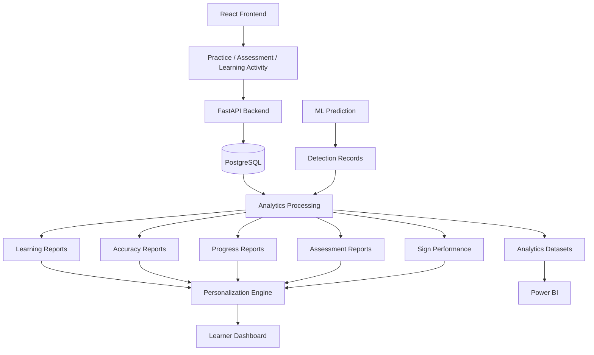
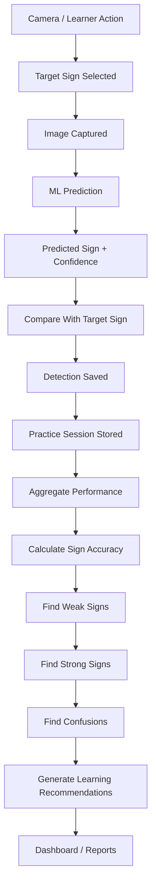
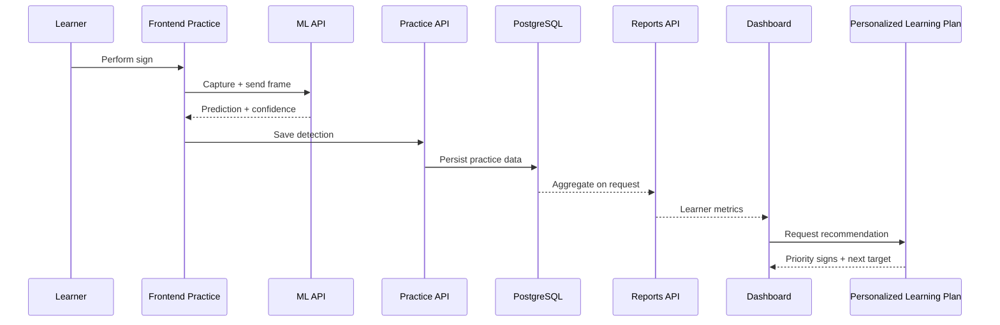
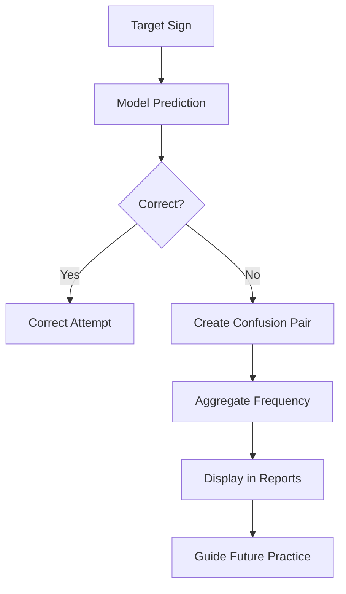
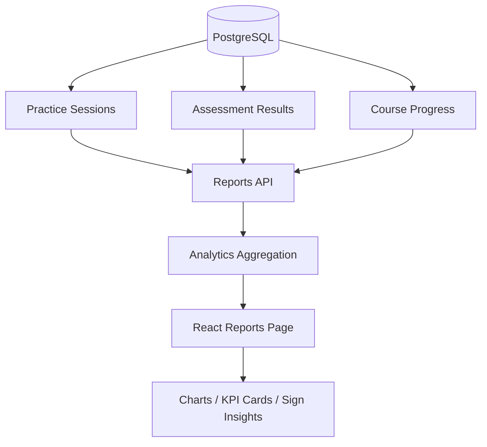
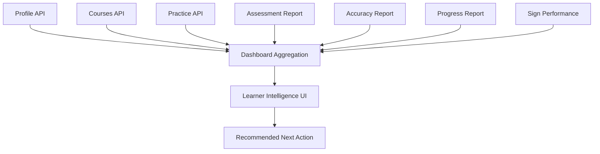
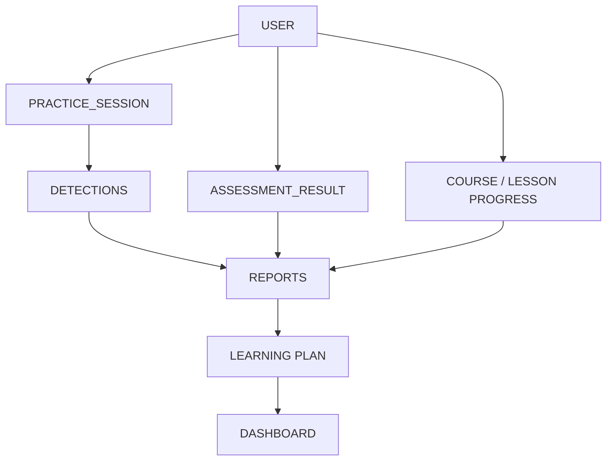

<div align="center">

# 📊 SignSpeak Analytics

### *Turning learner activity and AI predictions into actionable learning intelligence.*

**Performance • Insights • Personalization • Reporting • Model Analytics**


</div>

---

## 📊 Analytics Overview

SignSpeak analytics connects learning activity with measurable learner insights.

```
Learner
  ↓
Courses & Lessons
  ↓
Practice Sessions
  ↓
AI Predictions
  ↓
Assessments
  ↓
Stored Performance Data
  ↓
Analytics Aggregation
  ↓
Weak / Strong Signs
  ↓
Confusion Analysis
  ↓
Personalized Learning Plan
  ↓
Dashboard & Reports
```

Analytics in SignSpeak is not used only for visualization — it directly guides what a learner should practice next, closing the loop between raw activity and personalized instruction.

---

## 🏗️ Analytics Architecture



---

## 🔄 End-to-End Analytics Flow



Each stage builds on the last: a raw prediction becomes a stored detection, detections aggregate into sign-level accuracy, accuracy classifies signs into weak/strong buckets, and confusion patterns and recommendations are derived from that same underlying data.

---

## 🧠 Learner Analytics Pipeline



One learner action — a single practice attempt — flows all the way through storage, aggregation, and reporting before finally reappearing as a personalized recommendation on the dashboard.

---

## 🗂️ Analytics Data Sources

| Data Source | Purpose | Important Data | Analytics Produced |
|---|---|---|---|
| **Practice Sessions** | Track practice activity | Attempts, successful attempts, average confidence, target gesture, duration, detections | Practice activity, accuracy, confidence, sign performance |
| **Detection Records** | Capture individual prediction attempts | Target gesture, predicted gesture, confidence, correct, feedback, recommendation | Sign-level performance, weak signs, strong signs, confusions |
| **Assessment Results** | Track assessment outcomes | Score, total points, earned points, passed | Assessment average, pass/fail performance, assessment history |
| **Course / Lesson Progress** | Track learning progression | Enrollment and lesson completion state | Learning progress, completion activity |
| **ML Predictions** | Track model behavior | Prediction confidence, expected vs. predicted sign | Prediction confidence, model behavior, external prediction analysis |

---

## 🤟 Practice Session Analytics

Every practice session can track: target gesture, number of attempts, successful attempts, average confidence, duration, detection history, start time, and end time.

```
Practice Session
│
├── Target Sign
├── Attempts
├── Successful Attempts
├── Average Confidence
├── Duration
└── Detections
      │
      ├── Target
      ├── Prediction
      ├── Confidence
      ├── Correct?
      ├── Feedback
      └── Recommendation
```

---

## 🔍 Detection-Level Analytics

SignSpeak analyzes **individual prediction attempts**, not only session summaries. Detection records may include `target_gesture`, `predicted_gesture`, `confidence`, `correct`, `learning_status`, `feedback`, `recommendation`, and `timestamp`.

<details>
<summary><strong>Example detection record (illustrative)</strong></summary>

```json
{
  "target_gesture": "A",
  "predicted_gesture": "M",
  "confidence": 93.33,
  "correct": false,
  "learning_status": "good",
  "feedback": "Strong prediction confidence.",
  "recommendation": "Practice sign M together with N to improve distinction."
}
```

*Example values shown are illustrative.*

</details>

---

## 📈 Core Learner KPIs

| KPI | Meaning | Used For |
|---|---|---|
| Total Practice Sessions | Count of practice sessions started | Activity tracking |
| Total Detection Attempts | Count of individual sign attempts | Volume of practice |
| Successful Attempts | Attempts where prediction matched target | Correctness tracking |
| Overall Accuracy | Correct attempts ÷ total attempts | Headline performance metric |
| Average Confidence | Mean model confidence across attempts | Confidence trend analysis |
| Lessons Completed | Count of completed lessons | Learning progression |
| Practice Sessions | Sessions per period | Engagement tracking |
| Assessment Average | Mean assessment score | Assessment performance |
| Assessments Passed | Count of passed assessments | Mastery tracking |
| Course Progress | Completion percentage | Progression tracking |
| Weak Signs | Signs below the priority threshold | Personalization input |
| Strong Signs | Signs at or above the strong threshold | Mastery recognition |
| Confusion Pairs | Actual/predicted mismatch pairs | Error-pattern analysis |

---

## KPI Dashboard Visual

> *Wireframe values are illustrative.*

```
┌──────────────────────────────────────────────────────────────┐
│                   LEARNER PERFORMANCE                        │
├──────────────┬──────────────┬──────────────┬────────────────┤
│ Accuracy     │ Sessions     │ Confidence   │ Assessment Avg  │
│    82%       │     24       │    88%       │      76%        │
├──────────────┴──────────────┴──────────────┴────────────────┤
│ Weekly Activity                          │ Daily Goal         │
│ ███ █████ ██ ████ █████                  │ 4 / 5              │
├──────────────────────────────────────────┼────────────────────┤
│ Priority Signs                           │ Strong Signs        │
│ A • M • V                                │ B • C • L            │
├──────────────────────────────────────────┴────────────────────┤
│ Personalized Learning Recommendation                          │
└──────────────────────────────────────────────────────────────┘
```

---

## ✋ Sign Performance Analytics

**`GET /api/reports/sign-performance`**

This endpoint aggregates detection-level practice history into sign-level metrics.

**Response fields:** `total_sessions`, `total_detection_attempts`, `total_correct`, `overall_accuracy_percent`, `signs`, `weak_signs`, `strong_signs`, `confusions`

<details>
<summary><strong>Example response (illustrative)</strong></summary>

```json
{
  "total_sessions": 12,
  "total_detection_attempts": 48,
  "total_correct": 36,
  "overall_accuracy_percent": 75.0,
  "weak_signs": ["A", "V"],
  "strong_signs": ["B", "C"],
  "confusions": [
    {
      "target": "A",
      "predicted": "M"
    }
  ]
}
```

*Values are illustrative.*

</details>

---

## 🎯 Sign-Level Performance

Each sign can be analyzed using attempts, correct attempts, accuracy, and average confidence.

**Illustrative example:**

| Sign | Attempts | Correct | Accuracy | Avg. Confidence |
|---|---:|---:|---:|---:|
| A | 8 | 5 | 62.5% | 84% |
| B | 10 | 9 | 90% | 91% |
| V | 6 | 4 | 66.7% | 79% |

---

## ⚠️ Weak Sign Detection

**Rule:** `attempts >= 1` **AND** `accuracy < 70%`

Signs below this threshold become priority signs for additional practice.

```
Sign Accuracy
  ↓
Is Accuracy < 70%?
├── No  → Continue Tracking
└── Yes
     ↓
  Weak Sign
     ↓
Priority Practice
     ↓
Personalized Recommendation
```

---

## ✅ Strong Sign Detection

**Rule:** `attempts >= 1` **AND** `accuracy >= 80%`

Strong signs indicate areas where the learner is consistently performing well.

```
Accuracy >= 80%
  ↓
Strong Sign
  ↓
Mastery Insight
  ↓
Shift Practice Toward Weak Signs
```

---

## Performance Zones

| Zone | Accuracy | Interpretation |
|---|---:|---|
| Priority | < 70% | Needs additional practice |
| Developing | 70–79% | Improving |
| Strong | ≥ 80% | Performing well |

Weak/strong thresholds above come directly from the SignSpeak reporting logic.

---

## 🔀 Sign Confusion Analysis

When `Target Sign != Predicted Sign`, a **confusion pair** is created.

```
A → M
W → V
V → U
```

Confusion pairs help identify visually similar signs that the learner or model frequently mixes up.



---

## 🧩 Example Model Confusions

Observed **model evaluation** confusion counts:

| Actual Sign | Predicted Sign | Observed Count |
|---|---|---:|
| W | V | 39 |
| V | U | 24 |
| N | M | 22 |
| V | W | 19 |
| U | V | 17 |
| U | R | 15 |
| Y | X | 14 |
| X | V | 13 |
| B | E | 11 |

These are model-evaluation observations and are **different** from any individual learner's personal confusion history recorded during practice.

---

## 🧠 Personalized Learning Analytics

```
Practice History
  ↓
Current Accuracy
  ↓
Weak Signs
  ↓
Confusion History
  ↓
Priority Signs
  ↓
Next Accuracy Target
  ↓
Practice Recommendation
```

**`POST /api/v1/ml/learning-plan`**

The sign classifier is machine-learning based. The **personalized learning-plan logic is performance-based / rule-based recommendation logic** — it is not a generative AI model.

---

## 🎯 Progressive Accuracy Targets

```
target_accuracy =
min(
    max(current_accuracy + 10, 70),
    95
)
```

- Minimum beginner target: **70%**
- Progressive improvement: **current accuracy + 10%**
- Maximum target: **95%**

| Current Accuracy | Next Target |
|---:|---:|
| 0% | 70% |
| 30% | 70% |
| 60% | 70% |
| 65% | 75% |
| 72% | 82% |
| 80% | 90% |
| 90% | 95% |

---

## 📑 Reporting Engine

```
GET /api/reports/learning
GET /api/reports/assessment
GET /api/reports/accuracy
GET /api/reports/progress
GET /api/reports/sign-performance
```

| Report | Purpose |
|---|---|
| Learning | Overall learner activity |
| Assessment | Assessment scores and outcomes |
| Accuracy | Practice / prediction accuracy |
| Progress | Learning progression |
| Sign Performance | Weak signs, strong signs, sign accuracy, and confusions |

### Reporting Architecture



---

## 🖥️ Learner Dashboard Intelligence

The learner dashboard consumes analytics from: profile, courses, practice sessions, assessment reports, accuracy reports, progress reports, sign-performance reports, and the personalized learning plan.

**Dashboard areas:** performance metrics, weekly activity, daily goal, personalized recommendation, priority signs, strong signs, enrolled courses, recent activity, next actions.

### Dashboard Data Flow



---

## Recent Activity Analytics

Meaningful practice activity should focus on sessions containing **actual attempts**. Zero-attempt sessions should not be interpreted as successful practice — including them would inflate activity counts without reflecting genuine engagement, degrading the quality and trustworthiness of the reported metrics.

---

## 📝 Assessment Analytics

Assessments generate score, total points, earned points, passed/retry status, and assessment history.

```
Assessment
  ↓
Learner Answers
  ↓
Score
  ↓
Persist Result
  ↓
Assessment Report
  ↓
Dashboard / Reports
```

**Example KPI cards:** Assessment Average · Assessments Attempted · Assessments Passed · Latest Score

---

## 📚 Learning Progress Analytics

Analytics derived from courses, lessons, enrollments, and lesson completion. Current outputs used in the app include lessons completed, course progress, enrolled courses, and learning activity.

Course position-based sidebar styling is a **UI navigation aid**, not actual completion analytics — the two should not be conflated.

---

## 🤖 ML Performance Analytics

| Model | Validation Accuracy | Test Accuracy |
|---|---:|---:|
| HOG + Linear SVM | 91.14% | 91.09% |
| CNN + Data Augmentation | 91.62% | 90.98% |

```
Model                   Validation        Test
------------------------------------------------
HOG + Linear SVM         91.14%          91.09%
CNN + Augmentation       91.62%          90.98%
```

The compact **HOG + Linear SVM** model is used for backend inference.

---

## ⚠️ External Generalization Analysis

Both models performed poorly on a very small custom external image set.

**External test accuracy: 0% on the tiny custom sample set.**

This does **not** mean the model has 0% general accuracy. It means the tested custom samples were not correctly classified, exposing a domain/generalization gap.

**Examples:**

```
A → N
B → E
C → O
L → Q
V → K
```

Possible contributing factors — presented as **possible causes, not proven causes**: lighting, background, camera framing, signer variation, image scale, training-dataset characteristics.

---

## 📉 CNN Training Analytics

CNN training-history data is prepared for analysis, covering training accuracy, validation accuracy, training loss, validation loss, and epoch. These can be visualized as learning curves to study convergence behavior over time.

---

## 📊 Power BI Analytics Layer

SignSpeak prepares analytics-ready CSV datasets for Power BI:

```
cnn_training_history.csv
external_predictions.csv
learner_performance.csv
model_performance.csv
sign_confusions.csv
sign_performance.csv
```

| Dataset | Purpose | Recommended Visualization |
|---|---|---|
| `cnn_training_history.csv` | CNN learning curves | Line chart |
| `external_predictions.csv` | Custom image prediction analysis | Table / bar chart |
| `learner_performance.csv` | Learner KPI analysis | KPI cards / trend chart |
| `model_performance.csv` | SVM vs. CNN comparison | Clustered column chart |
| `sign_confusions.csv` | Confusion analysis | Matrix / bar chart |
| `sign_performance.csv` | Sign accuracy | Bar chart / heatmap |

### Power BI Dashboard Wireframe

> *Wireframe values are illustrative.*

```
┌─────────────────────────────────────────────────────────────┐
│                   SIGNSPEAK ANALYTICS                       │
├──────────────┬──────────────┬──────────────┬────────────────┤
│ Learner Acc. │ Model Acc.   │ Weak Signs   │ Sessions       │
│     78%      │    91%       │      4       │     32         │
├──────────────┴──────────────┴──────────────┴────────────────┤
│ Learner Progress                │ Model Comparison            │
│       Line Chart                │      Bar Chart               │
├─────────────────────────────────┼───────────────────────────┤
│ Sign Performance                 │ Confusion Analysis          │
│       Bar Chart                  │      Heatmap                 │
├──────────────────────────────────┴───────────────────────────┤
│ External Predictions / Training History                       │
└─────────────────────────────────────────────────────────────┘
```

Full BI documentation: [`../powerbi/README.md`](../powerbi/README.md)

---

## Data Relationship Diagram



---

## 🔌 Analytics API Reference

| Method | Endpoint | Purpose | Protected |
|---|---|---|---|
| GET | `/api/reports/learning` | Overall learner activity | ✅ |
| GET | `/api/reports/assessment` | Assessment scores and outcomes | ✅ |
| GET | `/api/reports/accuracy` | Practice / prediction accuracy | ✅ |
| GET | `/api/reports/progress` | Learning progression | ✅ |
| GET | `/api/reports/sign-performance` | Weak/strong signs, sign accuracy, confusions | ✅ |
| POST | `/api/v1/ml/learning-plan` | Personalized recommendation | ✅ |
| GET | `/api/practice/sessions` | Practice session history | ✅ |

Practice history (via `/api/practice/sessions` and its associated detections) is a major analytics input feeding nearly every report above.

---

## 🧭 Example Learner Analytics Journey

> *This is an illustrative walkthrough based on the SignSpeak analytics flow.*

```
Learner chooses A
  ↓
Camera frame captured
  ↓
Model predicts M
  ↓
Confidence = 93.33%
  ↓
Prediction is incorrect
  ↓
Detection stored
  ↓
A receives one failed attempt
  ↓
A becomes a weak / priority sign
  ↓
A → M becomes a confusion
  ↓
Reports show the confusion
  ↓
Dashboard recommends practicing A
```

---

## 🧹 Data Quality Considerations

| Issue | Effect on Analytics |
|---|---|
| Zero-attempt practice sessions | Can inflate activity counts without real engagement |
| Small learner sample sizes | Accuracy metrics can be statistically unstable |
| Limited practice history | Weak/strong classification may be premature |
| Missing detections | Reports may undercount actual practice |
| Incorrect model predictions | Directly affects accuracy and confusion metrics |
| High-confidence incorrect predictions | Can mislead learners if confidence is misread as correctness |
| Assessment sample size | Small numbers of assessments make averages less reliable |
| External model-domain mismatch | Limits how far controlled accuracy can be generalized |

---

## 🎚️ Confidence Is Not Accuracy

**Confidence:** How strongly the classifier prefers its prediction.

**Accuracy:** Whether the prediction matches the expected sign.

```
Target:      A
Prediction:  M
Confidence:  93.33%
```

This is **High Confidence** BUT **Incorrect Prediction**.

Analytics must track both separately — collapsing them into a single number would hide exactly the cases (high-confidence errors) that matter most for both learner feedback and model evaluation.

---

## 🔐 Analytics Privacy & Access

Learner analytics is tied to **authenticated user data**. This includes authenticated report requests, user-specific practice history, user-specific notification/history access, and resource-ownership validation on every analytics endpoint.

This documentation does **not** claim GDPR certification, HIPAA compliance, anonymous analytics, encryption at rest, or enterprise compliance.

---

## 🧪 Analytics Validation

**Practice verification chain:**

```
Camera → Prediction → Practice Detection → PostgreSQL → Sign Performance API → Reports Page → Dashboard Recommendation
```

**Assessment verification chain:**

```
Assessment → Assessment Result → Assessment Report → Dashboard / Reports
```

Analytics can be validated end-to-end across either pipeline by tracing a single event from its origin through to its effect on the dashboard.

---

## Analytics Test Scenarios

| Scenario | Expected Analytics Result |
|---|---|
| Correct sign prediction | Successful attempt increases |
| Incorrect sign prediction | Confusion pair created |
| Accuracy below 70% | Sign classified as weak |
| Accuracy ≥ 80% | Sign classified as strong |
| Assessment submission | Assessment report updated |
| New practice session | Activity/reporting updated |

---

## 📁 Analytics Workspace

```
analytics/
└── README.md
```

This directory documents the analytics architecture and can hold future analytics exports, analysis assets, or derived artifacts.

**Related project modules** (not subfolders of `analytics/`):

```
backend/app/routers/reports.py
backend/app/services/
frontend/src/pages/reports/
frontend/src/pages/dashboard/
ml/reports/
ml/results/
powerbi/data/
```

---

## Analytics Architecture Summary

```
┌─────────────────────────────────────────────────────────┐
│                  SIGNSPEAK ANALYTICS                     │
├─────────────────────────────────────────────────────────┤
│ INPUTS                                                   │
│ Practice • Assessments • Progress • ML Predictions        │
├─────────────────────────────────────────────────────────┤
│ PROCESSING                                                │
│ Accuracy • Confidence • Weak Signs • Strong Signs          │
│ Confusions • Progress • Assessment Analysis                │
├─────────────────────────────────────────────────────────┤
│ PERSONALIZATION                                            │
│ Priority Signs • Next Target • Recommendations              │
├─────────────────────────────────────────────────────────┤
│ OUTPUTS                                                    │
│ Dashboard • Reports • Power BI • Learning Plan               │
└─────────────────────────────────────────────────────────┘
```

---

## 📌 Analytics Status

| Capability | Status |
|---|---|
| Practice Session Tracking | ✅ |
| Detection-Level Analytics | ✅ |
| Overall Accuracy | ✅ |
| Confidence Tracking | ✅ |
| Sign Performance | ✅ |
| Weak Sign Detection | ✅ |
| Strong Sign Detection | ✅ |
| Confusion Analysis | ✅ |
| Assessment Analytics | ✅ |
| Learner Reports | ✅ |
| Personalized Learning Plan | ✅ |
| Dashboard Integration | ✅ |
| Power BI Data Preparation | ✅ |
| Production Model Monitoring | 🔜 Future |
| Large-Scale Cohort Analytics | 🔜 Future |

---

## 🗺️ Future Analytics Roadmap

All items below are **future enhancements**, not current capabilities.

- Real-time learner analytics
- Sign mastery scoring
- Cohort analysis
- Retention analytics
- Practice streak trends
- Difficulty scoring
- Recommendation ranking
- Time-series learner progress
- Advanced Power BI dashboards
- Automated Power BI refresh
- Instructor analytics
- Model drift monitoring
- Prediction calibration dashboards
- Sign-level learning curves
- Learning outcome forecasting

---

## 💡 Analytics Design Principles

Measure actual learner activity • Separate confidence from correctness • Use sign-level data for personalization • Preserve detection history • Avoid hiding model errors • Prefer actionable metrics over vanity metrics • Make recommendations explainable • Clearly separate model analytics from learner analytics

---

## ⚠️ Important ML Honesty

The model achieved approximately **91%** on the controlled validation/test dataset. However, custom external image testing exposed poor real-world generalization.

Therefore:

- Model accuracy and learner analytics should not be interpreted as production-grade recognition performance.
- High prediction confidence does not guarantee correctness.
- Additional real-world data and model improvements are required.

---

## Analytics vs. ML

| Layer | Responsibility |
|---|---|
| Machine Learning | Predicts the sign from an image |
| Practice Engine | Compares prediction to target and stores attempt |
| Analytics Engine | Aggregates learner performance |
| Personalization Engine | Converts analytics into learning recommendations |
| Dashboard | Visualizes the learner state |
| Power BI | Provides extended analytical visualization |

This distinction is maintained consistently throughout the platform: each layer has one job, and no layer silently absorbs another's responsibility.

---

## 📚 Related Documentation

- [`../README.md`](../README.md) — Complete project overview
- [`../backend/README.md`](../backend/README.md) — FastAPI backend
- [`../ml/README.md`](../ml/README.md) — Machine learning experiments
- [`../powerbi/README.md`](../powerbi/README.md) — Power BI analytics
- [`../frontend/README.md`](../frontend/README.md) — React application

---

<div align="center">

### 📊 SignSpeak Analytics

*"From every practice attempt to the next intelligent learning decision."*

**Learner Analytics • ML Insights • Personalization • Power BI**

</div>