<div align="center">

# ⚡ SignSpeak Backend

**The API, data and intelligence layer powering the SignSpeak AI Sign Language Learning Platform.**

**Authentication • Learning • AI Practice • Assessments • Analytics • Personalization**

[](https://www.python.org/)
[](https://fastapi.tiangolo.com/)
[](https://www.postgresql.org/)
[](https://www.sqlalchemy.org/)
[](https://alembic.sqlalchemy.org/)
[](https://www.docker.com/)
[](https://scikit-learn.org/)
[](https://opencv.org/)
[](#-api-summary)


</div>

---

## ⚡ Backend Overview

The **SignSpeak backend** is the central application layer that connects the **React + Vite frontend**, the **PostgreSQL database**, the **machine learning inference pipeline**, and the **learner analytics and personalization logic** into a single cohesive API surface.

It is responsible for:

- 🔑 Authentication & authorization
- 🎓 Learning content delivery (courses, lessons, enrollments)
- 🤟 AI-assisted sign practice sessions
- 📝 Assessment creation, submission and scoring
- 📊 Learner reporting and sign-performance analytics
- 🎯 Personalized, performance-driven learning recommendations
- 🔔 Notifications
- 🧑‍💼 Administrative operations
- 🤖 ML inference for sign prediction

| Component | Responsibility |
|---|---|
| **FastAPI** | HTTP routing, request/response lifecycle, dependency injection |
| **PostgreSQL** | Durable persistence for all application state |
| **SQLAlchemy** | ORM layer mapping Python models to relational tables |
| **Alembic** | Version-controlled schema migrations |
| **ML Service** | HOG + Linear SVM sign classification inference |
| **Reporting Engine** | Aggregates practice/assessment data into learner analytics |
| **Personalization Engine** | Converts performance data into learning-plan recommendations |
| **Docker** | Reproducible containerized deployment of the API |

---

## 🏗️ Backend Architecture

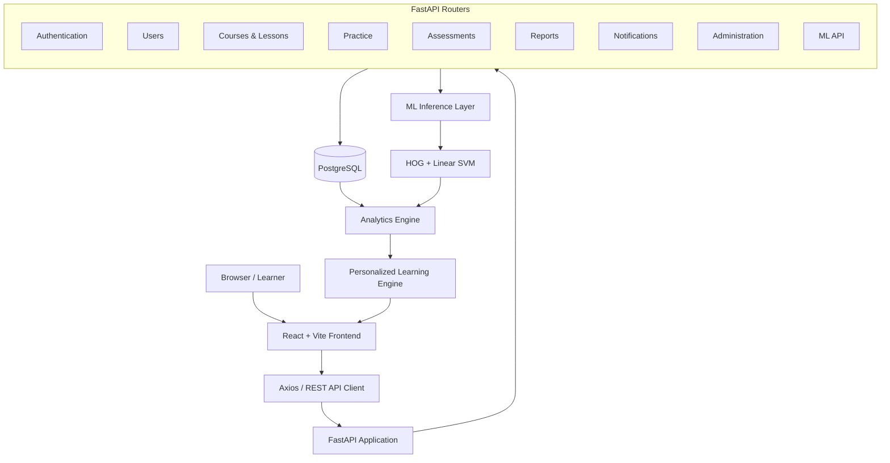

The FastAPI application exposes a modular set of routers, each scoped to a single domain. Every router depends on shared services for authentication, database access, and (where relevant) ML inference — keeping domain logic isolated and testable.

---

## 🔄 Request Lifecycle

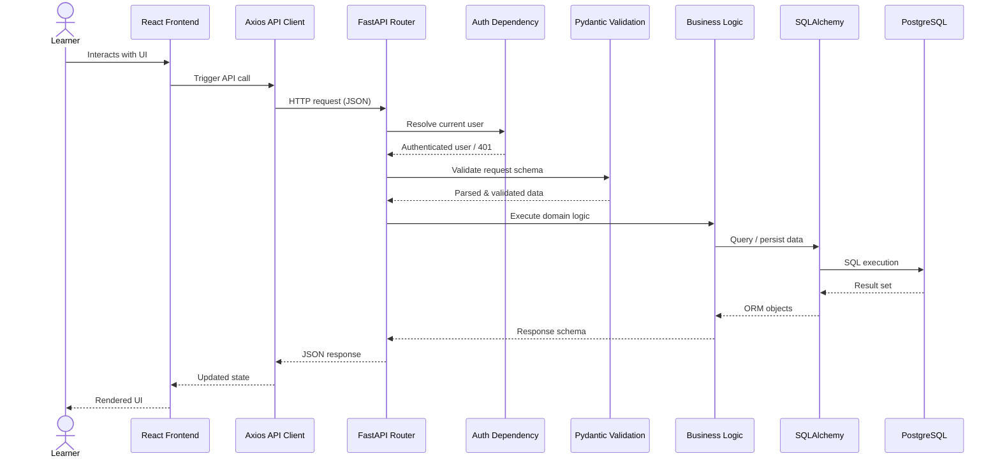

| Stage | Purpose |
|---|---|
| **Axios API Client** | Attaches auth headers and serializes requests from the frontend |
| **FastAPI Router** | Routes the request to the correct domain handler |
| **Auth Dependency** | Resolves and verifies the authenticated user |
| **Pydantic Validation** | Ensures request payloads match expected schemas |
| **Business Logic** | Applies domain rules (courses, practice, assessments, etc.) |
| **SQLAlchemy** | Translates domain objects into SQL operations |
| **PostgreSQL** | Executes queries and returns persisted state |

---

## 📁 Backend Structure

```
backend/
│
├── alembic/
│   └── versions/                 # Database migration revisions
│
├── app/
│   ├── core/                     # Config, security, settings
│   ├── database/                 # Session/engine setup
│   ├── middleware/                # CORS, error handling
│   ├── models/                   # SQLAlchemy ORM models
│   ├── routers/                  # FastAPI route modules
│   ├── schemas/                  # Pydantic request/response schemas
│   ├── services/                 # Business logic & ML orchestration
│   └── main.py                   # FastAPI application entrypoint
│
├── models/
│   ├── hog_linear_svm.joblib     # Trained sign classifier
│   └── label_encoder.joblib      # Class index → sign label mapping
│
├── scripts/                      # Utility & maintenance scripts
├── tests/                        # Backend test suite
├── requirements.txt              # Python dependencies
├── Dockerfile                    # Container build definition
└── README.md
```

| Directory | Responsibility |
|---|---|
| `alembic/` | Tracks and applies incremental database schema changes |
| `app/core/` | Application configuration, environment loading, security helpers |
| `app/database/` | SQLAlchemy engine, session factory, base model declaration |
| `app/middleware/` | CORS configuration and cross-cutting request handling |
| `app/models/` | ORM entity definitions representing database tables |
| `app/routers/` | FastAPI `APIRouter` modules, one per domain |
| `app/schemas/` | Pydantic models for validation and serialization |
| `app/services/` | Reusable business logic, including ML inference orchestration |
| `models/` | Serialized machine learning artifacts loaded at runtime |
| `scripts/` | One-off or maintenance scripts (seeding, exports, etc.) |
| `tests/` | Automated tests covering routers, services and models |

---

## 🧩 Backend Modules

| Module | Responsibility | Primary Output |
|---|---|---|
| **Authentication** | Registration, login, token issuance, session validation | Auth tokens, current user context |
| **Users** | Profile management, credentials, preferences | User profile records |
| **Courses** | Category and course organization | Structured course catalog |
| **Lessons** | Lesson content and completion tracking | Lesson content, progress state |
| **Practice** | AI-assisted sign practice sessions | Detection records, session summaries |
| **Assessments** | Question delivery, submission, scoring | Assessment results |
| **Reports** | Aggregation of learning & practice data | Analytics payloads |
| **Notifications** | User-facing system messages | Notification records |
| **Administration** | Platform and user management for admins | Admin statistics, user actions |
| **Machine Learning** | Sign image classification | Predicted sign + confidence |

---

## 🔌 REST API Architecture

SignSpeak's backend follows a **modular REST API architecture** — each domain (auth, courses, practice, assessments, reports, notifications, admin, ML) is implemented as an isolated FastAPI router with its own schemas and service layer.

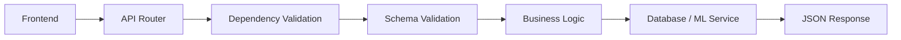

---

## 🔐 Authentication

| Method | Endpoint | Description |
|---|---|---|
| `POST` | `/api/v1/auth/register` | Create a new learner account |
| `POST` | `/api/v1/auth/login` | Authenticate and issue an access token |
| `POST` | `/api/v1/auth/logout` | Invalidate the current session |
| `POST` | `/api/v1/auth/refresh` | Refresh an expiring access token |
| `POST` | `/api/v1/auth/forgot-password` | Initiate a password reset flow |
| `POST` | `/api/v1/auth/reset-password` | Complete a password reset |
| `GET` | `/api/v1/auth/me` | Return the currently authenticated user |

<details>
<summary><strong>Authentication behavior details</strong></summary>

- **Registration** creates a user record with a securely hashed password.
- **Login** verifies credentials and issues an authentication token used for subsequent requests.
- **Protected requests** attach the token as an `Authorization` header, resolved by the auth dependency.
- **Logout** clears the active session/token on the client side.
- **Password recovery** allows a learner to safely reset a forgotten password through a token-based flow.

</details>

---

## 🔑 Authentication Flow

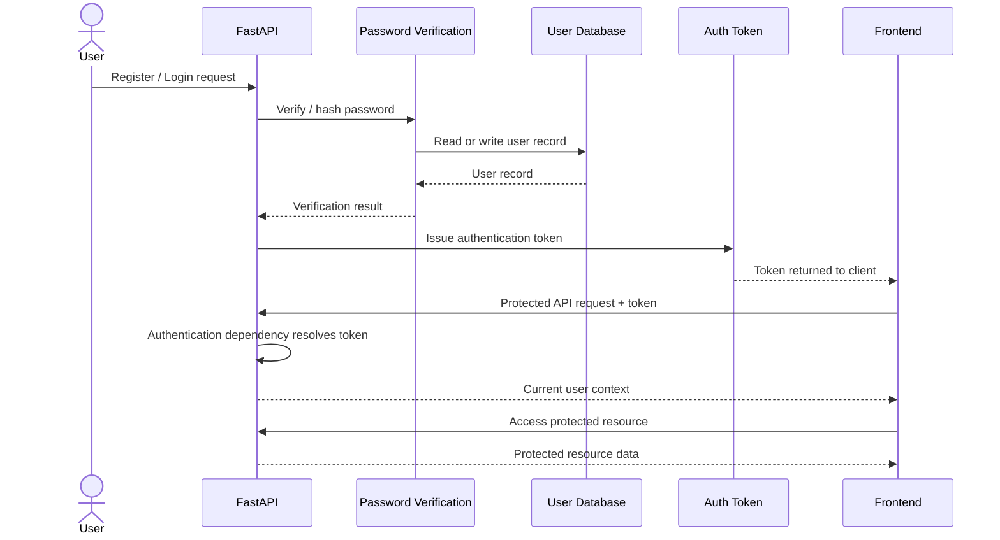

Every protected endpoint depends on an authentication dependency that resolves the current user from the token before any business logic executes.

---

## 🛡️ Role-Based Access Control

SignSpeak defines the following roles:

| Role | Description |
|---|---|
| `student` | Default learner role with access to courses, practice, assessments and personal reports |
| `instructor` | Extended access relevant to course/lesson oversight |
| `accessibility_trainer` | Specialized role focused on accessibility-oriented content and feedback |
| `admin` | Administrative access to platform-wide user management |

Protected routes are guarded by an **authentication dependency** (is the request authenticated?) followed by a **role check** (is this user authorized for this action?). Learner/student roles retain full access to their own learning functionality, while **admin** accounts additionally gain access to platform administration endpoints such as user management and role assignment.

---

## 👤 User Profile

| Method | Endpoint | Description |
|---|---|---|
| `GET` | `/api/users/profile` | Retrieve the current user's profile |
| `PUT` | `/api/users/profile` | Update profile information |
| `PUT` | `/api/users/password` | Change account password |
| `DELETE` | `/api/users/profile` | Delete the current user's account |

Profile data includes: full name, email, avatar, bio, location, preferred language, learning level, learning goals, XP, current streak, and account status.

<details>
<summary><strong>Example profile response (illustrative)</strong></summary>

```json
{
  "id": "usr_8f21a3",
  "full_name": "Ananya Rao",
  "email": "ananya@example.com",
  "avatar_url": "https://cdn.signspeak.app/avatars/usr_8f21a3.png",
  "bio": "Learning ASL for accessibility volunteering.",
  "location": "Chennai, India",
  "preferred_language": "en",
  "learning_level": "intermediate",
  "learning_goals": ["daily conversation signs", "alphabet fluency"],
  "xp": 1240,
  "current_streak": 6,
  "account_status": "active"
}
```

</details>

---

## 📚 Course & Learning Content

The backend organizes structured learning content through **Categories → Courses → Lessons → Enrollments → Lesson Progress**.

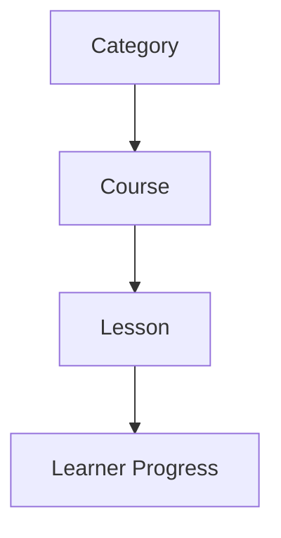

SignSpeak currently ships with structured ASL (American Sign Language) learning content organized into courses and lessons that learners enroll in and progress through sequentially.

---

## 🎬 Lesson Content

Each lesson may contain:

- Title
- Description / instructional content
- Learning material
- Video URL
- Parent course relationship
- Progress / completion status

Lesson video URLs are delivered to the frontend, where supported video content is embedded within the learning interface for the learner to watch.

---

## 🤟 AI Practice Session Engine

| Method | Endpoint | Description |
|---|---|---|
| `POST` | `/api/practice/sessions` | Start a new AI practice session |
| `PATCH` | `/api/practice/sessions/{session_id}` | Update / record a detection within a session |
| `GET` | `/api/practice/sessions` | Retrieve practice session history |

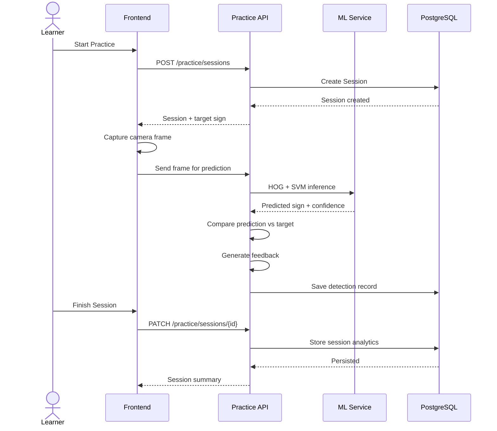

---

## 📦 Practice Session Data

A `PracticeSession` tracks:

- User
- Lesson
- Target gesture
- Start time / end time / duration
- Average confidence
- Attempts and successful attempts
- Individual detections

Each detection record can contain: `target_gesture`, `predicted_gesture`, `confidence`, `correct`, `learning_status`, `feedback`, `recommendation`, `timestamp`.

> **Example values shown below are illustrative.**

```json
{
  "session_id": "prac_9f13c7",
  "user_id": "usr_8f21a3",
  "lesson_id": "les_0042",
  "target_gesture": "A",
  "start_time": "2026-08-28T09:12:04Z",
  "end_time": "2026-08-28T09:14:41Z",
  "duration_seconds": 157,
  "average_confidence": 88.6,
  "attempts": 6,
  "successful_attempts": 5,
  "detections": [
    {
      "target_gesture": "A",
      "predicted_gesture": "A",
      "confidence": 91.4,
      "correct": true,
      "learning_status": "improving",
      "feedback": "Great form — hand shape closely matches target.",
      "recommendation": "Continue practicing sign A briefly, then progress.",
      "timestamp": "2026-08-28T09:12:20Z"
    }
  ]
}
```

---

## 🤖 Machine Learning Inference

The **deployed** SignSpeak inference pipeline uses:

**HOG Feature Extraction + Linear SVM Classifier + Label Encoder**

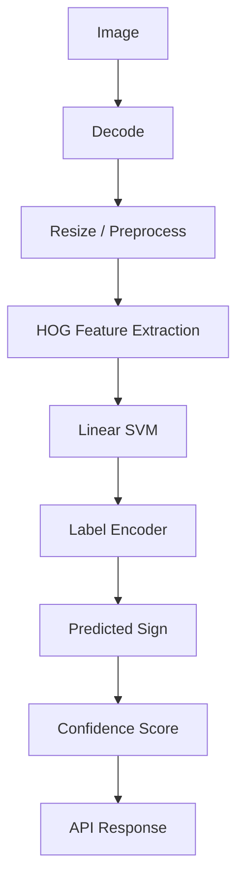

> A CNN-based classifier has been explored as a separate ML experiment but is **not** the classifier active in the deployed backend.

---

## 🔮 ML Prediction Endpoint

| Method | Endpoint | Description |
|---|---|---|
| `POST` | `/api/v1/ml/predict` | Classify a submitted sign image |

The endpoint accepts a sign image (submitted from a captured camera frame) and returns the model's predicted sign along with a confidence score.

<details>
<summary><strong>Example request / response (illustrative)</strong></summary>

**Request**
```json
{
  "image_base64": "<base64-encoded-image-data>"
}
```

**Response**
```json
{
  "predicted_sign": "A",
  "confidence": 91.42
}
```

</details>

---

## 🧠 Model Artifacts

| File | Purpose |
|---|---|
| `backend/models/hog_linear_svm.joblib` | Trained sign classifier (HOG features + Linear SVM) |
| `backend/models/label_encoder.joblib` | Converts model class indices into human-readable sign labels |

Both artifacts are loaded once by the inference layer at service startup and reused across prediction requests.

---

## 🎯 Personalized Learning Engine

| Method | Endpoint | Description |
|---|---|---|
| `POST` | `/api/v1/ml/learning-plan` | Generate a personalized learning plan for a learner |

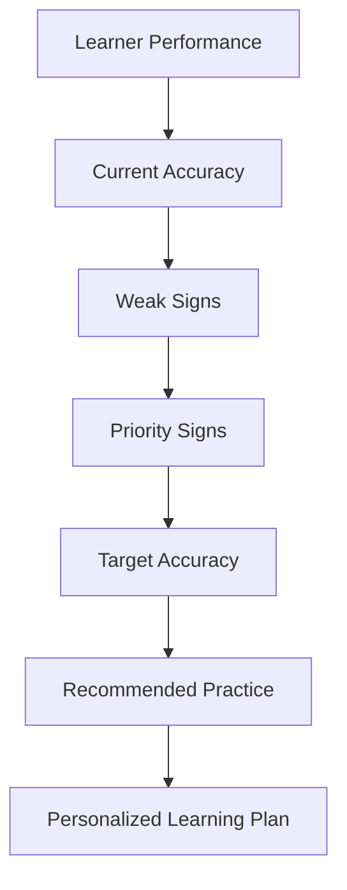

> **Important distinction:** the Personalized Learning Engine is a **rule-based recommendation layer** built on top of learner performance data. It is **not** part of, and should not be confused with, the HOG + Linear SVM classification model.

---

## 📈 Target Accuracy Logic

```text
target_accuracy = min( max(current_accuracy + 10, 70), 95 )
```

| Rule | Behavior |
|---|---|
| Beginner learners | Minimum target = **70%** |
| Developing learners | Target = current accuracy **+ 10%** |
| Advanced learners | Target capped at **95%** |

| Current Accuracy | Next Target |
|---|---|
| 0% | 70% |
| 30% | 70% |
| 60% | 70% |
| 65% | 75% |
| 72% | 82% |
| 80% | 90% |
| 90% | 95% |

---

## 📊 Reporting & Learner Analytics

| Endpoint | Analytics Produced |
|---|---|
| `GET /api/reports/learning` | Overall learning progress summary |
| `GET /api/reports/assessment` | Assessment performance history |
| `GET /api/reports/accuracy` | Accuracy trends over time |
| `GET /api/reports/progress` | Course & lesson completion progress |
| `GET /api/reports/sign-performance` | Per-sign detection accuracy and confusion data |

---

## 🧮 Sign Performance Analytics

`GET /api/reports/sign-performance` aggregates **detection-level** practice history to produce sign-by-sign insight.

Documented fields: `total_sessions`, `total_detection_attempts`, `total_correct`, `overall_accuracy_percent`, `signs`, `weak_signs`, `strong_signs`, `confusions`.

<details>
<summary><strong>Example response (illustrative)</strong></summary>

```json
{
  "total_sessions": 42,
  "total_detection_attempts": 310,
  "total_correct": 248,
  "overall_accuracy_percent": 80.0,
  "signs": [
    { "sign": "A", "attempts": 40, "correct": 36, "accuracy_percent": 90.0 },
    { "sign": "M", "attempts": 28, "correct": 15, "accuracy_percent": 53.6 }
  ],
  "weak_signs": ["M", "N"],
  "strong_signs": ["A", "B", "C"],
  "confusions": [
    { "target": "M", "predicted": "N", "count": 7 }
  ]
}
```

</details>

---

## 💪 Weak & Strong Signs

**Weak Sign** — `attempts >= 1 AND accuracy < 70%`
**Strong Sign** — `attempts >= 1 AND accuracy >= 80%`

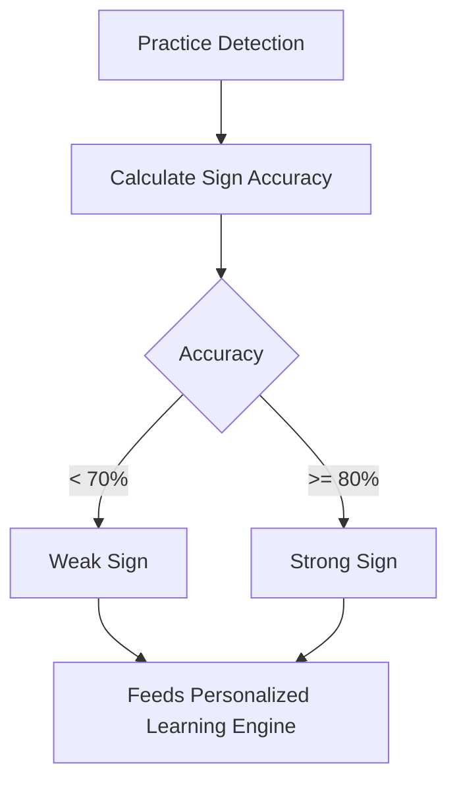

---

## 🔀 Sign Confusion Analysis

Whenever a prediction does not match the target sign, the pair is treated as a **confusion**.

Example: `A → M` (target `A`, predicted `M`)

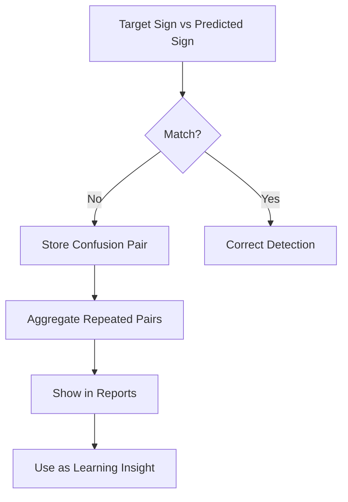

---

## 📝 Assessment Engine

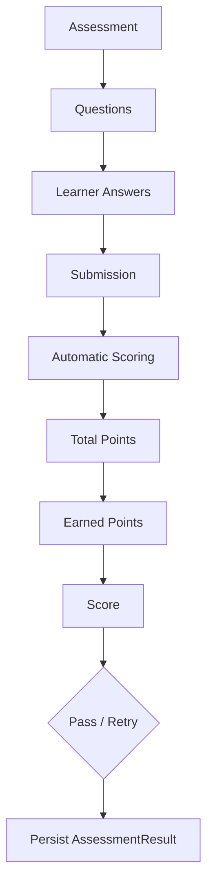

Supported question categories: `multiple_choice`, `gesture_recognition`, `true_false`.

Assessment results are persisted to the database and feed directly into the reporting engine.

---

## 📝 Assessment API

| Method | Endpoint | Description |
|---|---|---|
| `GET` | `/api/assessments` | List available assessments |
| `GET` | `/api/assessments/{id}` | Retrieve a specific assessment and its questions |
| `POST` | `/api/assessments/{id}/submit` | Submit learner answers for scoring |
| `GET` | `/api/assessments/{id}/results` | Retrieve results for a completed assessment |

---

## 🔔 Notifications

Notification types: `info`, `success`, `warning`, `achievement`, `course`.

| Method | Endpoint | Description |
|---|---|---|
| `GET` | `/api/notifications` | List notifications for the current user |
| `PATCH` | `/api/notifications/{id}/read` | Mark a single notification as read |
| `PATCH` | `/api/notifications/read-all` | Mark all notifications as read |
| `DELETE` | `/api/notifications/{id}` | Delete a notification |

Notifications are user-specific, track read/unread state, and support both individual and bulk read operations.

---

## 🧑‍💼 Administration

| Method | Endpoint | Description |
|---|---|---|
| `GET` | `/api/admin/dashboard` | Retrieve platform-wide administrative statistics |
| `GET` | `/api/admin/users` | List platform users |
| `POST` | `/api/admin/users` | Create a new staff/admin user |
| `PATCH` | `/api/admin/users/{user_id}/role` | Update a user's role |
| `PATCH` | `/api/admin/users/{user_id}/status` | Activate or deactivate a user account |

All administration endpoints require **administrator authorization** in addition to standard authentication.

---

## 🗄️ PostgreSQL Database

PostgreSQL is the system of record for all SignSpeak application state, including:

Users • Courses • Lessons • Enrollments • Practice Sessions • Assessments • Assessment Results • Notifications • Progress

---

## 🧬 Database ER Diagram

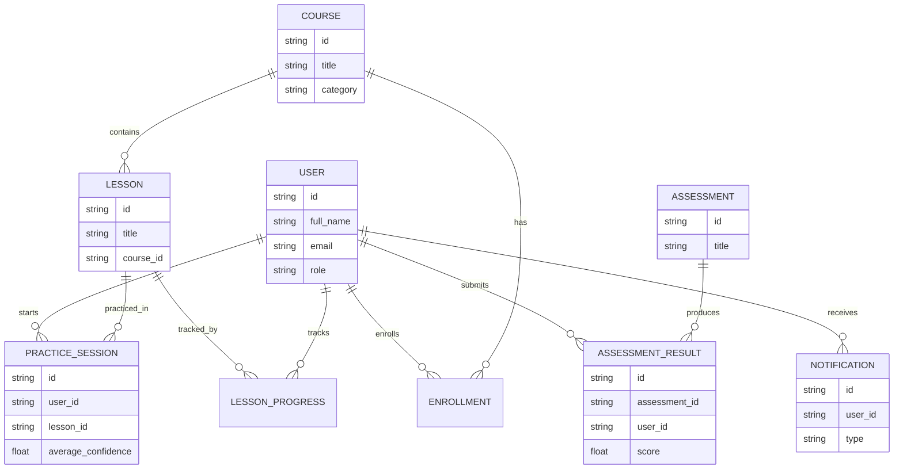

*The diagram intentionally shows core relationships rather than every column, for readability.*

---

## 🔄 End-to-End Data Flow

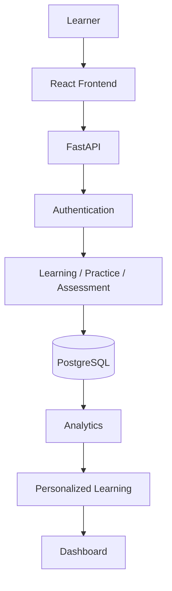

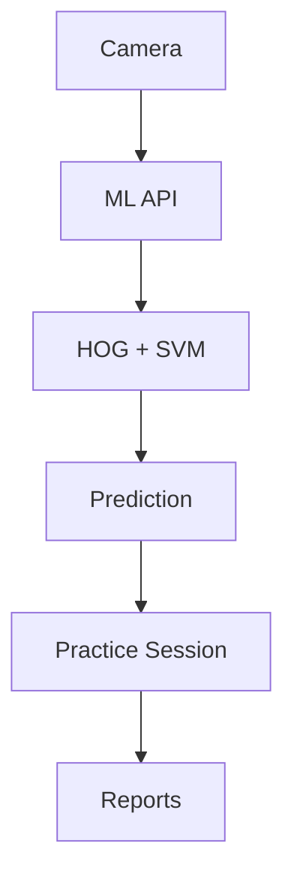

---

## 🧭 API Summary

| Area | Method | Endpoint | Purpose | Protected? |
|---|---|---|---|---|
| Auth | POST | `/api/v1/auth/register` | Create account | No |
| Auth | POST | `/api/v1/auth/login` | Authenticate | No |
| Auth | POST | `/api/v1/auth/logout` | End session | Yes |
| Auth | POST | `/api/v1/auth/refresh` | Refresh token | Yes |
| Auth | POST | `/api/v1/auth/forgot-password` | Start reset | No |
| Auth | POST | `/api/v1/auth/reset-password` | Complete reset | No |
| Auth | GET | `/api/v1/auth/me` | Current user | Yes |
| Users | GET | `/api/users/profile` | View profile | Yes |
| Users | PUT | `/api/users/profile` | Update profile | Yes |
| Users | PUT | `/api/users/password` | Change password | Yes |
| Users | DELETE | `/api/users/profile` | Delete account | Yes |
| Courses | GET | `/api/courses` | List courses | Yes |
| Courses | GET | `/api/courses/{id}` | Course detail | Yes |
| Lessons | GET | `/api/lessons/{id}` | Lesson detail | Yes |
| Lessons | POST | `/api/lessons/{id}/progress` | Update progress | Yes |
| Practice | POST | `/api/practice/sessions` | Start session | Yes |
| Practice | PATCH | `/api/practice/sessions/{session_id}` | Update session | Yes |
| Practice | GET | `/api/practice/sessions` | Session history | Yes |
| Assessments | GET | `/api/assessments` | List assessments | Yes |
| Assessments | GET | `/api/assessments/{id}` | Assessment detail | Yes |
| Assessments | POST | `/api/assessments/{id}/submit` | Submit answers | Yes |
| Assessments | GET | `/api/assessments/{id}/results` | View results | Yes |
| Reports | GET | `/api/reports/learning` | Learning summary | Yes |
| Reports | GET | `/api/reports/assessment` | Assessment history | Yes |
| Reports | GET | `/api/reports/accuracy` | Accuracy trends | Yes |
| Reports | GET | `/api/reports/progress` | Progress report | Yes |
| Reports | GET | `/api/reports/sign-performance` | Sign analytics | Yes |
| Notifications | GET | `/api/notifications` | List notifications | Yes |
| Notifications | PATCH | `/api/notifications/{id}/read` | Mark read | Yes |
| Notifications | PATCH | `/api/notifications/read-all` | Mark all read | Yes |
| Notifications | DELETE | `/api/notifications/{id}` | Delete notification | Yes |
| Admin | GET | `/api/admin/dashboard` | Admin statistics | Yes (Admin) |
| Admin | GET | `/api/admin/users` | List users | Yes (Admin) |
| Admin | POST | `/api/admin/users` | Create staff user | Yes (Admin) |
| Admin | PATCH | `/api/admin/users/{user_id}/role` | Update role | Yes (Admin) |
| Admin | PATCH | `/api/admin/users/{user_id}/status` | Update status | Yes (Admin) |
| ML | POST | `/api/v1/ml/predict` | Predict sign | Yes |
| ML | POST | `/api/v1/ml/learning-plan` | Generate learning plan | Yes |
| Health | GET | `/api/health` | Service health check | No |

---

## ✅ Request Validation

All request and response payloads are validated using **Pydantic** schemas, covering:

- Request body validation
- Response structure enforcement
- Field-level type & constraint validation
- Password strength constraints
- Practice payload validation
- Assessment submission validation

<details>
<summary><strong>Illustrative Pydantic example</strong></summary>

```python
from pydantic import BaseModel, EmailStr, Field

class UserRegisterSchema(BaseModel):
    full_name: str = Field(min_length=2, max_length=100)
    email: EmailStr
    password: str = Field(min_length=8)
```

</details>

---

## 🔗 ORM Layer

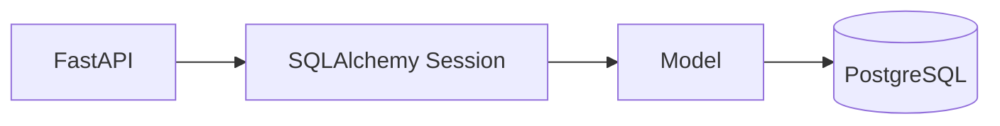

SQLAlchemy ORM models represent application entities (users, courses, lessons, practice sessions, assessments, etc.) and the relationships between them, keeping persistence logic decoupled from route handlers.

---

## 🧱 Database Migrations

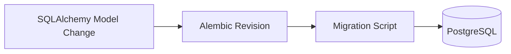

```bash
alembic revision --autogenerate -m "description"
alembic upgrade head
```

---

## 🔐 Security Architecture

SignSpeak's backend implements:

- Password hashing (never stored in plaintext)
- Password verification on login
- Authenticated API routes via dependency injection
- Role-based authorization for sensitive actions
- Resource ownership checks (users can only access their own data)
- Pydantic-based input validation
- CORS configuration restricting allowed frontend origins
- Environment-based configuration (no hard-coded secrets)

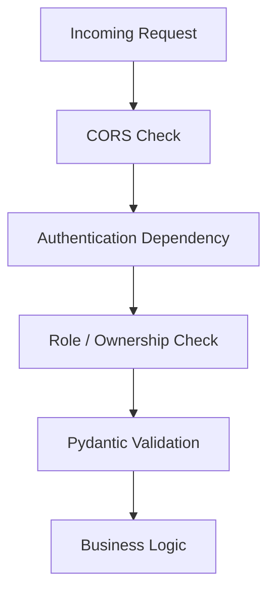

> The backend does **not** currently implement MFA, GDPR certification, SOC 2 compliance, encryption at rest, formal rate limiting, or penetration testing.

---

## 🌐 CORS

During local development, the frontend and backend run as separate processes:

| Service | URL |
|---|---|
| Frontend (Vite) | `http://localhost:5173` |
| Backend (FastAPI) | `http://127.0.0.1:8000` |

The `FRONTEND_ORIGIN` environment variable controls which frontend origin is permitted to access the API via CORS.

---

## ⚙️ Environment Variables

| Variable | Description | Example |
|---|---|---|
| `ENVIRONMENT` | Deployment environment name | `development` |
| `FRONTEND_ORIGIN` | Allowed CORS origin for the frontend | `http://localhost:5173` |
| `DB_HOST` | PostgreSQL host | `localhost` |
| `DB_PORT` | PostgreSQL port | `5432` |
| `DB_NAME` | Database name | `sign_language_platform` |
| `DB_USER` | Database username | `<your-postgres-user>` |
| `DB_PASSWORD` | Database password | `<your-postgres-password>` |
| `API_V1_PREFIX` | API version prefix | `/api/v1` |

> Never commit real credentials. Use a local `.env` file excluded from version control.

---

## 🚀 Running the Backend

```bash
cd backend

python3 -m venv venv
source venv/bin/activate

pip install -r requirements.txt

uvicorn app.main:app --reload
```

Backend will be available at: **`http://127.0.0.1:8000`**

---

## 📖 Interactive API Documentation

| Tool | URL |
|---|---|
| Swagger UI | `http://127.0.0.1:8000/docs` |
| OpenAPI schema | `http://127.0.0.1:8000/openapi.json` |

Swagger UI allows every endpoint to be inspected and tested interactively, including authenticated routes (via the "Authorize" flow) — useful during development and demos without needing a separate API client.

---

## 🐳 Docker Deployment

**Build:**

```bash
docker build -t signspeak-backend ./backend
```

**Run:**

```bash
docker run -d \
  --name signspeak-api \
  -p 8000:8000 \
  -e FRONTEND_ORIGIN="http://localhost:5173" \
  -e DB_HOST="host.docker.internal" \
  -e DB_PORT="5432" \
  -e DB_NAME="sign_language_platform" \
  -e DB_USER="<your-postgres-user>" \
  signspeak-backend
```

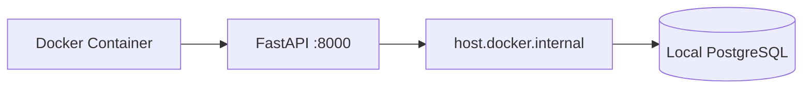

---

## ❤️ Health Check

| Method | Endpoint | Description |
|---|---|---|
| `GET` | `/api/health` | Verify backend availability |

```json
{
  "status": "healthy"
}
```

Used to confirm the API process is running and responsive, e.g. from deployment tooling or manual checks.

---

## 🧪 Backend Testing

```
              End-to-End
          Integration Tests
        API / Validation Tests
      Unit / Service-Level Tests
```

Testing spans: Authentication, Authorization, Courses, Practice, ML inference, Assessments, Reports, Notifications, Administration, Database persistence, and the Health endpoint.

> Test coverage is targeted at core flows and is **not** claimed to be exhaustive across all edge cases.

---

## 🔁 AI Practice Integration Test

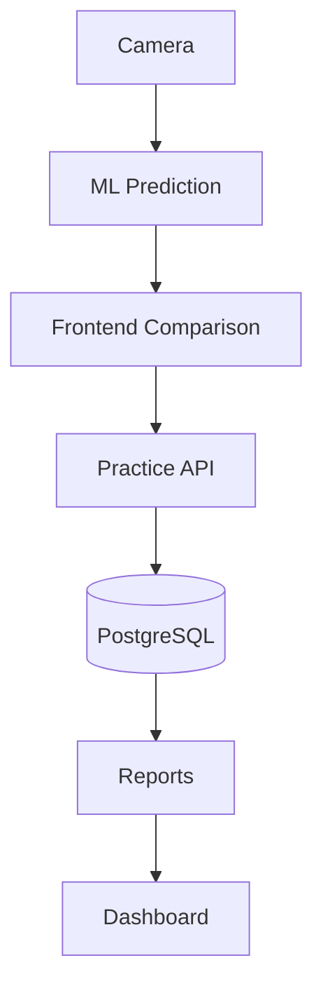

This flow verifies the complete AI practice data pipeline end-to-end, from frame capture through to reporting.

---

## 🔍 Backend Observability

Current development-stage observability relies on:

- FastAPI application logs
- Uvicorn server logs
- HTTP status codes for request outcomes
- Manual testing through Swagger UI
- Docker container logs
- The `/api/health` endpoint

> No production-grade monitoring/observability stack is currently integrated.

---

## ⚙️ Performance Considerations

Relevant performance factors include:

- Image preprocessing cost prior to ML inference
- ML inference (HOG extraction + SVM prediction) cost per request
- Database query cost for report aggregation
- Size and growth of JSON detection history per session
- Report calculation overhead as data volume grows
- Frontend ↔ backend request latency

> Formal production performance benchmarking has not yet been completed.

---

## ⚠️ ML Generalization Limitation

The deployed model achieves approximately **91% accuracy** on the controlled validation/test distribution used during training.

However, testing against **custom external images** (different lighting, backgrounds, and camera conditions) showed **poor generalization** beyond the training distribution.

**Conclusion:** the current recognition model is suitable for **prototype and research demonstration**, but should **not** be considered production-grade sign recognition.

Planned improvements include:

- More diverse, real-world training data
- Camera-domain data augmentation
- Hand landmark normalization
- MediaPipe-based preprocessing
- Transfer learning approaches
- Signer-independent evaluation
- Model confidence calibration

---

## 📌 Implementation Status

| Module | Status |
|---|---|
| FastAPI Core | ✅ |
| Authentication | ✅ |
| PostgreSQL | ✅ |
| SQLAlchemy | ✅ |
| Alembic | ✅ |
| Courses | ✅ |
| Lessons | ✅ |
| Practice Sessions | ✅ |
| ML Prediction | ✅ |
| Personalized Learning | ✅ |
| Assessments | ✅ |
| Reports | ✅ |
| Notifications | ✅ |
| Administration | ✅ |
| Docker | ✅ |
| Production ML Robustness | ⚠️ Improvement Required |

---

## 🗺️ Future Backend Roadmap

> Everything below is **planned future work**, not current functionality.

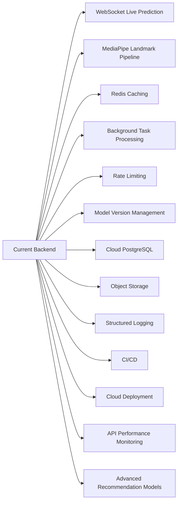

---

## 👨‍💻 Backend Development Guidelines

- Keep routers focused on a single domain
- Use Pydantic schemas for all request/response validation
- Place reusable logic in the service layer, not in routers
- Use SQLAlchemy for all persistence access
- Create an Alembic migration for every schema change
- Always enforce ownership checks on user-owned resources
- Never hard-code credentials — use environment variables
- Add tests for new backend behavior
- Keep ML inference logic separate from learning recommendation logic

---

## 🔎 Quick Backend Flow

```
┌──────────────────────────────────────────────┐
│               SIGNSPEAK BACKEND               │
├──────────────────────────────────────────────┤
│ FastAPI                                       │
│   ├── Authentication                          │
│   ├── Learning Content                        │
│   ├── AI Practice                             │
│   ├── Assessments                             │
│   ├── Reports                                 │
│   ├── Notifications                           │
│   └── Administration                          │
│                                                │
│ PostgreSQL  ←→  SQLAlchemy                    │
│                                                │
│ Image → HOG → SVM → Prediction                │
│                                                │
│ Practice → Analytics → Learning Plan          │
└──────────────────────────────────────────────┘
```

---

<div align="center">

### SignSpeak Backend

*"Powering intelligent, measurable and personalized sign-language learning."*

**FastAPI • PostgreSQL • Python • Machine Learning • Docker**

</div>