<div align="center">

# 🐳 SignSpeak Docker

**Containerized backend infrastructure for the SignSpeak AI Sign Language Learning Platform.**

**FastAPI • Machine Learning • PostgreSQL • Docker • REST API**

[](https://www.docker.com/)
[](https://www.python.org/)
[](https://fastapi.tiangolo.com/)
[](https://www.postgresql.org/)
[](https://scikit-learn.org/)
[](https://opencv.org/)


</div>

---

## 🐳 Docker Overview

SignSpeak uses Docker to containerize the **FastAPI backend**, providing a consistent, reproducible runtime for the application code, Python dependencies, and machine-learning inference stack.

Containerization delivers:

- A consistent backend environment across machines
- Dependency isolation from the host system
- Repeatable, reproducible setup
- A portable backend runtime
- Simplified installation of ML dependencies (OpenCV, scikit-learn, scikit-image, NumPy)
- Predictable API execution independent of local Python configuration

**Current scope:** Docker containerizes the **backend only**. The React frontend runs directly through Vite, and PostgreSQL runs as a local service on the host machine — both outside of Docker in the current architecture.

---

## 🏗️ Container Architecture

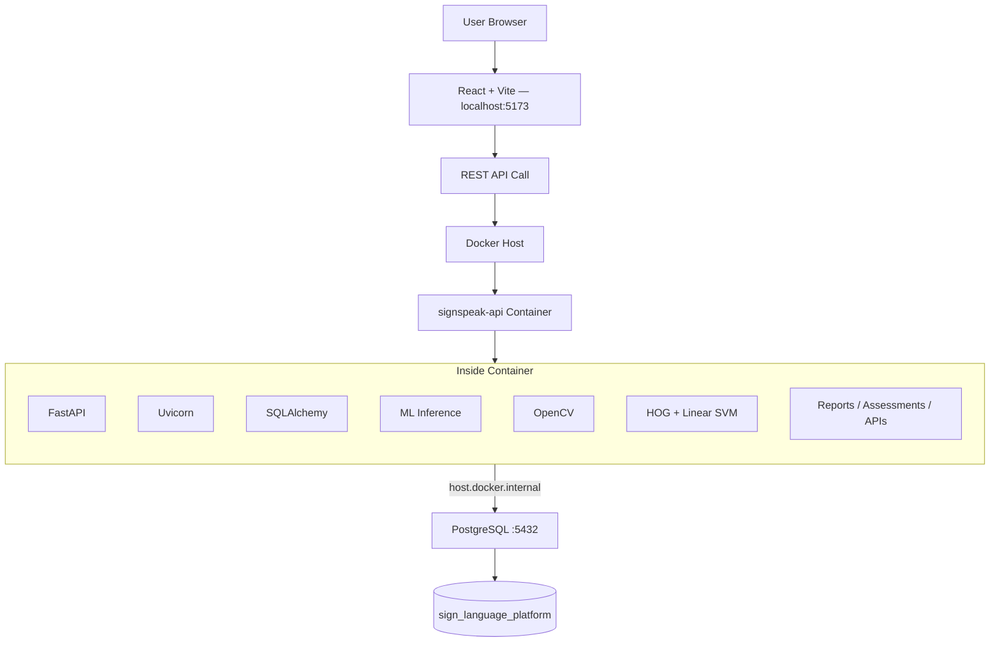

| Port | Component |
|---|---|
| `5173` | React + Vite frontend (host) |
| `8000` | FastAPI backend (container) |
| `5432` | PostgreSQL (host) |

---

## 🌐 Development Deployment Model

| Layer | Runs |
|---|---|
| **Frontend** | Directly via Vite dev server |
| **Backend** | Inside a Docker container |
| **Database** | Local PostgreSQL service on the host |

```
Browser
│
├── localhost:5173
│        │
│        ▼
│      React
│        │
│        ▼
│  HTTP Requests
│        │
▼        ▼
localhost:8000
        │
        ▼
  Docker Container
        │
        ▼
     FastAPI
        │
        ▼
host.docker.internal
        │
        ▼
  PostgreSQL:5432
```

**Why `host.docker.internal`?** Inside a Docker container, `localhost` resolves to the container itself, not the host machine. Since PostgreSQL runs on the host, the container must reach it through the special DNS name `host.docker.internal`, which Docker resolves to the host machine's IP address.

---

## 🔄 Docker Workflow

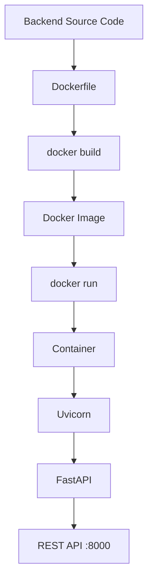

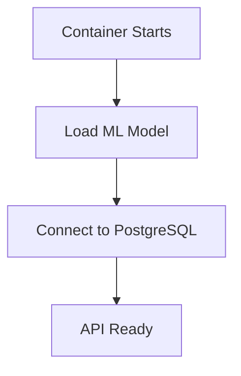

---

## 📦 Image Build Pipeline

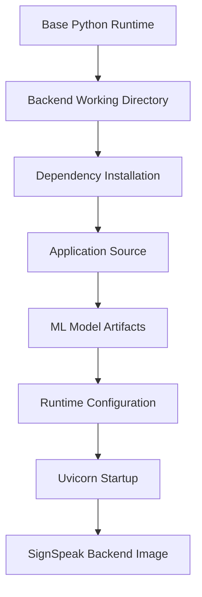

The final image bundles everything required to execute the FastAPI backend and its ML inference pipeline — application code, Python dependencies, and the serialized model artifacts — into a single, runnable unit.

---

## 🔨 Building the Backend Image

```bash
cd /path/to/SignSpeak-Work

docker build -t signspeak-backend ./backend
```

| Part | Meaning |
|---|---|
| `docker build` | Creates a Docker image from a Dockerfile |
| `-t signspeak-backend` | Tags (names) the resulting image |
| `./backend` | Uses the `backend/` directory as the build context |

Verify the image was created:

```bash
docker images
```

---

## 📦 Docker Image

| Concept | Meaning |
|---|---|
| **Image** | The packaged backend application — a static, immutable snapshot |
| **Container** | A running instance of an image |
| **Dockerfile** | Instructions describing how to build the image |
| **Port Mapping** | Connects a host port to a container port |
| **Environment Variable** | Runtime configuration passed into the container |
| **Volume** | Mechanism for persistent/shared filesystem access *(optional Docker concept — not currently used by SignSpeak)* |

---

## ▶️ Running SignSpeak Backend

```bash
docker run -d \
  --name signspeak-api \
  -p 8000:8000 \
  -e FRONTEND_ORIGIN="http://localhost:5173" \
  -e DB_HOST="host.docker.internal" \
  -e DB_PORT="5432" \
  -e DB_NAME="sign_language_platform" \
  -e DB_USER="<your-postgres-user>" \
  signspeak-backend
```

| Option | Purpose |
|---|---|
| `-d` | Runs the container in detached (background) mode |
| `--name signspeak-api` | Assigns a recognizable name to the container |
| `-p 8000:8000` | Maps host port `8000` to container port `8000` |
| `-e` | Passes an environment variable into the container |
| `signspeak-backend` | The image to run |

---

## 🔑 Database Password Configuration

If your local PostgreSQL installation requires a password, add:

```bash
-e DB_PASSWORD="<your-postgres-password>"
```

> Never commit or hard-code a real password. Database authentication requirements vary between local PostgreSQL installations — some allow trust-based local connections, others require explicit credentials.

---

## ⚙️ Container Environment Variables

| Variable | Purpose | Example |
|---|---|---|
| `FRONTEND_ORIGIN` | Allowed CORS origin for the frontend | `http://localhost:5173` |
| `DB_HOST` | PostgreSQL host reachable from the container | `host.docker.internal` |
| `DB_PORT` | PostgreSQL port | `5432` |
| `DB_NAME` | Target database name | `sign_language_platform` |
| `DB_USER` | Database username | `<your-postgres-user>` |
| `DB_PASSWORD` | Database password (if required) | `<your-postgres-password>` |
| `ENVIRONMENT` | Runtime environment label | `development` |

---

## 🔀 Environment Flow

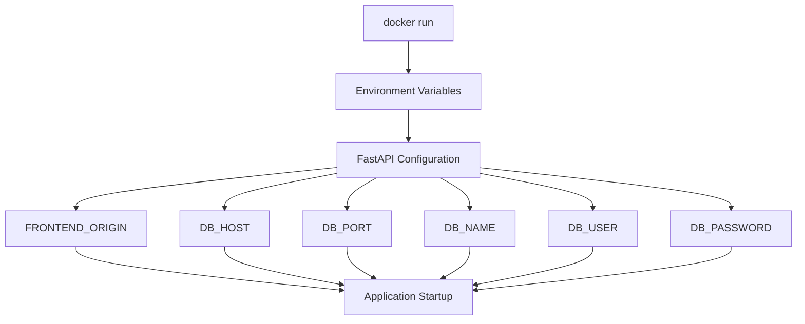

---

## 🔌 Port Mapping

| Service | Host Port | Purpose |
|---|---:|---|
| React / Vite | 5173 | Frontend development server |
| FastAPI | 8000 | Backend REST API |
| PostgreSQL | 5432 | Database |

```
Browser
   │
   ├── :5173 → React
   │
   └── :8000 → Docker → FastAPI
                         │
                         └── :5432 → PostgreSQL
```

`-p 8000:8000` maps **Host Port 8000 → Container Port 8000**, allowing requests sent to the host machine's port 8000 to reach the FastAPI process running inside the container.

---

## 🎨 Frontend → Container Communication

```
React
  │
  ▼
Axios
  │
  ▼
http://localhost:8000/api
  │
  ▼
Docker Port Mapping
  │
  ▼
FastAPI
```

The frontend's development origin is `http://localhost:5173`. For cross-origin requests from the frontend to succeed, the backend's CORS configuration must explicitly allow this origin.

---

## 🌐 CORS Configuration

```
Browser
  │
  ▼
localhost:5173
  │
  ▼
Cross-Origin API Request
  │
  ▼
localhost:8000
  │
  ▼
FastAPI CORS Middleware
  │
  ▼
Allowed FRONTEND_ORIGIN
  │
  ▼
API Response
```

The container is started with `FRONTEND_ORIGIN="http://localhost:5173"` so the FastAPI CORS middleware knows to accept requests from the frontend's origin.

> Incorrect CORS configuration can cause frontend login, registration, and API requests to fail — **even when the backend container itself is healthy**. CORS errors are one of the most common sources of confusion in local full-stack Docker setups.

---

## 🗄️ Docker → PostgreSQL Connection

```
FastAPI Container
      │
      ▼
  SQLAlchemy
      │
      ▼
host.docker.internal:5432
      │
      ▼
   PostgreSQL
      │
      ▼
sign_language_platform
```

This differs from running FastAPI directly on the host machine (e.g. via `uvicorn app.main:app --reload` outside Docker), where the database host is typically `localhost`. **Inside** a Docker container, the correct host for a locally-installed PostgreSQL instance is `host.docker.internal`.

---

## 🧬 Database Connection Diagram

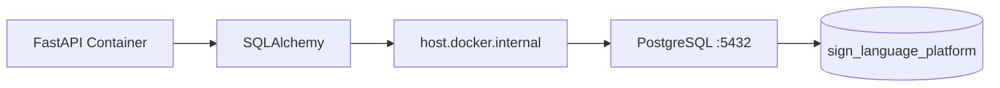

---

## 🤖 Machine Learning Inside the Container

Docker also packages the dependencies required for SignSpeak's ML inference — OpenCV, scikit-learn, scikit-image, and NumPy — alongside the serialized model artifacts.

**Active backend prediction pipeline:**

```
Uploaded Image
      │
      ▼
   FastAPI
      │
      ▼
   OpenCV
      │
      ▼
Image Preprocessing
      │
      ▼
HOG Feature Extraction
      │
      ▼
  Linear SVM
      │
      ▼
 Label Encoder
      │
      ▼
Predicted Sign
      │
      ▼
  Confidence
      │
      ▼
JSON Response
```

Model artifacts packaged into the image:

- `backend/models/hog_linear_svm.joblib`
- `backend/models/label_encoder.joblib`

These artifacts are available to the backend inference layer at runtime inside the container.

---

## 🔮 ML Container Flow

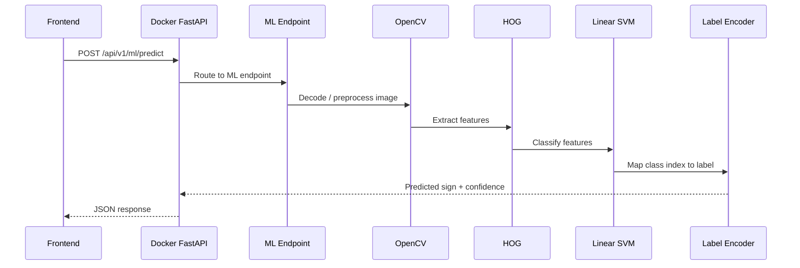

---

## 🤟 AI Practice Through Docker

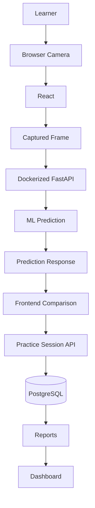

---

## ⚡ Containerized Backend Capabilities

| Module | Purpose |
|---|---|
| Authentication | Registration, login, token issuance |
| User Profiles | Learner profile management |
| Courses | Structured course catalog |
| Lessons | Lesson content and progress tracking |
| Practice Sessions | AI-assisted sign practice |
| Assessments | Question delivery, submission, scoring |
| Reports | Learner analytics and aggregation |
| Notifications | User-facing system messages |
| Administration | Platform and user management |
| ML Prediction | Sign image classification |
| Personalized Learning | Performance-based recommendations |
| Health Check | Container/service availability check |

All modules above are exposed through the **same FastAPI application** running inside the `signspeak-api` container — there is no separate container per module.

---

## ❤️ Health Check

```
GET http://127.0.0.1:8000/api/health
```

**Expected response:**

```json
{
  "status": "healthy"
}
```

```bash
curl http://127.0.0.1:8000/api/health
```

A successful response confirms the FastAPI application inside the container is running and reachable through the mapped port.

---

## 🔁 Health Check Flow

```
Browser / curl
      │
      ▼
 localhost:8000
      │
      ▼
Docker Port Mapping
      │
      ▼
    FastAPI
      │
      ▼
  /api/health
      │
      ▼
    200 OK
      │
      ▼
{"status":"healthy"}
```

---

## 📖 API Documentation

| Tool | URL |
|---|---|
| Swagger UI | `http://127.0.0.1:8000/docs` |
| OpenAPI schema | `http://127.0.0.1:8000/openapi.json` |

The Dockerized backend exposes the same interactive FastAPI documentation as a non-containerized run — no additional configuration is required to access it.

---

## ✅ Container Verification

```bash
docker ps
docker logs signspeak-api
curl http://127.0.0.1:8000/api/health
```

| Command | Purpose |
|---|---|
| `docker ps` | Confirms the container is running |
| `docker logs signspeak-api` | Reveals startup errors or runtime issues |
| `curl .../api/health` | Confirms the API is reachable and responding |

**Verification checklist:**

- [ ] Image built
- [ ] Container running
- [ ] Port 8000 exposed
- [ ] Health endpoint returns 200
- [ ] PostgreSQL connection succeeds
- [ ] Swagger loads
- [ ] Frontend can reach API
- [ ] ML prediction endpoint responds

---

## 🎛️ Container Management

```bash
# View running containers
docker ps

# View all containers (including stopped)
docker ps -a

# View logs
docker logs signspeak-api

# Follow logs in real time
docker logs -f signspeak-api

# Stop the container
docker stop signspeak-api

# Start a stopped container
docker start signspeak-api

# Restart the container
docker restart signspeak-api

# Remove the container
docker rm signspeak-api
```

---

## 🔁 Rebuilding After Backend Changes

```bash
docker stop signspeak-api
docker rm signspeak-api

docker build -t signspeak-backend ./backend

docker run -d \
  --name signspeak-api \
  -p 8000:8000 \
  -e FRONTEND_ORIGIN="http://localhost:5173" \
  -e DB_HOST="host.docker.internal" \
  -e DB_PORT="5432" \
  -e DB_NAME="sign_language_platform" \
  -e DB_USER="<your-postgres-user>" \
  signspeak-backend
```

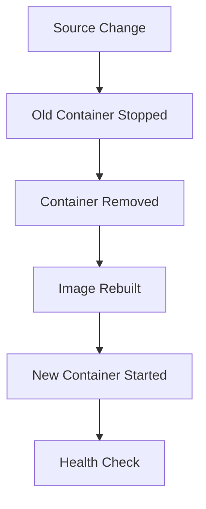

---

## 🧩 Why Rebuilding Is Required

Changing backend source code on the host does **not** automatically update an already-built Docker image, unless the source directory is explicitly mounted into the container as a development volume (which is not part of the current setup).

Under the current image-based workflow, the backend image must be **rebuilt** after any backend source code change for those changes to take effect inside the container. Hot reload between host and container is not currently configured.

---

## 🧾 Logs & Debugging

```bash
docker logs signspeak-api
docker logs -f signspeak-api
```

Container logs are useful for diagnosing:

- FastAPI startup errors
- PostgreSQL connection errors
- Missing environment variables
- ML model loading problems
- HTTP request errors
- Unhandled Python exceptions

---

## 🛠️ Troubleshooting

| Problem | Possible Cause | Fix |
|---|---|---|
| Container exits immediately | Application startup error | Run `docker logs signspeak-api` to inspect the error |
| Backend works but frontend API calls fail | CORS misconfiguration | Verify `FRONTEND_ORIGIN` matches the frontend's actual origin |
| Database connection refused | `DB_HOST` set to `localhost` inside Docker | Use `host.docker.internal` instead |
| Port 8000 already in use | Another process/container is bound to port 8000 | Stop the conflicting process/container, or map to a different host port |
| ML endpoint fails | Model artifact missing or dependency issue | Inspect Docker logs; verify model files are included in the image |
| Changes do not appear | Docker image was not rebuilt after source changes | Stop → remove → rebuild → restart the container |
| Container name already exists | A container named `signspeak-api` already exists | Run `docker rm signspeak-api` before creating a new one |

---

## 🔀 Common Docker Error Flow

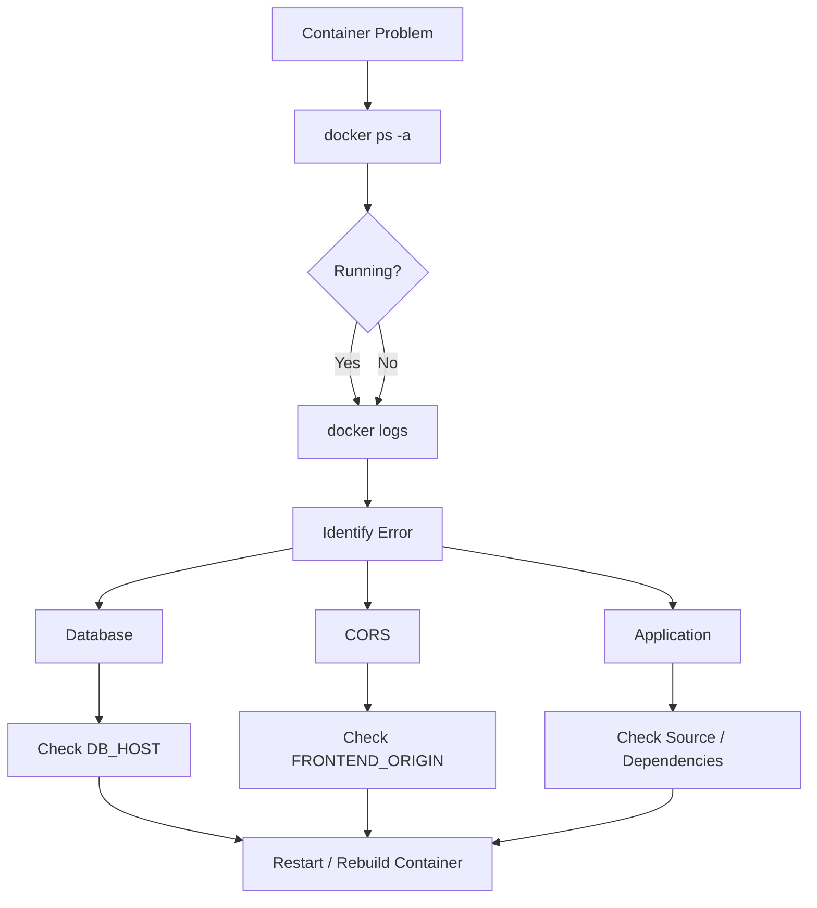

---

## 🔐 Container Security Considerations

- Do not hard-code database passwords in the Dockerfile or source code
- Do not commit `.env` files to version control
- Pass sensitive configuration through runtime environment variables
- Avoid including unnecessary files in the build context/image
- Keep dependency versions controlled and intentional
- Do not expose unnecessary ports
- Avoid running development-only configuration in a production context
- Protect model artifacts where appropriate

> These are current working practices — SignSpeak does not currently implement advanced container security features such as image scanning, secrets managers, or runtime hardening.

---

## 🧹 Build Context Hygiene

Docker build contexts should exclude unnecessary development files to keep builds fast and images clean. Recommended `.dockerignore` exclusions include:

```
venv/
__pycache__/
.pytest_cache/
.git/
.env
.DS_Store
*.pyc
local datasets
temporary files
```

> These are **recommended exclusions** — verify your actual `.dockerignore` reflects them for your environment.

Benefits:

- Smaller build context → faster builds
- Reduced risk of accidental secret exposure
- Cleaner, more predictable images

---

## 📦 Image Size Considerations

AI/ML backend images tend to be larger than typical web-service images due to:

- OpenCV
- scikit-learn
- scikit-image
- NumPy
- Serialized model artifacts
- Other Python dependencies

Possible future optimizations:

- Slim/minimal Python base images
- Multi-stage builds
- Dependency cleanup and pruning
- Splitting ML inference into a separate, dedicated service

> Current image size is not benchmarked or claimed here — measure it locally with `docker images` if needed.

---

## 🧪 Development vs Production

| Area | Development (Current) | Production Direction (Future) |
|---|---|---|
| Frontend | `localhost:5173` via Vite | Deployed static/hosted frontend |
| Backend | Docker container on `localhost:8000` | Hosted container (cloud) |
| Database | Local PostgreSQL on host | Managed PostgreSQL service |
| Configuration | Runtime environment variables | Centralized secret management |
| Logging | Docker/Uvicorn logs | Centralized/structured logging |
| ML | Bundled inference in backend container | Dedicated, independently scalable model service (if needed) |

---

## 📌 Docker Implementation Status

| Capability | Status |
|---|---|
| Backend Docker Image | ✅ |
| FastAPI Container | ✅ |
| Port 8000 Mapping | ✅ |
| PostgreSQL Host Connectivity | ✅ |
| Frontend CORS Configuration | ✅ |
| ML Inference in Container | ✅ |
| Health Endpoint | ✅ |
| Swagger Through Container | ✅ |
| Practice APIs | ✅ |
| Reports APIs | ✅ |
| Personalized Learning API | ✅ |
| Docker Compose | 🔜 Future |
| Frontend Containerization | 🔜 Future |
| PostgreSQL Containerization | 🔜 Future |
| Cloud Container Deployment | 🔜 Future |
| Kubernetes | 🔜 Future |

---

## 🔖 Current Reference

| Item | Value |
|---|---|
| Backend image | `signspeak-backend` |
| Backend container | `signspeak-api` |
| Backend port | `8000` |
| Database name | `sign_language_platform` |

---

## ♻️ Container Lifecycle

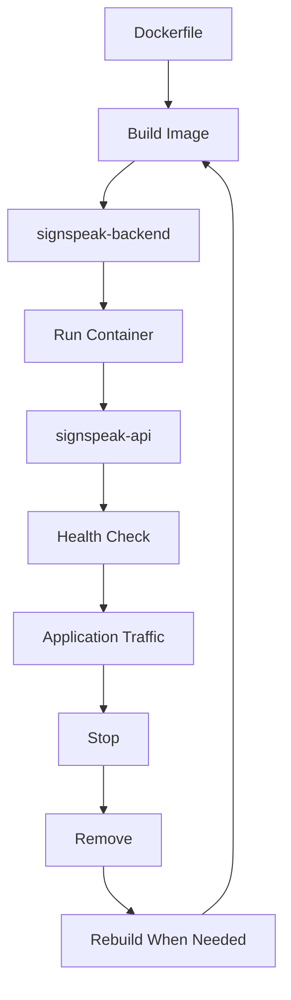

---

## 🗺️ Complete Local Stack Diagram

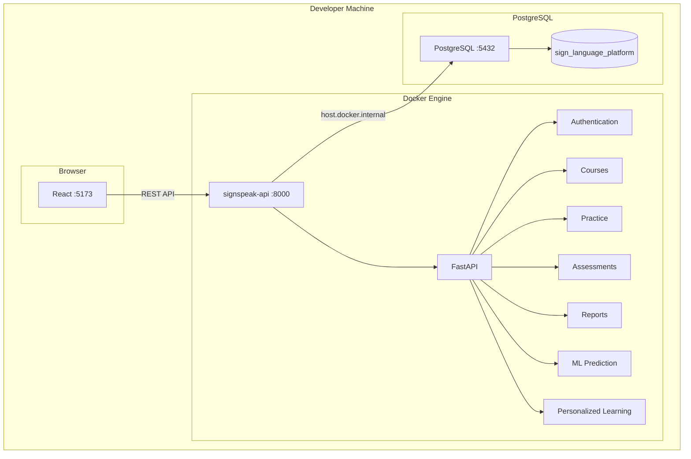

---

## 🧠 Model Deployment Architecture

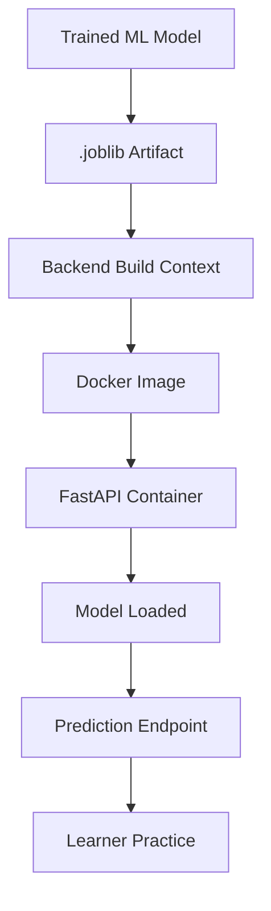

The current backend uses compact, pre-trained, serialized model artifacts for inference — the image does not train models at build or run time.

---

## 🧰 Docker Command Cheat Sheet

| Action | Command |
|---|---|
| Build | `docker build -t signspeak-backend ./backend` |
| Run | `docker run -d --name signspeak-api -p 8000:8000 signspeak-backend` |
| List running | `docker ps` |
| List all | `docker ps -a` |
| Logs | `docker logs signspeak-api` |
| Follow logs | `docker logs -f signspeak-api` |
| Stop | `docker stop signspeak-api` |
| Start | `docker start signspeak-api` |
| Restart | `docker restart signspeak-api` |
| Remove | `docker rm signspeak-api` |
| Inspect image | `docker inspect signspeak-backend` |

---

## 🚀 Startup Checklist

1. Start PostgreSQL
2. Verify the target database exists
3. Build the backend image
4. Run the backend container
5. Check container status (`docker ps`)
6. Test `/api/health`
7. Open Swagger UI
8. Start the React frontend
9. Verify frontend → API connectivity
10. Test authentication
11. Test the ML prediction endpoint
12. Test the practice/report flow

---

## 🔄 Example Request Journey

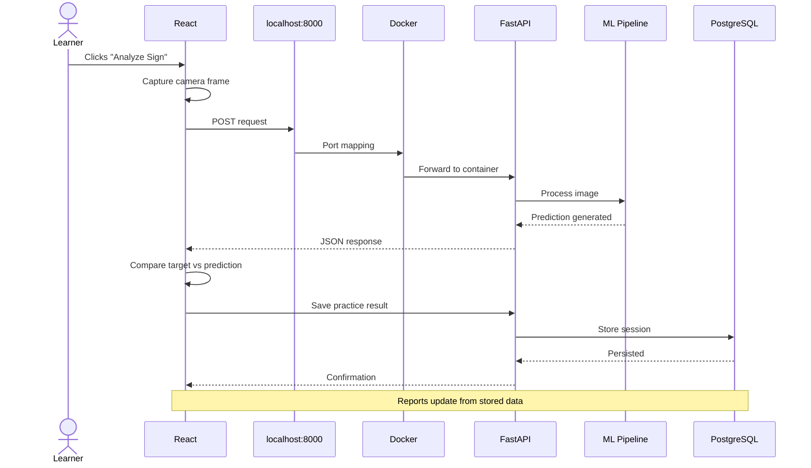

---

## 📊 Docker & Analytics

```
   PostgreSQL
        │
        ▼
Dockerized FastAPI
        │
        ▼
      Reports
   ┌────┼──────────┬──────────┬───────────────┐
   ▼    ▼          ▼          ▼               ▼
Learning Assessment Accuracy Progress  Sign Performance
        │
        ▼
  React Dashboard
```

Analytics APIs run through the same backend container as every other module — there is no separate analytics service.

---

## 🎯 Docker & Personalized Learning

```
Practice Data
      │
      ▼
FastAPI Container
      │
      ▼
   Analytics
      │
      ▼
Learning Plan Logic
      │
      ▼
POST /api/v1/ml/learning-plan
      │
      ▼
Personalized Recommendation
      │
      ▼
Frontend Dashboard
```

---

## 🗺️ Future Containerization Roadmap

> Everything below is **planned future work**, not current functionality.

- Docker Compose orchestration
- Frontend Docker image
- PostgreSQL container
- Dedicated Docker network
- Persistent PostgreSQL volume
- Reverse proxy
- Cloud container registry
- CI/CD-driven image builds
- Container vulnerability scanning
- Production secret management
- Cloud container deployment
- Kubernetes (only if future scale requires it)

---

## 🔮 Future Docker Compose Concept

```
Docker Compose
      │
      ├── frontend
      │
      ├── backend
      │
      └── postgres
```

> This is a **future architecture direction** and is **not** the current deployment. No `docker-compose.yml` currently exists in this project.

---

## 🛤️ Deployment Evolution

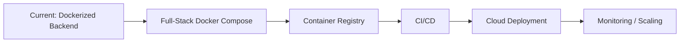

*(Everything after "Current: Dockerized Backend" represents future work.)*

---

## 📌 Important Technical Distinctions

> **Docker does not train the ML model.** Docker packages and runs the backend inference environment. The ML model is trained separately, offline; the resulting artifact is then loaded by the FastAPI inference service inside the container.

> **Docker does not replace PostgreSQL.** The current backend container connects to PostgreSQL running on the host machine — PostgreSQL itself is not containerized.

> **Docker does not replace the frontend.** The current React frontend runs separately via Vite, outside of Docker.

---

## 🗂️ Docker Architecture Summary

```
┌───────────────────────────────────────────────────────────┐
│                 SIGNSPEAK LOCAL STACK                      │
├───────────────────────────────────────────────────────────┤
│                                                             │
│ Browser                                                    │
│    │                                                       │
│    ▼                                                       │
│ React + Vite :5173                                         │
│    │                                                       │
│    │ REST API                                              │
│    ▼                                                       │
│ ┌─────────────────────────────────────────────────────────┐│
│ │ Docker: signspeak-api :8000                              ││
│ │                                                           ││
│ │ FastAPI                                                   ││
│ │ Authentication                                            ││
│ │ Learning APIs                                             ││
│ │ Practice                                                  ││
│ │ Assessments                                               ││
│ │ Analytics                                                 ││
│ │ ML Inference                                              ││
│ └───────────────────────┬───────────────────────────────────┘│
│                         │                                   │
│                         ▼                                   │
│              host.docker.internal                           │
│                         │                                   │
│                         ▼                                   │
│                PostgreSQL :5432                              │
│                         │                                   │
│                         ▼                                   │
│              sign_language_platform                          │
│                                                             │
└───────────────────────────────────────────────────────────┘
```

---

## ⚠️ Current Limitations

- Only the backend is currently containerized
- PostgreSQL runs separately on the host
- The frontend runs separately through Vite
- No Docker Compose orchestration yet
- No cloud container deployment yet
- No Kubernetes orchestration
- No automated image build/deployment pipeline
- ML model remains prototype-level for external/real-world generalization

---

## 💡 Containerization Principles

- Reproducible environments
- Runtime configuration through environment variables
- No hard-coded credentials
- Minimal exposed ports
- Clear separation between application and database
- Portable backend runtime
- Observable container logs
- Health verification before relying on the API
- Rebuild after dependency or source changes
- Keep experimental ML training separate from inference deployment

---

<div align="center">

### 🐳 SignSpeak Docker

*"Portable infrastructure for intelligent sign-language learning."*

**Docker • FastAPI • PostgreSQL • Python • Machine Learning**

</div>