<div align="center">

# 📚 SignSpeak Documentation

**Architecture, workflows, AI systems and engineering documentation for the SignSpeak learning platform.**

**System Design • Frontend • Backend • AI/ML • Analytics • Database • DevOps**

[](https://react.dev/)
[](https://fastapi.tiangolo.com/)
[](https://www.postgresql.org/)
[](https://www.python.org/)
[](https://scikit-learn.org/)
[](https://www.docker.com/)


</div>

---

## 📖 Documentation Overview

This directory is the **central technical documentation hub** for SignSpeak — an AI-powered platform for learning and assessing American Sign Language (ASL).

This hub covers:

- Product architecture — problem, solution, platform overview
- System architecture — how the frontend, backend, database, and ML layers connect
- Frontend architecture — UI structure, pages, and API integration
- Backend architecture — FastAPI modules, request lifecycle, security
- Database design — entities, relationships, and data domains
- AI/ML pipeline — the deployed classifier and experimental research model
- Learner analytics — sign performance, confusions, weak/strong signs
- Personalization — rule-based learning-plan recommendations
- API architecture — endpoint groups and workflows
- User journeys and role-based workflows
- UI structure via conceptual wireframes
- Docker deployment
- Testing strategy
- Known limitations and future architecture

Deeper, module-specific documentation lives in dedicated subdirectories:

| Directory | Focus |
|---|---|
| `frontend/` | React UI architecture |
| `backend/` | FastAPI and database architecture |
| `analytics/` | Learner intelligence and reporting |
| `ml/` | Model development and evaluation |
| `powerbi/` | BI datasets and dashboards |
| `docker/` | Containerization and deployment |

---

## 🗺️ Documentation Map

```mermaid
flowchart TD
    ROOT[SignSpeak Documentation]

    ROOT --> P[Product]
    P --> P1[Problem]
    P --> P2[Solution]
    P --> P3[Features]

    ROOT --> F[Frontend]
    F --> F1[UI Architecture]
    F --> F2[Pages]
    F --> F3[Components]
    F --> F4[API Integration]

    ROOT --> B[Backend]
    B --> B1[FastAPI]
    B --> B2[Authentication]
    B --> B3[REST APIs]
    B --> B4[Services]

    ROOT --> D[Database]
    D --> D1[PostgreSQL]
    D --> D2[SQLAlchemy]
    D --> D3[Alembic]

    ROOT --> AI[AI / ML]
    AI --> AI1[HOG]
    AI --> AI2[Linear SVM]
    AI --> AI3[CNN Experiments]
    AI --> AI4[Evaluation]

    ROOT --> AN[Analytics]
    AN --> AN1[Learner Analytics]
    AN --> AN2[Sign Performance]
    AN --> AN3[Confusions]
    AN --> AN4[Personalization]

    ROOT --> DO[DevOps]
    DO --> DO1[Docker]
    DO --> DO2[Deployment]
```

---

## 🤟 Platform Overview

SignSpeak is a full-stack learning platform that combines a **React frontend**, **FastAPI backend**, **PostgreSQL database**, and a **machine learning inference pipeline** to make ASL learning interactive, measurable, personalized, and analytics-driven.

**Core learner journey:**

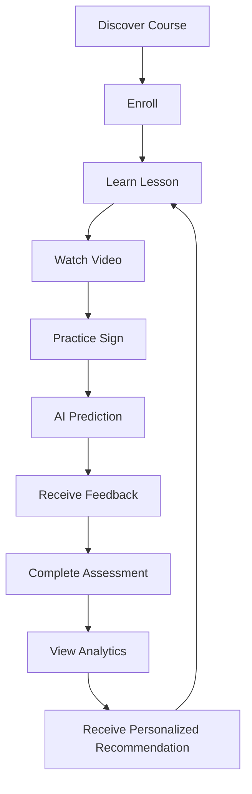

---

## 🎯 Problem Statement

Learners studying sign language independently often lack:

- Immediate, objective feedback while practicing signs
- Structured tracking of progress over time
- Measurable, quantified sign-performance data
- Personalized recommendations tailored to their weak areas
- Visibility into recurring mistakes (e.g. consistently confusing two signs)

SignSpeak addresses these gaps by connecting structured learning content, AI-assisted practice, and learner analytics into a single platform — so that practice generates data, and data drives better learning decisions.

---

## 💡 SignSpeak Solution

| Challenge | SignSpeak Solution |
|---|---|
| Structured learning | Courses and lessons |
| Visual learning | Lesson video integration |
| Practice feedback | AI-assisted sign prediction |
| Performance tracking | Practice-session analytics |
| Knowledge evaluation | Assessments |
| Learning difficulty | Weak-sign analysis |
| Repeated mistakes | Sign-confusion analysis |
| Personalization | Learning-plan recommendations |
| Progress visibility | Dashboard and reports |
| Administration | Role-based admin tools |

---

## 🏗️ System Architecture

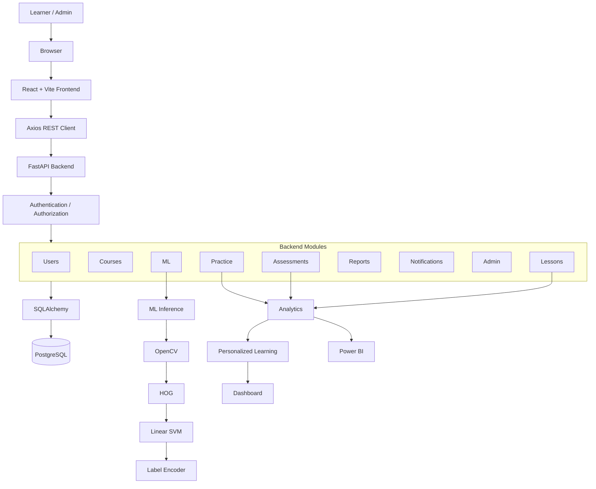

---

## 🧱 Platform Layers

```
┌─────────────────────────────────────────────────┐
│                EXPERIENCE LAYER                  │
│ React • Dashboard • Courses • Practice           │
├─────────────────────────────────────────────────┤
│               APPLICATION LAYER                  │
│ FastAPI • Authentication • Business Logic        │
├─────────────────────────────────────────────────┤
│              INTELLIGENCE LAYER                  │
│ ML Prediction • Analytics • Personalization       │
├─────────────────────────────────────────────────┤
│                  DATA LAYER                      │
│ PostgreSQL • SQLAlchemy • Practice History        │
├─────────────────────────────────────────────────┤
│              INFRASTRUCTURE LAYER                │
│ Docker • Uvicorn • Development Environment        │
└─────────────────────────────────────────────────┘
```

| Layer | Role |
|---|---|
| **Experience** | Everything the learner directly interacts with in the browser |
| **Application** | Request handling, authentication, and domain business logic |
| **Intelligence** | ML inference and the analytics/personalization logic built on top of it |
| **Data** | Persistent storage of all application and learner state |
| **Infrastructure** | The runtime environment the application executes within |

---

## 🧩 Technology Stack

| Layer | Technology | Responsibility |
|---|---|---|
| Frontend | React | UI component framework |
| Frontend | Vite | Development server & build tool |
| Frontend | Tailwind CSS | Utility-first styling |
| Frontend | React Router | Client-side routing |
| Frontend | Axios | HTTP client for API communication |
| Frontend | Recharts | Data visualization/charts |
| Frontend | Lucide React | Icon system |
| Backend | Python | Core application language |
| Backend | FastAPI | REST API framework |
| Backend | Uvicorn | ASGI application server |
| Backend | SQLAlchemy | ORM / database access layer |
| Backend | Alembic | Database migrations |
| Backend | Pydantic | Request/response validation |
| Database | PostgreSQL | Primary relational data store |
| Machine Learning | scikit-learn | Model training and inference (SVM) |
| Machine Learning | scikit-image | Feature extraction utilities |
| Machine Learning | OpenCV | Image decoding and preprocessing |
| Machine Learning | HOG | Feature extraction for classification |
| Machine Learning | Linear SVM | Deployed sign classifier |
| Machine Learning | CNN experimentation | Research/experimental classifier |
| Analytics | Python / Pandas | Data processing for analytics |
| Analytics | Power BI | Business-intelligence dashboards |
| Analytics | CSV datasets | Analytics-ready exported data |
| DevOps | Docker | Backend containerization |
| DevOps | Git / GitHub | Version control and collaboration |

---

## 🧩 SignSpeak Module Map

```
SignSpeak
│
├── Authentication          — account access and session security
├── Dashboard                — learner's central activity hub
├── Courses                  — structured learning catalog
├── Lessons                  — individual learning units with video
├── AI Practice               — camera-based sign practice with prediction
├── Assessments               — structured knowledge/skill evaluation
├── Reports                   — learner analytics and performance insight
├── Personalized Learning     — performance-based recommendations
├── Profile                   — learner identity and preferences
├── Settings                  — account configuration
├── Notifications             — system and progress messages
└── Administration            — platform and user management
```

---

## 📁 Repository Architecture

```
SignSpeak-Work/
│
├── analytics/
│
├── backend/
│   ├── alembic/
│   ├── app/
│   ├── models/
│   ├── scripts/
│   └── tests/
│
├── docker/
│
├── docs/
│   └── backend/
│
├── frontend/
│   ├── public/
│   └── src/
│
├── ml/
│   ├── data/
│   ├── models/
│   ├── notebooks/
│   ├── reports/
│   ├── results/
│   └── src/
│
├── powerbi/
│   └── data/
│
└── README.md
```

| Directory | Responsibility |
|---|---|
| `analytics/` | Learner intelligence and reporting logic/artifacts |
| `backend/` | FastAPI application, database models, migrations, tests |
| `docker/` | Containerization configuration and documentation |
| `docs/` | Central technical documentation (this hub) |
| `frontend/` | React + Vite client application |
| `ml/` | Model training, experimentation, and evaluation |
| `powerbi/` | BI-ready datasets and dashboard assets |

---

## 🎨 Frontend Architecture

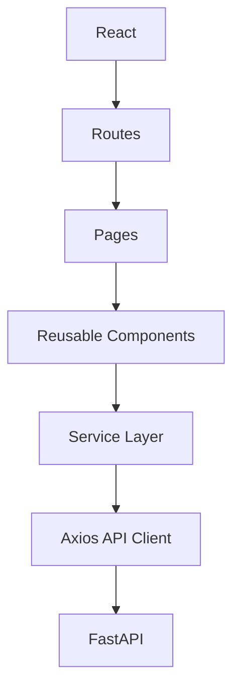

Major UI areas: Landing, Authentication, Dashboard, Courses, Lessons, Practice, Assessments, Reports, Profile, Settings, Notifications, and Admin.

---

## 🗺️ Frontend Page Map

```
SignSpeak
│
├── Public
│   ├── Landing
│   ├── Login
│   └── Register
│
├── Learner
│   ├── Dashboard
│   ├── Courses
│   ├── Lessons
│   ├── Practice
│   ├── Assessments
│   ├── Reports
│   ├── Profile
│   ├── Settings
│   └── Notifications
│
└── Admin
    └── Admin Dashboard
```

---

## 🖥️ Learner Dashboard Wireframe

```
┌────────────────────────────────────────────────────────────┐
│ SignSpeak                                  Profile • 🔔     │
├───────────────┬────────────────────────────────────────────┤
│               │ Welcome Back                               │
│ Dashboard     │                                            │
│ Courses       │ ┌────────┬────────┬────────┬─────────────┐ │
│ Practice      │ │Accuracy│Sessions│Lessons │Assessments  │ │
│ Assessments   │ └────────┴────────┴────────┴─────────────┘ │
│ Reports       │                                            │
│               │ Weekly Activity      Daily Goal            │
│               │                                            │
│               │ Priority Signs       Strong Signs          │
│               │                                            │
│               │ Personalized Recommendation                │
└───────────────┴────────────────────────────────────────────┘
```

*Wireframe values/content are illustrative.*

---

## 📚 Learning Experience

```
Course Catalogue
      │
      ▼
   Enrollment
      │
      ▼
Course Lessons
      │
      ▼
Lesson Content
      │
      ▼
Video Learning
      │
      ▼
  AI Practice
      │
      ▼
Lesson Progress
```

Current learning content focuses on **American Sign Language (ASL)**.

---

## 🎬 Lesson UI Wireframe

```
┌─────────────────────────────────────────────────────────────┐
│ Course > Lesson                                             │
├────────────────────────────────────┬────────────────────────┤
│                                    │ Lesson Navigation      │
│         VIDEO / CONTENT            │                        │
│                                    │ ✓ Introduction         │
│                                    │   Alphabet A-F         │
├────────────────────────────────────┤   Alphabet G-L         │
│ Lesson Explanation                 │   ...                  │
│                                    │                        │
├────────────────────────────────────┤                        │
│ AI PRACTICE                        │                        │
│ Practice this sign →               │                        │
└────────────────────────────────────┴────────────────────────┘
```

---

## 🤖 AI Practice Architecture

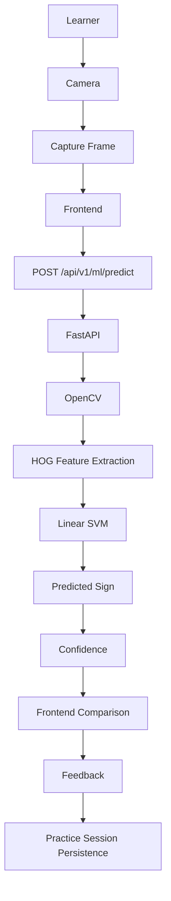

---

## 🔄 AI Practice Sequence

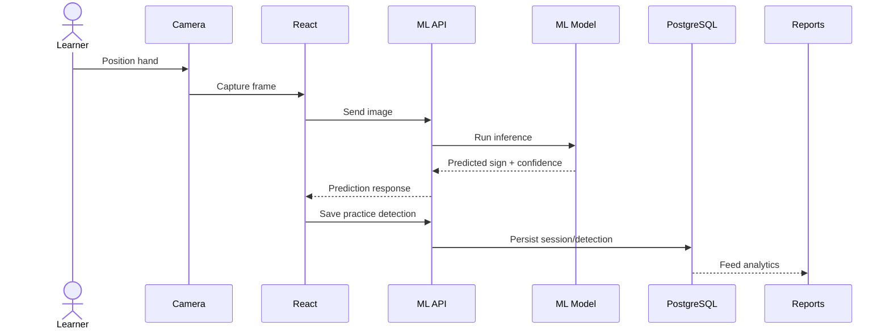

The frontend captures a single frame at a time and sends it for prediction — this is not continuous video streaming to the backend.

---

## 📷 Practice Workspace Wireframe

```
┌────────────────────────────────────────────────────────────┐
│                    Practice Sign: A                        │
├──────────────────────────────────┬─────────────────────────┤
│                                  │ Prediction              │
│                                  │                         │
│          CAMERA PANEL            │ Predicted: A            │
│                                  │ Confidence: 91%         │
│                                  │ Status: Correct         │
│                                  │                         │
├──────────────────────────────────┼─────────────────────────┤
│ Start Camera • Analyze Sign      │ Feedback                │
│                                  │ Recommendation          │
└──────────────────────────────────┴─────────────────────────┘
```

*Displayed values are illustrative.*

---

## 🧠 Machine Learning Architecture

Two distinct areas exist and should never be conflated:

**Backend Inference Model** — HOG + Linear SVM
**Experimental Model** — CNN + Data Augmentation (research only)

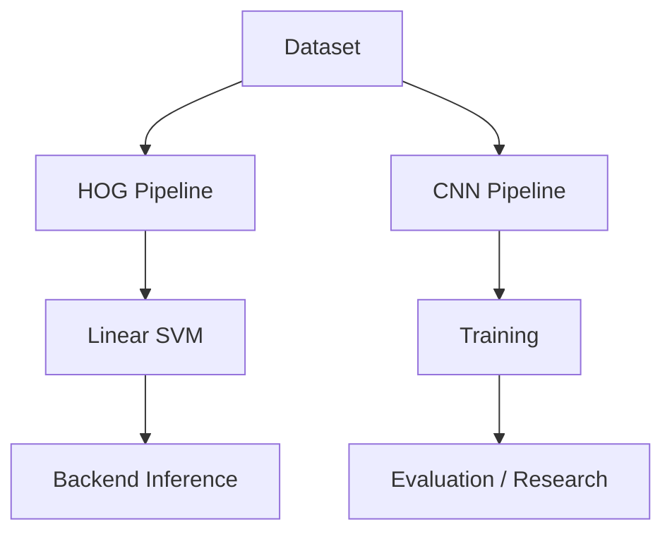

---

## 📊 ML Evaluation

| Model | Validation Accuracy | Test Accuracy |
|---|---:|---:|
| HOG + Linear SVM | 91.14% | 91.09% |
| CNN + Data Augmentation | 91.62% | 90.98% |

These figures reflect **in-distribution** results on the controlled validation/test dataset, not real-world generalization.

---

## ⚠️ Real-World Generalization

A small custom external image set produced poor classification results, including confusions such as:

| Target | Predicted |
|---|---|
| A | N |
| B | E |
| C | O |
| L | Q |
| V | K |

This exposed a **domain/generalization gap** between the training distribution and real-world image conditions. The model should **not** be considered production-grade sign recognition.

Improvement directions:

- More diverse training data
- Lighting augmentation
- Background augmentation
- Hand landmark normalization
- MediaPipe-based preprocessing
- Transfer learning
- Signer-independent evaluation

---

## ⚡ Backend Architecture

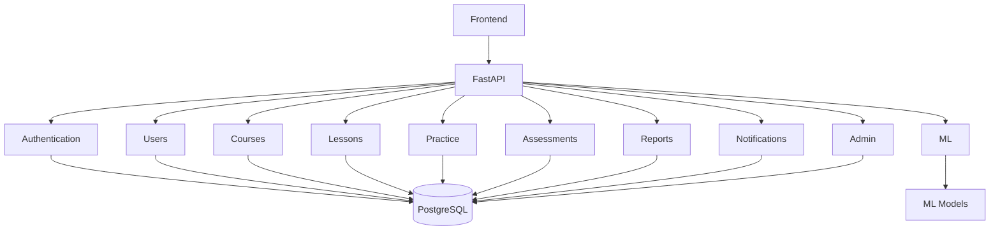

---

## 🔌 API Architecture

| API Area | Purpose | Example Endpoint |
|---|---|---|
| Authentication | Registration, login, session tokens | `POST /api/v1/auth/login` |
| Users | Learner profile management | `GET /api/users/profile` |
| Courses | Structured course catalog | `GET /api/courses` |
| Lessons | Lesson content and progress | `GET /api/lessons/{id}` |
| Practice | AI-assisted practice sessions | `POST /api/practice/sessions` |
| Assessments | Question delivery and scoring | `POST /api/assessments/{id}/submit` |
| Reports | Learner analytics | `GET /api/reports/sign-performance` |
| Notifications | User-facing messages | `GET /api/notifications` |
| Administration | User/platform management | `GET /api/admin/users` |
| Machine Learning | Sign prediction & recommendations | `POST /api/v1/ml/predict`, `POST /api/v1/ml/learning-plan` |
| Health | Service availability | `GET /api/health` |

---

## 🔄 Request Lifecycle

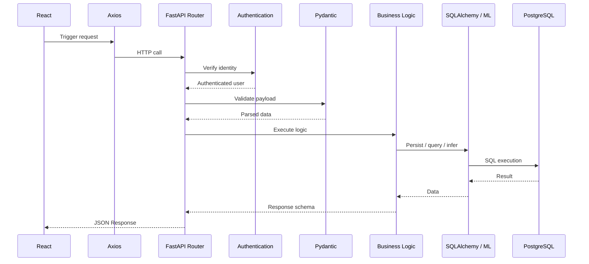

---

## 🔐 Authentication Flow

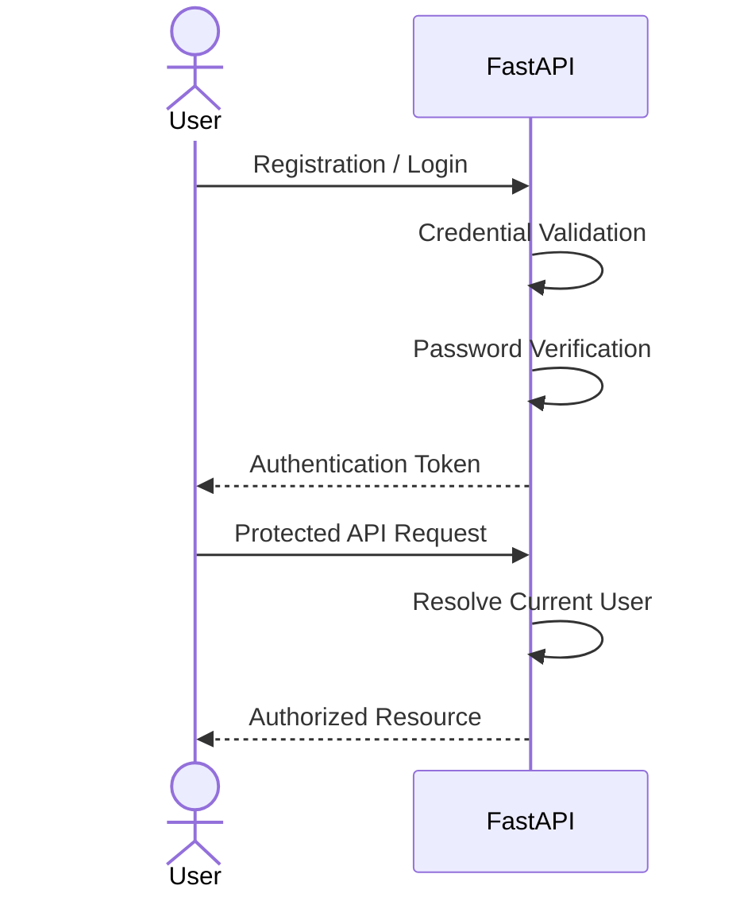

---

## 👥 User Roles

| Role | Description |
|---|---|
| `student` | Default learner role with access to courses, practice, assessments, and personal reports |
| `instructor` | Supported role identity relevant to course/lesson oversight |
| `accessibility_trainer` | Supported role identity for accessibility-focused contexts |
| `admin` | Administrative access to platform-wide user management |

Administrator routes provide user-management functionality (viewing users, creating staff, changing roles, activating/deactivating accounts). Role-based access control ensures protected endpoints check both authentication and role before granting access.

---

## 🗄️ Data Architecture

```
FastAPI
   │
   ▼
SQLAlchemy
   │
   ▼
PostgreSQL
```

Major data domains: Users, Courses, Lessons, Enrollments/Progress, Practice Sessions, Assessments, Assessment Results, Notifications.

---

## 🧬 Database ER Diagram

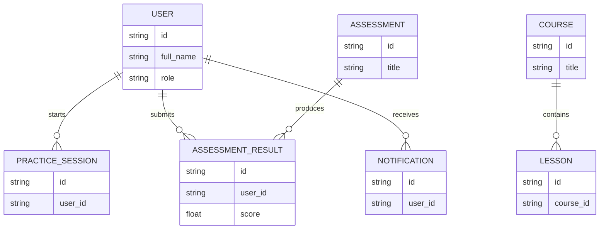

*Diagram shows architectural relationships rather than every database column.*

---

## 📦 Practice Data Flow

```
PracticeSession
│
├── target_gesture
├── attempts
├── successful_attempts
├── average_confidence
├── duration
└── detections
     │
     ├── target_gesture
     ├── predicted_gesture
     ├── confidence
     ├── correct
     ├── feedback
     ├── recommendation
     └── timestamp
```

Storing detection-level history (rather than just a session summary) enables richer analytics — per-sign accuracy, confusion pairs, and trend analysis all depend on this granularity.

---

## 📈 Learner Analytics Architecture

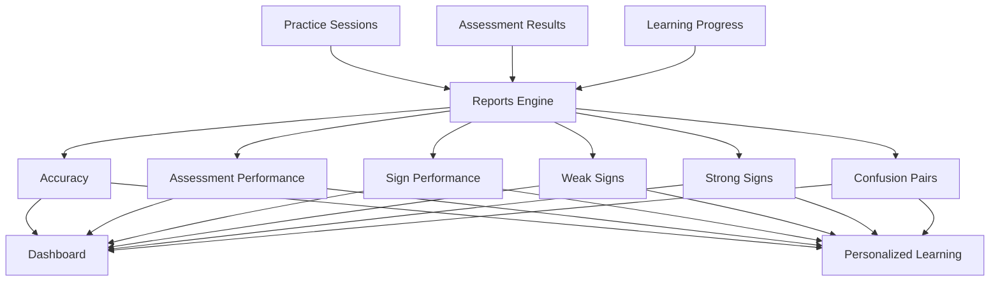

---

## 🎯 Sign Intelligence

**Weak Sign** — `attempts >= 1 AND accuracy < 70%`
**Strong Sign** — `attempts >= 1 AND accuracy >= 80%`

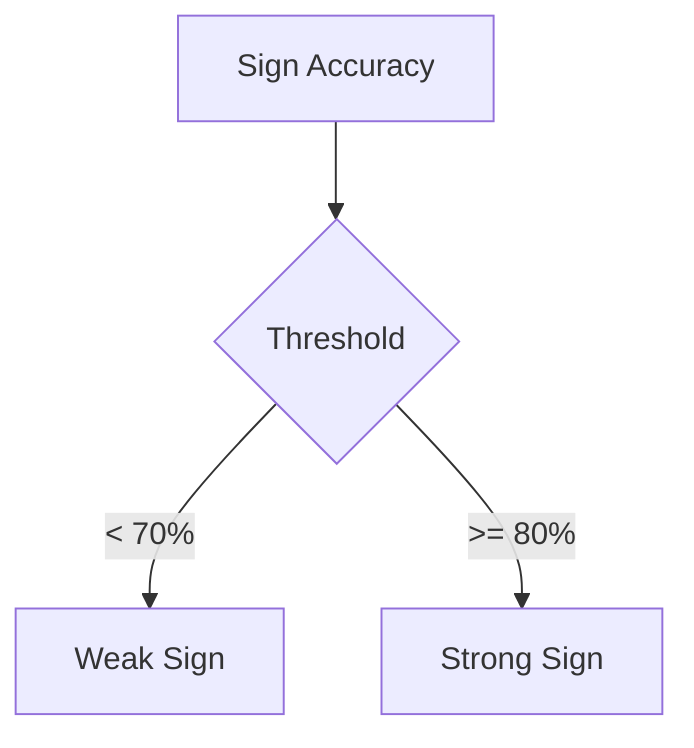

---

## 🔀 Confusion Analysis

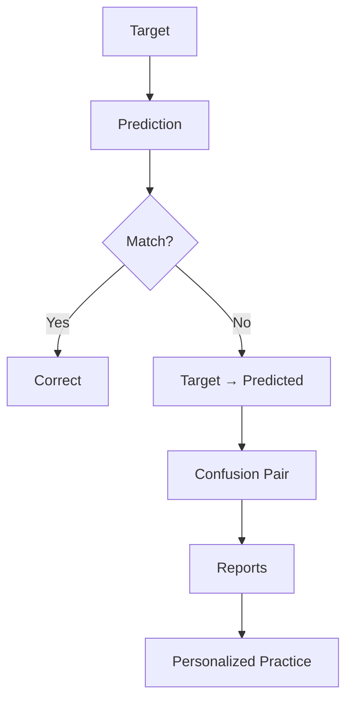

---

## 🎯 Personalized Learning

```
Learner History
      │
      ▼
Current Performance
      │
      ▼
   Weak Signs
      │
      ▼
  Priority Signs
      │
      ▼
 Accuracy Target
      │
      ▼
Recommended Focus
      │
      ▼
Next Practice Action
```

Exposed via `POST /api/v1/ml/learning-plan`.

> Personalized learning recommendations are **performance-based, rule-based logic** — not a generative AI model.

---

## 📐 Progressive Target Logic

```text
target_accuracy = min( max(current_accuracy + 10, 70), 95 )
```

| Current | Target |
|---:|---:|
| 0% | 70% |
| 30% | 70% |
| 60% | 70% |
| 65% | 75% |
| 72% | 82% |
| 80% | 90% |
| 90% | 95% |

---

## 📝 Assessment Architecture

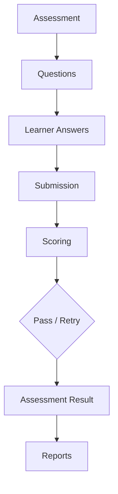

Supported question categories: `multiple_choice`, `gesture_recognition`, `true_false`.

> Gesture-recognition assessment prompts do not currently represent a fully camera-driven, live-ML assessment pipeline.

---

## 🗒️ Assessment UI Wireframe

```
┌────────────────────────────────────────────────────────────┐
│ ASL Assessment                              12:42          │
├────────────────────────────────────────────────────────────┤
│ Question 08 / 25                                           │
│                                                            │
│ Which sign represents ... ?                                │
│                                                            │
│ ○ Option A                                                 │
│ ○ Option B                                                 │
│ ○ Option C                                                 │
│ ○ Option D                                                 │
│                                                            │
│                          Previous     Next                  │
└────────────────────────────────────────────────────────────┘
```

---

## 📊 Reports Wireframe

```
┌─────────────────────────────────────────────────────────────┐
│                    PERFORMANCE ANALYTICS                    │
├────────────┬────────────┬────────────┬─────────────────────┤
│ Accuracy   │ Sessions   │ Confidence │ Assessment Average  │
├────────────┴────────────┴────────────┴─────────────────────┤
│ Weekly Activity              │ Sign Accuracy               │
│      Line Chart              │      Bar Chart              │
├──────────────────────────────┼─────────────────────────────┤
│ Priority Signs               │ Strong Signs                │
├──────────────────────────────┼─────────────────────────────┤
│ Confusion Pairs              │ Assessment Summary          │
└──────────────────────────────┴─────────────────────────────┘
```

*This is a conceptual documentation wireframe.*

---

## 🔔 Notifications

Types: `info`, `success`, `warning`, `achievement`, `course`.

```
Backend Notification
      │
      ▼
     User
      │
      ▼
Notification API
      │
      ▼
  React Inbox
      │
      ▼
Unread / Read
      │
      ▼
Mark Read / Delete
```

---

## 🧑‍💼 Administration

```
Admin Dashboard
      │
      ▼
Backend Admin API
      │
      ▼
User Management
      │
      ├── View Users
      ├── Create Staff
      ├── Change Role
      └── Activate / Deactivate
```

Administration endpoints require administrator authorization in addition to standard authentication.

---

## 🗂️ Admin Wireframe

```
┌────────────────────────────────────────────────────────────┐
│                     ADMIN CONTROL                          │
├───────────┬───────────┬───────────┬───────────────────────┤
│ Users     │ Students  │ Staff     │ Active Accounts       │
├───────────┴───────────┴───────────┴───────────────────────┤
│ Search Users                         + Create Staff        │
├────────────────────────────────────────────────────────────┤
│ Name      Email       Role       Status        Actions     │
│ --------------------------------------------------------- │
│ User      ...         Student    Active        Manage      │
└────────────────────────────────────────────────────────────┘
```

---

## 📊 Power BI Analytics

Analytics-ready CSV exports include:

- `cnn_training_history.csv`
- `external_predictions.csv`
- `learner_performance.csv`
- `model_performance.csv`
- `sign_confusions.csv`
- `sign_performance.csv`

```
Application / ML Results
         │
         ▼
   Analytics CSV
         │
         ▼
     Power BI
         │
         ▼
Model Performance • Learner Performance • Sign Confusions • Training Analysis
```

---

## 🗺️ Power BI Wireframe

```
┌────────────────────────────────────────────────────────────┐
│                 SIGNSPEAK BI DASHBOARD                    │
├──────────────┬──────────────┬──────────────┬──────────────┤
│ Model Acc.   │ Learner Acc. │ Weak Signs   │ Sessions     │
├──────────────┴──────────────┴──────────────┴──────────────┤
│ Model Comparison              │ Learner Trend              │
├───────────────────────────────┼────────────────────────────┤
│ Sign Performance              │ Confusion Analysis         │
├───────────────────────────────┴────────────────────────────┤
│ CNN Training History                                      │
└────────────────────────────────────────────────────────────┘
```

*Values and visuals shown are conceptual.*

---

## 🐳 Deployment Architecture

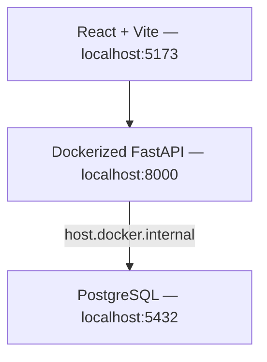

---

## 🔁 Docker Deployment Flow

```
Backend Source
      │
      ▼
  Docker Build
      │
      ▼
signspeak-backend
      │
      ▼
  Docker Run
      │
      ▼
 signspeak-api
      │
      ▼
 FastAPI :8000
      │
      ▼
  PostgreSQL
```

| Item | Value |
|---|---|
| Backend image | `signspeak-backend` |
| Container | `signspeak-api` |

---

## 🧭 Complete Learner Journey

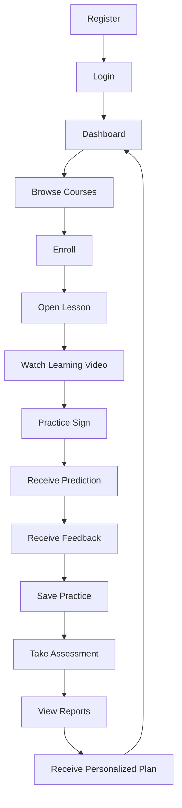

---

## 🧠 Complete AI Data Journey

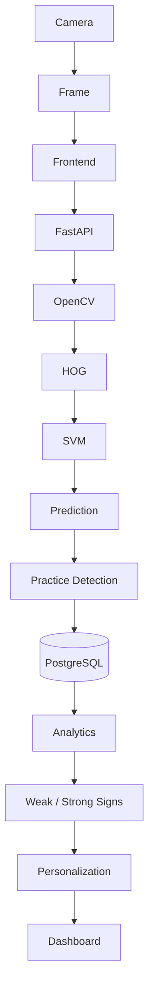

---

## 👥 Role-Based Journeys

**Student**

```
Login → Learn → Practice → Assess → Analyze → Improve
```

**Admin**

```
Login → Admin Dashboard → View Users → Create Staff → Manage Roles → Manage Status
```

`instructor` and `accessibility_trainer` are supported role identities in the system; no dedicated workflows beyond standard authenticated access are currently implemented for them.

---

## 🎨 UI Design Direction

SignSpeak's interface follows a modern AI/SaaS-inspired visual direction:

- Dark surfaces with a cyan accent
- Clear typography hierarchy
- Compact analytical cards
- Data-focused dashboards
- Responsive layout
- Consistent navigation
- Status indicators, charts, and progress indicators

---

## 💡 Engineering Principles

- Modular architecture
- Separation of concerns
- API-driven frontend
- Persistent learner state
- Authenticated user data
- Explainable personalization
- Detection-level analytics
- Transparent ML evaluation
- Reusable frontend components
- Containerized backend
- Environment-based configuration

---

## 🔐 Security Overview

Implemented:

- Password hashing
- Authentication
- Protected routes
- Role-based authorization
- Resource ownership checks
- Pydantic validation
- CORS configuration
- Environment-based configuration

> Not implemented or claimed: MFA, SOC 2, HIPAA, GDPR certification, penetration testing, or enterprise-grade encryption.

---

## 🧪 Testing Strategy

```
              End-to-End
          Integration Tests
        API / Validation Tests
      Unit / Service-Level Tests
```

Coverage areas: Authentication, Database, Practice, ML inference, Assessments, Reports, Notifications, Admin, Frontend build, Docker health.

> Complete automated test coverage is not claimed.

---

## 🔁 Full Pipeline Validation

```
   Camera
      │
      ▼
  Prediction
      │
      ▼
Frontend Comparison
      │
      ▼
 Practice API
      │
      ▼
 PostgreSQL
      │
      ▼
 Reports API
      │
      ▼
 Dashboard
      │
      ▼
Personalized Recommendation
```

This represents the core AI practice integration path validated end-to-end across the platform.

---

## 🧹 Data Quality Considerations

Analytics quality depends on meaningful learner activity and reliable model predictions. Factors that can affect insight quality include:

- Zero-attempt practice sessions
- Small learner histories
- High-confidence incorrect predictions
- Model-domain mismatch
- Missing or incomplete activity
- Limited assessment history

---

## ⚠️ Confidence vs Correctness

> **Target:** A
> **Prediction:** M
> **Confidence:** 93.33%
> **Result:** Incorrect

**High model confidence does not mean the prediction is correct.** This distinction is important when interpreting learner analytics — a confident wrong answer should not be mistaken for a reliable signal.

---

## 📌 Platform Status

| Module | Status |
|---|---|
| React Frontend | ✅ Implemented |
| FastAPI Backend | ✅ Implemented |
| PostgreSQL | ✅ Integrated |
| Authentication | ✅ Integrated |
| Courses | ✅ Integrated |
| Lessons | ✅ Integrated |
| Video Learning | ✅ Integrated |
| AI Practice | ✅ Integrated |
| Practice Persistence | ✅ Integrated |
| ML Prediction | ✅ Integrated |
| Assessments | ✅ Integrated |
| Reports | ✅ Integrated |
| Personalized Learning | ✅ Integrated |
| Notifications | ✅ Integrated |
| Admin | ✅ Integrated |
| Docker Backend | ✅ Implemented |
| Power BI Data | ✅ Prepared |
| Production ML Robustness | ⚠️ Improvement Required |

---

## ⚠️ Known Limitations

- Current learning content focuses on ASL
- The current ML model is prototype-level
- External custom-image testing exposed poor generalization
- Prediction confidence does not guarantee correctness
- Gesture-recognition assessment prompts do not currently represent a fully camera-driven assessment pipeline
- Power BI is an additional analytics layer, not part of the live web application runtime
- Only the backend is currently containerized
- Cloud production deployment is future work

---

## 🚀 Future Architecture

Clearly labeled future enhancements:

- MediaPipe landmark normalization
- Continuous sign recognition
- Sequence models (LSTM / Transformer experiments)
- Real-time prediction streaming
- Instructor analytics
- Advanced recommendation models
- Mobile application
- Cloud deployment
- Docker Compose
- CI/CD
- Model monitoring
- Model versioning
- Managed PostgreSQL
- Automated Power BI refresh

---

## 🛤️ Future Architecture Diagram

> **Future Direction — Not Current Architecture**

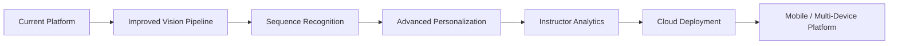

---

## 📚 Documentation Navigation

| Documentation | Purpose |
|---|---|
| [Root README](../README.md) | Complete project overview |
| [Frontend README](../frontend/README.md) | UI and React architecture |
| [Backend README](../backend/README.md) | FastAPI and database architecture |
| [Analytics README](../analytics/README.md) | Learner intelligence and reporting |
| [ML README](../ml/README.md) | Model development and evaluation |
| [Power BI README](../powerbi/README.md) | BI datasets and dashboards |
| [Docker README](../docker/README.md) | Containerization and deployment |
| Docs README | Central technical documentation hub (this file) |

---

## 🔎 Quick Architecture Reference

```
┌─────────────────────────────────────────────────────────────┐
│                       SIGNSPEAK                             │
├─────────────────────────────────────────────────────────────┤
│                                                             │
│  EXPERIENCE                                                 │
│  React • Courses • Lessons • Practice • Reports             │
│                          │                                  │
│                          ▼                                  │
│  APPLICATION                                                │
│  FastAPI • Auth • APIs • Business Logic                     │
│                          │                                  │
│                ┌─────────┴─────────┐                        │
│                ▼                   ▼                        │
│  INTELLIGENCE                 DATA                          │
│  HOG + SVM                    PostgreSQL                    │
│  Analytics                    SQLAlchemy                    │
│  Personalization              Learner History               │
│                │                   │                        │
│                └─────────┬─────────┘                        │
│                          ▼                                  │
│  INSIGHTS                                                   │
│  Dashboard • Reports • Power BI                              │
│                                                             │
├─────────────────────────────────────────────────────────────┤
│  INFRASTRUCTURE                                              │
│  Docker • Uvicorn • GitHub                                   │
└─────────────────────────────────────────────────────────────┘
```

---

## 📌 Important Technical Distinctions

- **HOG + Linear SVM** — current, compact backend sign-classification model.
- **CNN + Data Augmentation** — separate experimental ML approach, not deployed.
- **Personalized Learning** — performance-based recommendation logic. It is **not** a generative AI model.
- **Camera Practice** — individual camera frames are captured and sent for prediction. It is **not** continuous backend video streaming.
- **Prediction Confidence ≠ Prediction Correctness.**
- **Power BI** — a separate analytical visualization layer, not part of the FastAPI runtime.
- **Docker** — currently containerizes the backend only. The React frontend and PostgreSQL run separately in the current local setup.

---

## 🔬 Model Transparency

**HOG + Linear SVM**
- Validation Accuracy: 91.14%
- Test Accuracy: 91.09%

**CNN + Data Augmentation**
- Validation Accuracy: 91.62%
- Test Accuracy: 90.98%

**External custom testing:** a tiny custom external sample set produced **0% successful classifications**.

> This demonstrates a domain/generalization gap between the training distribution and real-world conditions — it does **not** mean the model has universally 0% real-world accuracy. It is disclosed here transparently rather than omitted.

---

<div align="center">

### 📚 SignSpeak Documentation

*"From system architecture to learner intelligence — the complete engineering story behind SignSpeak."*

**React • FastAPI • PostgreSQL • Machine Learning • Analytics • Docker**

</div>