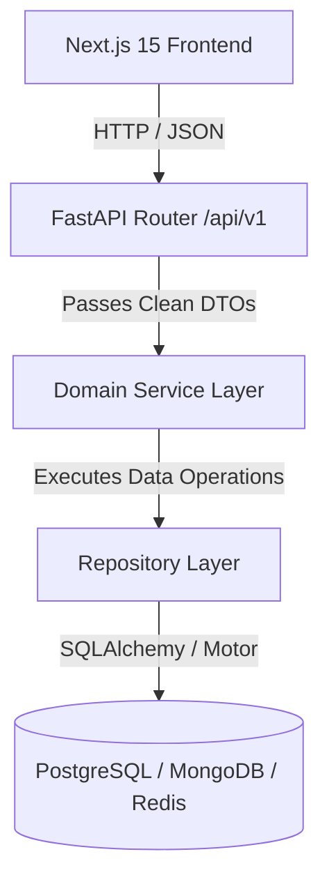

# SignLearn Architecture Overview

## Clean Architecture Principles

SignLearn follows strict **Clean Architecture** and **SOLID Design Principles** to ensure modularity, maintainability, and testability.

### Layer Separation Rules
1. **Routers (`app/api/v1/` & `app/routers/`)**:
   - Responsibilities: Parse HTTP requests, validate request bodies via Pydantic schemas, invoke Service methods, and format HTTP responses.
   - **RULE:** Routers MUST NEVER access database engines or write SQL/MongoDB queries directly.

2. **Services (`app/services/`)**:
   - Responsibilities: Encapsulate all business rules, orchestration across repositories, and domain calculations.
   - **RULE:** Services MUST NEVER read directly from HTTP Request objects.

3. **Repositories (`app/repositories/`)**:
   - Responsibilities: Perform CRUD persistence operations using SQLAlchemy AsyncSession, Motor, or Redis.
   - **RULE:** Repositories contain zero business logic.

4. **Models (`app/models/`)**:
   - Reusable SQLAlchemy ORM entities inheriting from `app.models.base.BaseModel`.

