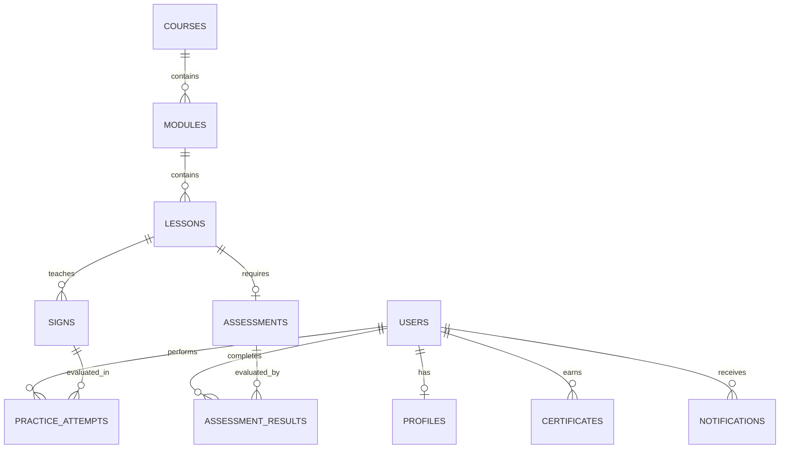

# SignLearn Database Overview & Future Schema Plan

This document details the database architecture and planned entity relationships for Phase 2+.

---

## 1. Multi-Database Architecture

- **PostgreSQL 16 (Primary RDBMS)**: Stores relational data requiring ACID compliance (Users, Profiles, Courses, Lessons, Assessments, Certificates, Subscriptions).
- **MongoDB 7.0 (Secondary NoSQL Store)**: Stores high-volume, dynamic spatial landmark datasets, raw AI gesture frame coordinate histories, and system event logs.
- **Redis 7.0 (In-Memory Cache & Pub/Sub)**: Manages active user sessions, token blacklists, real-time AI socket state, and API response caching.

---

## 2. Planned Entity Models & Relationships

### Future Entity Definitions:

1. **Users (`users`)**:
   - `id` (UUID), `email`, `hashed_password`, `role` (Learner, Instructor, Accessibility Trainer, Admin), `is_active`, `is_verified`.

2. **Profiles (`profiles`)**:
   - `id`, `user_id` (FK -> users.id), `full_name`, `bio`, `preferred_sign_language` (ASL, ISL, BSL), `avatar_url`.

3. **Courses (`courses`)**:
   - `id`, `title`, `description`, `difficulty_level`, `instructor_id` (FK -> users.id), `thumbnail_url`.

4. **Modules (`modules`)**:
   - `id`, `course_id` (FK -> courses.id), `title`, `order_index`.

5. **Lessons (`lessons`)**:
   - `id`, `module_id` (FK -> modules.id), `title`, `content_markdown`, `video_url`.

6. **Signs (`signs`)**:
   - `id`, `lesson_id` (FK -> lessons.id), `gesture_name`, `description`, `landmark_model_key`.

7. **PracticeAttempts (`practice_attempts`)**:
   - `id`, `user_id` (FK -> users.id), `sign_id` (FK -> signs.id), `accuracy_score`, `feedback_json`, `duration_ms`.

8. **Assessments (`assessments`)**:
   - `id`, `lesson_id` (FK -> lessons.id), `title`, `passing_score`.

9. **AssessmentResults (`assessment_results`)**:
   - `id`, `assessment_id` (FK -> assessments.id), `user_id` (FK -> users.id), `score`, `passed`.

10. **Certificates (`certificates`)**:
    - `id`, `user_id` (FK -> users.id), `course_id` (FK -> courses.id), `certificate_code`, `issued_at`.

11. **Notifications (`notifications`)**:
    - `id`, `user_id` (FK -> users.id), `title`, `message`, `is_read`.

12. **Reports (`reports`)**:
    - `id`, `reporter_id` (FK -> users.id), `target_type`, `description`, `status`.
