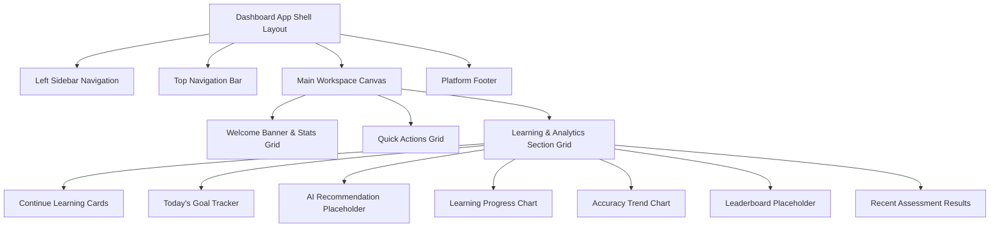

# SignLearn Platform — Learner Dashboard Layout & Component Architecture

```text
================================================================================
INFOSYS SPRINGBOARD INTERNSHIP PROJECT DELIVERABLE
Project Name : AI-Powered Sign Language Learning & Assessment Platform (SignLearn)
Document Type: Learner Dashboard Architectural & Component Specification
Document ID  : DOC-DASH-2026-V1
Version      : 1.0.0
Author       : Infosys Springboard Team 2 (Amrutha)
Date         : July 30, 2026
Status       : Complete (Milestone 1 Approved Deliverable)
================================================================================
```

---

## Document Control & Revision History

| Version | Date | Author | Description of Changes |
| :--- | :--- | :--- | :--- |
| **1.0.0** | 2026-07-30 | Infosys Team 2 (Amrutha) | Initial complete release of Milestone 1 Learner Dashboard Layout Plan. |

---

## Table of Contents

1. [Executive Overview & Objectives](#1-executive-overview--objectives)
2. [Scope & Operational Boundaries](#2-scope--operational-boundaries)
3. [Dashboard Layout Architecture](#3-dashboard-layout-architecture)
4. [Component Specifications](#4-component-specifications)
   - [4.1 Left Sidebar Navigation](#41-left-sidebar-navigation)
   - [4.2 Top Navigation Bar](#42-top-navigation-bar)
   - [4.3 Welcome Banner & Learning Statistics](#43-welcome-banner--learning-statistics)
   - [4.4 Quick Actions Launchpad](#44-quick-actions-launchpad)
   - [4.5 Learning Path & Continue Learning Cards](#45-learning-path--continue-learning-cards)
   - [4.6 Recommended Lessons & AI Guidance](#46-recommended-lessons--ai-guidance)
   - [4.7 Today's Goal Tracker](#47-todays-goal-tracker)
   - [4.8 Recent Activity Feed](#48-recent-activity-feed)
   - [4.9 Achievements & Badge Showcase](#49-achievements--badge-showcase)
   - [4.10 Leaderboard Placeholder](#410-leaderboard-placeholder)
   - [4.11 AI Recommendation Placeholder](#411-ai-recommendation-placeholder)
   - [4.12 Learning Progress Chart](#412-learning-progress-chart)
   - [4.13 Accuracy Trend Chart](#413-accuracy-trend-chart)
   - [4.14 Recent Assessment Results](#414-recent-assessment-results)
   - [4.15 Upcoming Lessons Calendar](#415-upcoming-lessons-calendar)
   - [4.16 Dashboard Footer](#416-dashboard-footer)
5. [Future API & Database Master Integration Mapping](#5-future-api--database-master-integration-mapping)
6. [Visual Assets Reference](#6-visual-assets-reference)
7. [References & Glossary](#7-references--glossary)

---

## 1. Executive Overview & Objectives

The **SignLearn AI Learner Dashboard** serves as the central intelligent hub for sign language students. It aggregates real-time gesture accuracy metrics, daily learning streaks, gamified XP progress, AI recommendations, and upcoming curriculum milestones into a unified visual workspace.

---

## 2. Scope & Operational Boundaries

> [!IMPORTANT]
> **Phase 1 Planning Status**: This document details component layout structures, future API contracts, and database sources. No source code changes have been introduced into `frontend/` or `backend/` during Milestone 1.

---

## 3. Dashboard Layout Architecture

### 3.1 Component Hierarchy Diagram


### 3.2 Visual Grid Layout
```text
+-----------------------------------------------------------------------------------+
| [LOGOMARK] SignLearn | [Search Lessons/Signs...  ]  (3 Alerts)  [Alex Johnson v]  |
+----------------------+------------------------------------------------------------+
| - Dashboard (Active) | Welcome back, Alex Johnson!                                |
| - Learn              | Level 4 Scholar | 7-Day Streak | XP: 1,450                  |
| - Practice           | +--------------+ +--------------+ +--------------+ +--------+ |
| - Assessments        | | Lessons: 24  | | Accuracy: 94%| | Streak: 7d   | | XP:1.4k| |
| - Progress           | +--------------+ +--------------+ +--------------+ +--------+ |
| - Achievements       | QUICK ACTIONS:                                             |
| - Profile            | [ Continue Lesson ] [ Practice Signs ] [ Take Assessment ] |
| - Settings           |                                                            |
|                      | CONTINUE LEARNING:                                         |
|                      | +--------------------------------------------------------+ |
|                      | | ASL Module 3: Fingerspelling Alphabet                  | |
|                      | | Progress: 65% [=====================>        ]         | |
|                      | | [ RESUME LESSON ]                                      | |
|                      | +--------------------------------------------------------+ |
|                      |                                                            |
|                      | ANALYTICS:                                                 |
|                      | [ Learning Progress Chart ]   [ Accuracy Trend Chart ]     |
+----------------------+------------------------------------------------------------+
| (c) 2026 SignLearn AI Platform. Version 1.0.0-Milestone1.                         |
+-----------------------------------------------------------------------------------+
```

---

## 4. Component Specifications

---

### 4.1 Left Sidebar Navigation

- **Purpose**: Primary vertical site navigation providing access to core platform sections.
- **Displayed Information**: Logomark, Navigation items (Dashboard, Learn, Practice, Assessments, Progress, Achievements, Profile, Settings), Active state highlight, Collapse toggle.
- **Future API Integration**: `GET /api/v1/users/me/nav-state`
- **Future Database Source**: PostgreSQL `users` table (`role`, `permissions`).
- **Responsive Behaviour**:
  - Desktop (>1024px): Expanded fixed sidebar (250px).
  - Tablet (768px-1024px): Collapsed icon-only mini rail (64px).
  - Mobile (<768px): Hidden off-canvas drawer triggered by topbar hamburger icon.
- **Loading State**: Skeleton sidebar item placeholders.
- **Empty State**: N/A (Static navigation structure).
- **Error State**: Graceful fallback displaying default public links.

---

### 4.2 Top Navigation Bar

- **Purpose**: Global header containing search functionality, real-time alert notifications, and user profile drawer.
- **Displayed Information**: Search input field, Notification bell with unread badge count (e.g., `3`), User avatar image, User full name, Profile dropdown menu (Profile, Settings, Logout).
- **Future API Integration**:
  - Search: `GET /api/v1/search?q={query}`
  - Notifications: `GET /api/v1/notifications/unread`
- **Future Database Source**: PostgreSQL `notifications` table, Redis cache key `session:{token}`.
- **Responsive Behaviour**: Search input collapses into a search icon button on mobile. Profile name hidden on screens <768px.
- **Loading State**: Pulse animation on avatar and notification badge.
- **Empty State**: Notification drawer displays "No new notifications".
- **Error State**: Red indicator dot showing offline/sync error.

---

### 4.3 Welcome Banner & Learning Statistics

- **Purpose**: Greet returning learner and summarize current mastery progress metrics.
- **Displayed Information**:
  - Greeting text: `Welcome back, <Learner Name>`
  - Subtitle: `Current Level: Level <N> <Title>`
  - 6 Key Metric Cards:
    1. Lessons Completed (Count)
    2. Overall Accuracy (%)
    3. Daily Streak (Days count + streak fire indicator)
    4. XP Points (Total accumulated XP)
    5. Current Level (Level rank badge)
    6. Weekly Progress (% increase this week)
- **Future API Integration**: `GET /api/v1/analytics/learner-stats`
- **Future Database Source**: PostgreSQL `practice_attempts` (aggregates), `profiles` (`xp`, `streak_count`, `level`).
- **Responsive Behaviour**: 6-card grid renders as 6x1 on Desktop, 3x2 on Tablet, 2x3 or 1x6 stacked on Mobile.
- **Loading State**: 6 rectangular skeleton cards with shimmering animation.
- **Empty State**: New users see `0 Lessons`, `0% Accuracy`, `1 Day Streak`, `0 XP`.
- **Error State**: Displays fallback dashes (`--`) with a "Retry loading stats" link.

---

### 4.4 Quick Actions Launchpad

- **Purpose**: Provide one-click access to common learning workflows.
- **Displayed Information**: 4 Action Buttons:
  1. `Start Learning` (Navigates to next uncompleted lesson)
  2. `Practice Signs` (Launches live webcam gesture feedback environment)
  3. `Take Assessment` (Opens active assessment catalog)
  4. `Continue Previous Lesson` (Resumes exact lesson timestamp)
- **Future API Integration**: `GET /api/v1/lessons/next-up`
- **Future Database Source**: PostgreSQL `lessons`, `practice_attempts`.
- **Responsive Behaviour**: Full-width button flex row on Desktop; 2x2 grid on Tablet; vertical stacked stack on Mobile.
- **Loading State**: Disabled buttons with embedded spinner icons.
- **Empty State**: Default to "Start Module 1: Basics".
- **Error State**: Displays static direct links to general course catalog.

---

### 4.5 Learning Path & Continue Learning Cards

- **Purpose**: Highlight active course module and provide direct progress resumption.
- **Displayed Information**: Course title, Module name, Progress bar (0–100%), Completed lesson count, Thumbnail image, `Resume Lesson` CTA button.
- **Future API Integration**: `GET /api/v1/courses/active-progress`
- **Future Database Source**: PostgreSQL `courses`, `modules`, `lessons`, `user_lesson_progress`.
- **Responsive Behaviour**: Side-by-side card layout on Desktop; full-width stacked cards on Mobile.
- **Loading State**: Skeleton card containing gray progress bar placeholder.
- **Empty State**: "No active course. Explore Courses ->".
- **Error State**: "Unable to load active course. Reload."

---

### 4.6 Recommended Lessons & AI Guidance

- **Purpose**: Provide personalized lesson suggestions based on historical weak gesture scores.
- **Displayed Information**: Lesson title, Target sign dialect (ASL/ISL), Difficulty tag, Reason tag (e.g., *"Recommended to improve 'Letter R' accuracy"*).
- **Future API Integration**: `GET /api/v1/recommendations/lessons`
- **Future Database Source**: MongoDB `landmark_frame_histories` (analytics), PostgreSQL `signs`.
- **Responsive Behaviour**: Horizontal scroll carousel on Mobile; 3-card grid on Desktop.
- **Loading State**: 3 shimmering card outlines.
- **Empty State**: "Complete 3 practice sessions to unlock AI recommendations!"
- **Error State**: Fallback to popular beginner lessons.

---

### 4.7 Today's Goal Tracker

- **Purpose**: Motivate daily engagement through measurable daily target tracking.
- **Displayed Information**: Target sign goal (e.g., `15 / 20 Signs Practiced`), Circular progress ring, Estimated XP bonus reward.
- **Future API Integration**: `GET /api/v1/goals/daily`
- **Future Database Source**: Redis key `daily_goal:{user_id}:{date}`, PostgreSQL `profiles`.
- **Responsive Behaviour**: Compact gauge embedded in right column grid.
- **Loading State**: Skeleton circle ring.
- **Empty State**: `0 / 20 Signs Practiced Today`.
- **Error State**: Static `Goal: 20 Signs` display.

---

### 4.8 Recent Activity Feed

- **Purpose**: Chronological log of recent practice attempts, quiz completions, and badge unlocks.
- **Displayed Information**: Activity icon, Activity description, Time elapsed (e.g., `"2 hours ago"`), Score achieved.
- **Future API Integration**: `GET /api/v1/activity/recent`
- **Future Database Source**: PostgreSQL `practice_attempts`, `assessment_results`.
- **Responsive Behaviour**: Vertical timeline list scaling fluidly across viewports.
- **Loading State**: 4 timeline skeleton lines.
- **Empty State**: `"No recent activity recorded yet. Start practicing!"`
- **Error State**: `"Failed to load timeline."`

---

### 4.9 Achievements & Badge Showcase

- **Purpose**: Gamification section displaying earned and locked achievement badges.
- **Displayed Information**: Badge icon, Badge title, Unlocked date or progress requirement.
- **Future API Integration**: `GET /api/v1/achievements/me`
- **Future Database Source**: PostgreSQL `user_achievements`, `achievements`.
- **Responsive Behaviour**: Responsive badge flex wrap grid.
- **Loading State**: Grayscale circular skeleton icons.
- **Empty State**: Locked badge icons displayed with lock overlay.
- **Error State**: `"Achievements temporarily unavailable."`

---

### 4.10 Leaderboard Placeholder

- **Purpose**: Foster community competition by ranking top learners by weekly XP.
- **Displayed Information**: Rank number, Avatar, Learner Name, Weekly XP total, User rank highlight.
- **Future API Integration**: `GET /api/v1/leaderboard/weekly`
- **Future Database Source**: Redis Sorted Set `leaderboard:weekly`, PostgreSQL `profiles`.
- **Responsive Behaviour**: Table view on Desktop/Tablet; simplified compact list on Mobile.
- **Loading State**: 5 table row skeletons.
- **Empty State**: `"Leaderboard resets every Monday at 00:00 UTC."`
- **Error State**: `"Unable to load leaderboard ranking."`

---

### 4.11 AI Recommendation Placeholder

- **Purpose**: Highlight AI feedback insights regarding specific gesture motor improvements.
- **Displayed Information**: Focus sign gesture, Common error hint (e.g., *"Thumb positioning off by 12 degrees"*), Quick Retry button.
- **Future API Integration**: `GET /api/v1/ai/gesture-insights`
- **Future Database Source**: MongoDB `landmark_frame_histories` analytics.
- **Responsive Behaviour**: Styled callout banner.
- **Loading State**: Shimmer callout.
- **Empty State**: `"Great job! No gesture accuracy errors detected."`
- **Error State**: Hidden container.

---

### 4.12 Learning Progress Chart

- **Purpose**: Visual line chart showing lessons completed over time.
- **Displayed Information**: Interactive chart (Days/Weeks axis vs Lessons count).
- **Future API Integration**: `GET /api/v1/analytics/progress-chart`
- **Future Database Source**: PostgreSQL `practice_attempts` aggregated by day.
- **Responsive Behaviour**: SVG/Canvas container auto-resizes to grid width.
- **Loading State**: Chart container skeleton box.
- **Empty State**: Flat baseline graph.
- **Error State**: `"Chart data unavailable."`

---

### 4.13 Accuracy Trend Chart

- **Purpose**: Visual trend graph tracking gesture recognition accuracy percentages over time.
- **Displayed Information**: Area chart mapping accuracy % over time.
- **Future API Integration**: `GET /api/v1/analytics/accuracy-trend`
- **Future Database Source**: PostgreSQL `practice_attempts.accuracy_score`.
- **Responsive Behaviour**: Responsive canvas component.
- **Loading State**: Shimmering graph outline.
- **Empty State**: Baseline 0% chart with guide text.
- **Error State**: Fallback tabular list.

---

### 4.14 Recent Assessment Results

- **Purpose**: Table listing recent formal evaluation scores and pass/fail statuses.
- **Displayed Information**: Assessment title, Date taken, Score (%), Status badge (PASSED / NEEDS RETAKE).
- **Future API Integration**: `GET /api/v1/assessments/results`
- **Future Database Source**: PostgreSQL `assessment_results`.
- **Responsive Behaviour**: Responsive card list on mobile.
- **Loading State**: Table row skeletons.
- **Empty State**: `"No assessments completed yet."`
- **Error State**: `"Failed to load assessment history."`

---

### 4.15 Upcoming Lessons Calendar

- **Purpose**: Calendar widget displaying scheduled live modules and daily goals.
- **Displayed Information**: Month view, highlighted dates with scheduled lessons.
- **Future API Integration**: `GET /api/v1/schedule/upcoming`
- **Future Database Source**: PostgreSQL `lessons`.
- **Responsive Behaviour**: Mini month calendar widget.
- **Loading State**: Grid box skeletons.
- **Empty State**: `"No upcoming scheduled events."`
- **Error State**: Static current date display.

---

### 4.16 Dashboard Footer

- **Purpose**: Display platform copyright, version information, accessibility standard indicator, and emergency help links.
- **Displayed Information**: Copyright text, Version `1.0.0-Milestone1`, WCAG 2.1 AA Compliance Badge, Help Center link.
- **Future API Integration**: N/A (Static component).
- **Future Database Source**: N/A.
- **Responsive Behaviour**: Stacked centered footer on mobile; flex row on desktop.
- **Loading State**: N/A.
- **Empty State**: N/A.
- **Error State**: N/A.

---

## 5. Future API & Database Master Integration Mapping

| Component | HTTP Method | REST API Endpoint | Primary Database Table / Collection | Redis Cache Key |
| :--- | :--- | :--- | :--- | :--- |
| **Left Sidebar** | `GET` | `/api/v1/users/me/nav-state` | PostgreSQL: `users` | `session:{token}` |
| **Top Navbar** | `GET` | `/api/v1/notifications/unread` | PostgreSQL: `notifications` | `notif_count:{user_id}` |
| **Welcome Stats** | `GET` | `/api/v1/analytics/learner-stats` | PostgreSQL: `profiles`, `practice_attempts` | `stats:{user_id}` |
| **Quick Actions** | `GET` | `/api/v1/lessons/next-up` | PostgreSQL: `lessons`, `courses` | - |
| **Continue Learning** | `GET` | `/api/v1/courses/active-progress` | PostgreSQL: `user_lesson_progress` | - |
| **Today's Goal** | `GET` | `/api/v1/goals/daily` | PostgreSQL: `profiles` | `daily_goal:{user_id}:{date}` |
| **Leaderboard** | `GET` | `/api/v1/leaderboard/weekly` | PostgreSQL: `profiles` | `leaderboard:weekly` |
| **AI Recommender** | `GET` | `/api/v1/ai/gesture-insights` | MongoDB: `landmark_frame_histories` | - |
| **Accuracy Chart** | `GET` | `/api/v1/analytics/accuracy-trend` | PostgreSQL: `practice_attempts` | - |
| **Recent Assessments**| `GET` | `/api/v1/assessments/results` | PostgreSQL: `assessment_results` | - |

---

## 6. Visual Assets Reference

Refer to visual exports located in the `design/` folder:
- `design/learner-dashboard-layout.png`
- `design/learner-dashboard-layout.pdf`

---

## 7. References & Glossary

- **Clean Architecture Principles**: Layer separation rules enforcing clean interfaces between presentation, business rules, and persistence layers.
- **WASM**: WebAssembly runtime target for client-side ML models.
