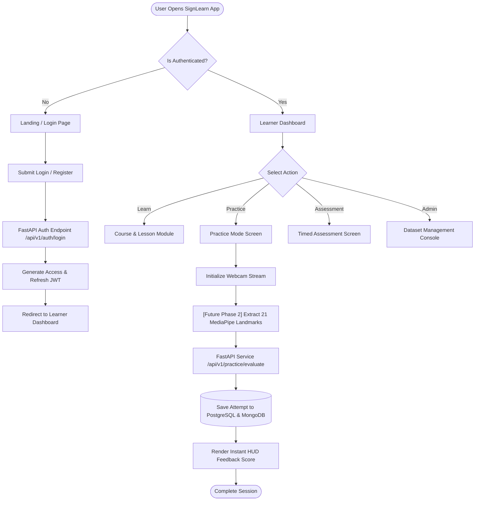
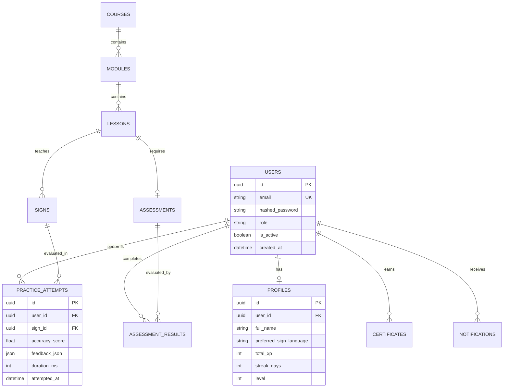
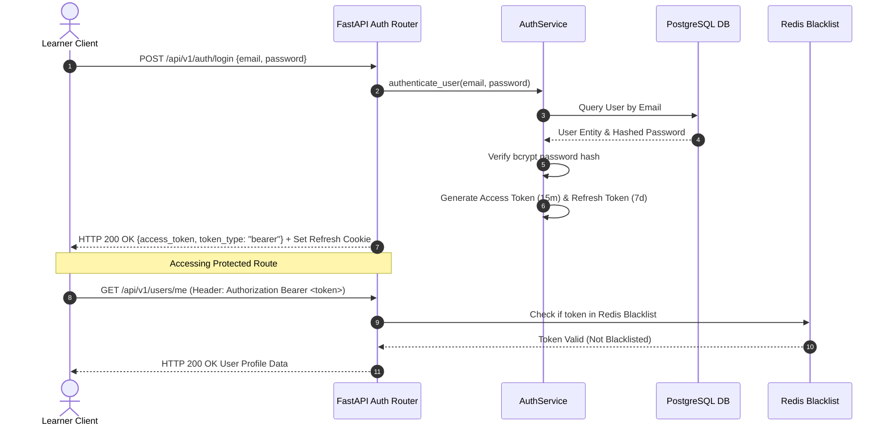
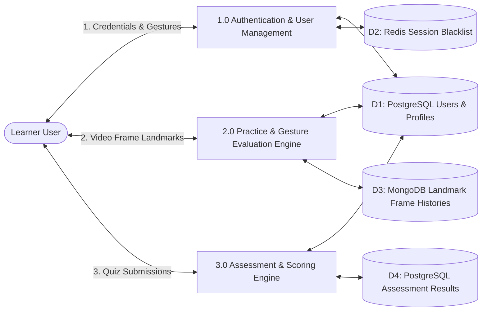
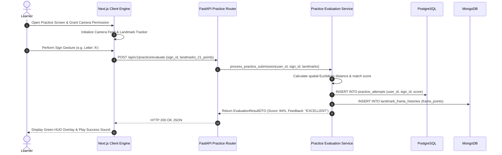
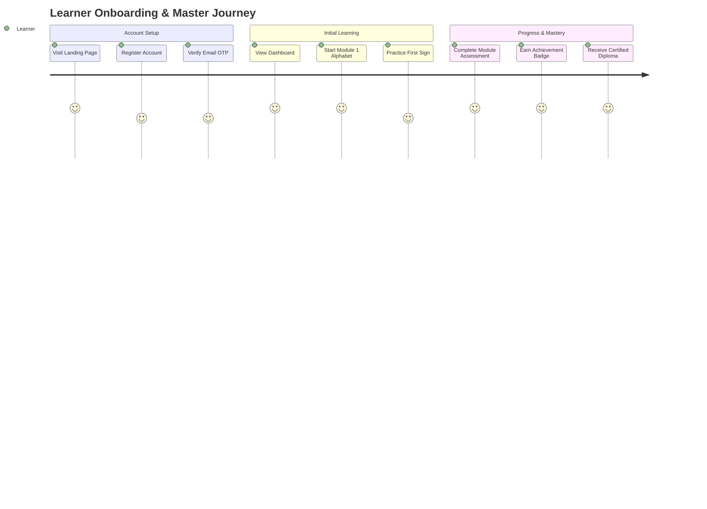
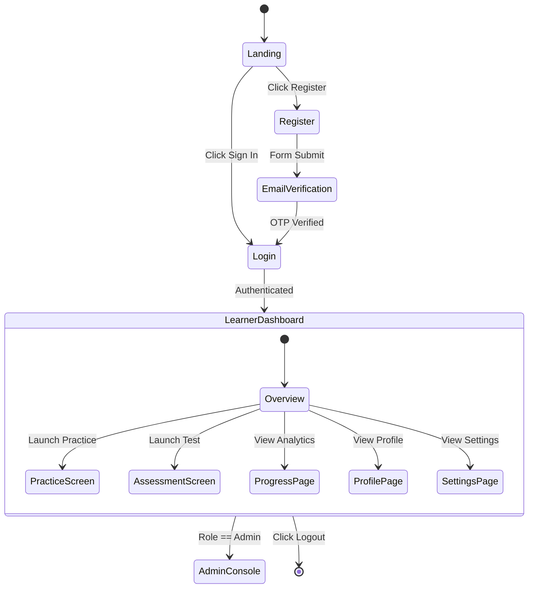
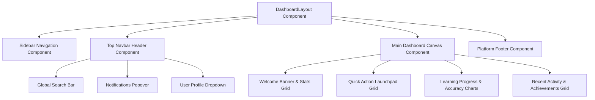

# SignLearn Platform — Complete System Architecture & Technical Design

```text
================================================================================
INFOSYS SPRINGBOARD INTERNSHIP PROJECT DELIVERABLE
Project Name : AI-Powered Sign Language Learning & Assessment Platform (SignLearn)
Document Type: Technical System Architecture & System Design Document
Document ID  : DOC-ARCH-2026-V1
Version      : 1.0.0
Author       : Infosys Springboard Team 2 (Amrutha)
Date         : July 30, 2026
Status       : Complete (Milestone 1 Approved Deliverable)
================================================================================
```

---

## Document Control & Revision History

| Version | Date | Author | Description of Changes |
| :--- | :--- | :--- | :--- |
| **1.0.0** | 2026-07-30 | Infosys Team 2 (Amrutha) | Initial complete release of Milestone 1 Technical System Architecture Document. |

---

## Table of Contents

1. [Executive Overview & Architectural Objectives](#1-executive-overview--architectural-objectives)
2. [Scope & Operational Boundaries](#2-scope--operational-boundaries)
3. [Core Architecture Principles](#3-core-architecture-principles)
4. [Multi-Layer System Architecture](#4-multi-layer-system-architecture)
   - [4.1 Overall Architecture](#41-overall-architecture)
   - [4.2 Frontend Architecture (Next.js 15)](#42-frontend-architecture-nextjs-15)
   - [4.3 Backend Architecture (FastAPI)](#43-backend-architecture-fastapi)
   - [4.4 Authentication & Authorization Layer (JWT & OAuth2)](#44-authentication--authorization-layer-jwt--oauth2)
   - [4.5 REST API Layer](#45-rest-api-layer)
   - [4.6 Service Layer](#46-service-layer)
   - [4.7 Repository Layer](#47-repository-layer)
   - [4.8 Multi-Database Persistence Layer](#48-multi-database-persistence-layer)
   - [4.9 Cloud Storage Layer](#49-cloud-storage-layer)
   - [4.10 Dataset Management Module](#410-dataset-management-module)
   - [4.11 Future AI & Computer Vision Layer (Phase 2+)](#411-future-ai--computer-vision-layer-phase-2)
   - [4.12 Monitoring & Telemetry Layer](#412-monitoring--telemetry-layer)
   - [4.13 Security & Compliance Layer](#413-security--compliance-layer)
   - [4.14 Deployment & Infrastructure Architecture](#414-deployment--infrastructure-architecture)
5. [Mermaid Architectural Diagrams](#5-mermaid-architectural-diagrams)
   - [5.1 Overall Application Flowchart](#51-overall-application-flowchart)
   - [5.2 System Component Diagram](#52-system-component-diagram)
   - [5.3 Container Deployment Diagram](#53-container-deployment-diagram)
   - [5.4 Database Entity Relationship Diagram (ERD)](#54-database-entity-relationship-diagram-erd)
   - [5.5 JWT Authentication & Authorization Flow](#55-jwt-authentication--authorization-flow)
   - [5.6 Level 1 Data Flow Diagram (DFD)](#56-level-1-data-flow-diagram-dfd)
   - [5.7 Sign Practice Sequence Diagram](#57-sign-practice-sequence-diagram)
   - [5.8 Learner Onboarding User Journey Diagram](#58-learner-onboarding-user-journey-diagram)
   - [5.9 Screen Navigation State Machine Diagram](#59-screen-navigation-state-machine-diagram)
   - [5.10 Dashboard React Component Hierarchy Diagram](#510-dashboard-react-component-hierarchy-diagram)
6. [Visual Assets Reference](#6-visual-assets-reference)
7. [References & Appendix](#7-references--appendix)
8. [Glossary of Architectural Terms](#8-glossary-of-architectural-terms)

---

## 1. Executive Overview & Architectural Objectives

The **AI-Powered Sign Language Learning & Assessment Platform (SignLearn)** architecture is designed to handle high-throughput real-time video landmark analysis, interactive gamified learning paths, secure multi-tenant identity management, and dataset annotation workflows.

### Architectural Objectives:
- **Clean Architecture & Decoupling**: Strict separation of concerns between presentation, API routers, business service orchestration, repository persistence, and AI inference engines.
- **Sub-50ms Latency Vision Pipeline**: Client-side MediaPipe landmark extraction combined with asynchronous backend evaluation engines.
- **High Availability & Horizontal Scalability**: Stateless API tiers running in containerized Docker microservices behind Nginx load balancers.

---

## 2. Scope & Operational Boundaries

> [!IMPORTANT]
> **Phase 1 Milestone Status**: This document details overall technical architecture, multi-database models, and future AI component integrations.
> - **Phase 1 (Implemented Foundation)**: Project layout, Clean Architecture layer interfaces, REST DTO schemas, multi-database configuration, Docker Compose topology, and complete architectural documentation.
> - **Future Milestone (Not Implemented in Phase 1)**: MediaPipe WebGL client canvas, CNN/LSTM PyTorch model serving, real-time WebSocket inference worker.

---

## 3. Core Architecture Principles

1. **SOLID Design Principles**: Single responsibility classes, open/closed extension interfaces, dependency inversion via FastAPI Dependency Injection (`Depends()`).
2. **Stateless API Services**: All HTTP session state stored in Redis or encoded inside signed JWT tokens.
3. **Multi-Database Polyglot Persistence**:
   - **Relational ACID**: PostgreSQL 16 for users, courses, assessments, and financial records.
   - **NoSQL Spatial Store**: MongoDB 7.0 for high-volume 21-point 3D landmark coordinate time-series frame histories.
   - **In-Memory Cache**: Redis 7.0 for session revocation blacklists, rate limiting, and real-time state.

---

## 4. Multi-Layer System Architecture

---

### 4.1 Overall Architecture

The platform follows a layered clean architecture pattern:

```text
[ Client Layer: Next.js 15 App Router ] <--- (REST / WebSockets) ---> [ Gateway: Nginx Reverse Proxy ]
                                                                                |
                                                                                v
                                                                   [ API Layer: FastAPI Routers ]
                                                                                |
                                                                                v
                                                                 [ Service Layer: Business Rules ]
                                                                                |
                                                                                v
                                                                [ Repository Layer: Data Access ]
                                                                                |
                                     +------------------------------------------+------------------------------------------+
                                     |                                          |                                          |
                                     v                                          v                                          v
                         [( PostgreSQL 16 RDBMS )]                  [( MongoDB 7.0 NoSQL Store )]                 [( Redis 7.0 In-Memory Cache )]
```

---

### 4.2 Frontend Architecture (Next.js 15)

- **Framework**: Next.js 15 with React 19, TypeScript, and App Router (`app/` directory).
- **State Management**: TanStack React Query v5 for server state caching; Zustand for global client UI state.
- **Styling System**: Tailored Vanilla CSS / Tailwind CSS tokens with dark-mode support.
- **Client Vision Engine (Phase 2+)**: `@mediapipe/hands` running in WebGL / WebWorker threads.

---

### 4.3 Backend Architecture (FastAPI)

- **Framework**: FastAPI 0.115+ on Python 3.12 with AsyncIO event loop (`uvicorn` ASGI server).
- **Layer Separation**:
  - `app/api/v1/`: API Routers (Handles HTTP request validation & HTTP response formatting).
  - `app/services/`: Service Layer (Implements core domain business rules).
  - `app/repositories/`: Repository Layer (Executes async SQL/NoSQL queries).
  - `app/models/`: SQLAlchemy ORM entity models & MongoDB Pydantic documents.

---

### 4.4 Authentication & Authorization Layer (JWT & OAuth2)

- **Authentication Protocol**: OAuth2 with Password Bearer flow.
- **Tokens**: Dual-token strategy:
  - **Access Token**: Short-lived JWT (15-minute expiration) signed with HMAC-SHA256 (`HS256`).
  - **Refresh Token**: Long-lived JWT (7-day expiration) stored in `httpOnly` secure cookies.
- **Password Security**: `bcrypt` password hashing with work factor = 12.
- **Token Revocation**: Active token blacklist stored in Redis in-memory cache.

---

### 4.5 REST API Layer

- **Specification**: OpenAPI 3.0 compliant JSON schemas auto-generated via FastAPI.
- **Request Validation**: Pydantic v2 DTO schemas enforcing strict type safety and field bounds.
- **CORS & Security**: Configured CORS middleware allowing trusted frontend origins only. Rate limiting via Redis sliding-window algorithm.

---

### 4.6 Service Layer

- Encapsulates business transactions (e.g., calculating lesson completion percentage, awarding streak bonuses, verifying sign accuracy thresholds).
- Completely decoupled from HTTP request headers and raw database drivers.

---

### 4.7 Repository Layer

- Asynchronous persistence layer using:
  - `SQLAlchemy 2.0 AsyncSession` for PostgreSQL.
  - `Motor 3.3` async driver for MongoDB.
  - `redis-py async` for Redis.

---

### 4.8 Multi-Database Persistence Layer

1. **PostgreSQL 16**: Primary RDBMS storing normalized relational tables (`users`, `profiles`, `courses`, `modules`, `lessons`, `signs`, `practice_attempts`, `assessments`, `assessment_results`, `certificates`, `notifications`).
2. **MongoDB 7.0**: Secondary NoSQL document store saving landmark datasets (`landmark_datasets`, `gesture_samples`, `landmark_frame_histories`, `audit_logs`).
3. **Redis 7.0**: In-memory key-value cache handling session tokens, rate limits, and live socket state.

---

### 4.9 Cloud Storage Layer

- **Provider**: AWS S3 or MinIO Object Storage.
- **Assets Stored**: Lesson demonstration videos (`mp4`/`webm`), reference sign GIFs, user avatars, and raw gesture sample dataset archives.

---

### 4.10 Dataset Management Module

- Administrative module for dataset creators to record raw sign gesture samples, inspect 21-point MediaPipe annotations, label target gesture metadata, and export training sets in JSON/CSV formats.

---

### 4.11 Future AI & Computer Vision Layer (Phase 2+)

> [!NOTE]
> **Marked clearly as**: *"Future Milestone (Not Implemented in Phase 1)"*

- **MediaPipe Hands**: Client-side 21 3D hand joint landmark tracking.
- **Convolutional Neural Networks (CNN)**: Spatial feature extraction from raw gesture image frames.
- **Long Short-Term Memory (LSTM)**: Recurrent neural network for temporal sign sequence classification.
- **Serving Engine**: Dedicated Python microservice running PyTorch / TensorFlow C++ runtime workers.

---

### 4.12 Monitoring & Telemetry Layer

- Structured JSON logs outputting trace IDs across microservice calls.
- Standard health check endpoints: `GET /health`, `GET /metrics`.
- Prometheus metrics scraper & Grafana dashboard placeholders.

---

### 4.13 Security & Compliance Layer

- **Data in Transit**: Forced TLS 1.3 encryption across all public endpoints.
- **Data at Rest**: AES-256 encrypted database volumes and object storage buckets.
- **OWASP Mitigation**: Protection against SQL Injection (parameterized SQLAlchemy queries), XSS (sanitized inputs), and CSRF (`httpOnly` SameSite cookies).

---

### 4.14 Deployment & Infrastructure Architecture

- Containerized Docker deployment managed via `docker-compose.yml`:
  - `frontend`: Next.js 15 container (Node 20 Alpine).
  - `backend`: FastAPI app container (Python 3.12 Slim).
  - `postgres`: PostgreSQL 16 database container.
  - `mongodb`: MongoDB 7.0 database container.
  - `redis`: Redis 7.0 in-memory container.
  - `nginx`: Reverse Proxy & SSL termination gateway container.

---

## 5. Mermaid Architectural Diagrams

---

### 5.1 Overall Application Flowchart



---

### 5.2 System Component Diagram

```mermaid
componentDiagram
    package "Client Tier (Next.js 15)" {
        [React Component UI]
        [Zustand Client State]
        [TanStack Query Cache]
        [Future: MediaPipe WebGL Engine]
    }

    package "API & Gateway Tier" {
        [Nginx Reverse Proxy]
        [FastAPI Router Layer]
        [OAuth2 / JWT Middleware]
    }

    package "Domain Service Tier" {
        [Auth & User Service]
        [Lesson & Course Service]
        [Practice Evaluation Service]
        [Dataset Management Service]
        [Future: PyTorch AI Inference Engine]
    }

    package "Persistence & Storage Tier" {
        database "PostgreSQL 16" {
            [Users & Profiles]
            [Courses & Lessons]
            [Practice Attempts]
        }
        database "MongoDB 7.0" {
            [Landmark Coordinates]
            [Raw Frame History]
        }
        database "Redis 7.0" {
            [Active Sessions]
            [Token Blacklist]
        }
        [S3 / MinIO Cloud Storage]
    }

    [React Component UI] --> [Nginx Reverse Proxy]
    [Nginx Reverse Proxy] --> [FastAPI Router Layer]
    [FastAPI Router Layer] --> [OAuth2 / JWT Middleware]
    [OAuth2 / JWT Middleware] --> [Auth & User Service]
    [OAuth2 / JWT Middleware] --> [Practice Evaluation Service]
    
    [Auth & User Service] --> [Users & Profiles]
    [Practice Evaluation Service] --> [Practice Attempts]
    [Practice Evaluation Service] --> [Landmark Coordinates]
    [Practice Evaluation Service] --> [Active Sessions]
    [Dataset Management Service] --> [S3 / MinIO Cloud Storage]
```

---

### 5.3 Container Deployment Diagram

```mermaid
deploymentDiagram
    node "Host Server (Linux Ubuntu 24.04 LTS)" {
        node "Docker Engine Runtime" {
            container "nginx-proxy Container" {
                artifact "Nginx 1.25 (Port 80 / 443)"
            }
            container "nextjs-frontend Container" {
                artifact "Next.js 15 App (Port 3000)"
            }
            container "fastapi-backend Container" {
                artifact "FastAPI ASGI App (Port 8000)"
            }
            container "postgres-db Container" {
                artifact "PostgreSQL 16 Instance (Port 5432)"
            }
            container "mongo-db Container" {
                artifact "MongoDB 7.0 Instance (Port 27017)"
            }
            container "redis-cache Container" {
                artifact "Redis 7.0 Cache (Port 6379)"
            }
        }
    }

    [Nginx 1.25 (Port 80 / 443)] --> [Next.js 15 App (Port 3000)] : Internal HTTP Proxy
    [Nginx 1.25 (Port 80 / 443)] --> [FastAPI ASGI App (Port 8000)] : /api/v1 Proxy
    [FastAPI ASGI App (Port 8000)] --> [PostgreSQL 16 Instance (Port 5432)] : Async PG Driver
    [FastAPI ASGI App (Port 8000)] --> [MongoDB 7.0 Instance (Port 27017)] : Motor Driver
    [FastAPI ASGI App (Port 8000)] --> [Redis 7.0 Cache (Port 6379)] : redis-py
```

---

### 5.4 Database Entity Relationship Diagram (ERD)



---

### 5.5 JWT Authentication & Authorization Flow



---

### 5.6 Level 1 Data Flow Diagram (DFD)



---

### 5.7 Sign Practice Sequence Diagram



---

### 5.8 Learner Onboarding User Journey Diagram



---

### 5.9 Screen Navigation State Machine Diagram



---

### 5.10 Dashboard React Component Hierarchy Diagram



---

## 6. Visual Assets Reference

Diagram graphics and visual technical blueprints generated for this milestone are archived in the root `design/` directory:
- `design/system-architecture.png`
- `design/system-architecture.pdf`

---

## 7. References & Appendix

1. Infosys Springboard Internship Project Guidelines.
2. Clean Architecture: A Craftsman's Guide to Software Structure and Design (Robert C. Martin).
3. FastAPI Documentation: https://fastapi.tiangolo.com/
4. Next.js App Router Architecture Documentation: https://nextjs.org/docs

---

## 8. Glossary of Architectural Terms

- **ACID**: Atomicity, Consistency, Isolation, Durability database transaction properties.
- **ASGI**: Asynchronous Server Gateway Interface (Python server protocol).
- **DTO**: Data Transfer Object (Pydantic schema used for HTTP request/response validation).
- **JWT**: JSON Web Token (RFC 7519 standard for secure HTTP authentication claims).
- **MediaPipe**: Google cross-platform ML framework for hand, face, and pose tracking.
- **ORM**: Object-Relational Mapping (SQLAlchemy).
