<div align="center">

# ✨ SignSpeak Frontend

**An intelligent, responsive and analytics-driven interface for AI-assisted sign-language learning.**

**React • Vite • Tailwind CSS • AI Practice • Analytics • Responsive UI**

[](https://react.dev/)
[](https://vitejs.dev/)
[](https://developer.mozilla.org/en-US/docs/Web/JavaScript)
[](https://tailwindcss.com/)
[](https://reactrouter.com/)
[](https://axios-http.com/)
[](https://recharts.org/)


</div>

---

## 🎨 Frontend Overview

The SignSpeak frontend is the primary interaction layer between learners and the platform. It transforms backend services and machine learning predictions into a coherent, usable experience — interactive lessons, camera-based practice, real-time feedback, assessments, performance dashboards, analytics, personalized recommendations, and account management.

```
Learner
   │
   ▼
React Interface
   │
   ▼
Learning / Practice / Assessment
   │
   ▼
REST API
   │
   ▼
FastAPI
   │
   ▼
PostgreSQL + ML
   │
   ▼
Analytics
   │
   ▼
React Dashboard
```

---

## 🏗️ Frontend Architecture

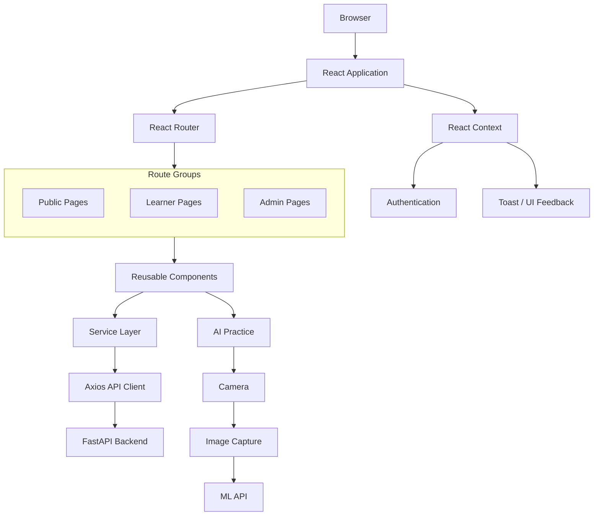

---

## 🧱 Frontend Layers

```
┌──────────────────────────────────────────────────────┐
│                   PAGE LAYER                          │
│ Dashboard • Courses • Practice • Reports              │
├──────────────────────────────────────────────────────┤
│                COMPONENT LAYER                        │
│ Cards • Buttons • Inputs • Charts • Layout             │
├──────────────────────────────────────────────────────┤
│                  STATE LAYER                           │
│ Authentication • Local State • UI State                │
├──────────────────────────────────────────────────────┤
│                 SERVICE LAYER                          │
│ Auth • Courses • Practice • Reports • ML                │
├──────────────────────────────────────────────────────┤
│                   API LAYER                             │
│ Axios API Client                                        │
├──────────────────────────────────────────────────────┤
│                 BACKEND LAYER                            │
│ FastAPI REST API                                          │
└──────────────────────────────────────────────────────┘
```

| Layer | Role |
|---|---|
| **Page** | Top-level route components composing the learner/admin experience |
| **Component** | Reusable, presentation-focused UI building blocks |
| **State** | Authentication context, local component state, transient UI state |
| **Service** | Domain-specific functions wrapping API calls |
| **API** | Configured Axios client handling requests/headers/errors |
| **Backend** | The FastAPI REST API consumed by the frontend |

---

## 📁 Frontend Structure

```
frontend/
│
├── public/
│
├── src/
│   ├── components/
│   │   ├── cards/
│   │   ├── charts/
│   │   ├── layout/
│   │   ├── practice/
│   │   └── ui/
│   │
│   ├── constants/
│   ├── context/
│   ├── pages/
│   ├── services/
│   ├── utils/
│   ├── App.jsx
│   └── main.jsx
│
├── package.json
├── vite.config.js
└── README.md
```

| Directory | Responsibility |
|---|---|
| `public/` | Static assets served as-is |
| `src/components/cards/` | Card-style presentational components (course, lesson, stats) |
| `src/components/charts/` | Recharts-based visualization components |
| `src/components/layout/` | Navbar, sidebar, topbar, breadcrumb, footer |
| `src/components/practice/` | Camera, confidence meter, feedback panel |
| `src/components/ui/` | Base UI primitives (button, input, modal, etc.) |
| `src/constants/` | Shared constant values and enums |
| `src/context/` | React Context providers (auth, toast) |
| `src/pages/` | Route-level page components |
| `src/services/` | API service modules per domain |
| `src/utils/` | Shared helper functions |
| `src/App.jsx` | Root application component and routing |
| `src/main.jsx` | Application entry point |

---

## 🗺️ Application Page Map

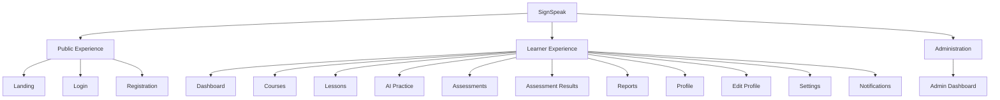

---

## 🧭 Navigation Architecture

**Primary learning path:**

```
Dashboard → Courses → Lesson → Practice → Assessment → Reports
```

**Account navigation:** Profile, Settings, Notifications
**Administrative navigation:** Admin Dashboard

React Router DOM provides client-side navigation across all of the above, keeping page transitions fast and state-preserving where needed.

---

## 🚦 Routing Flow

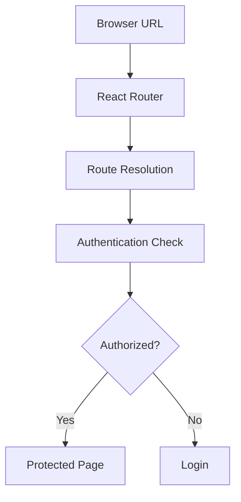

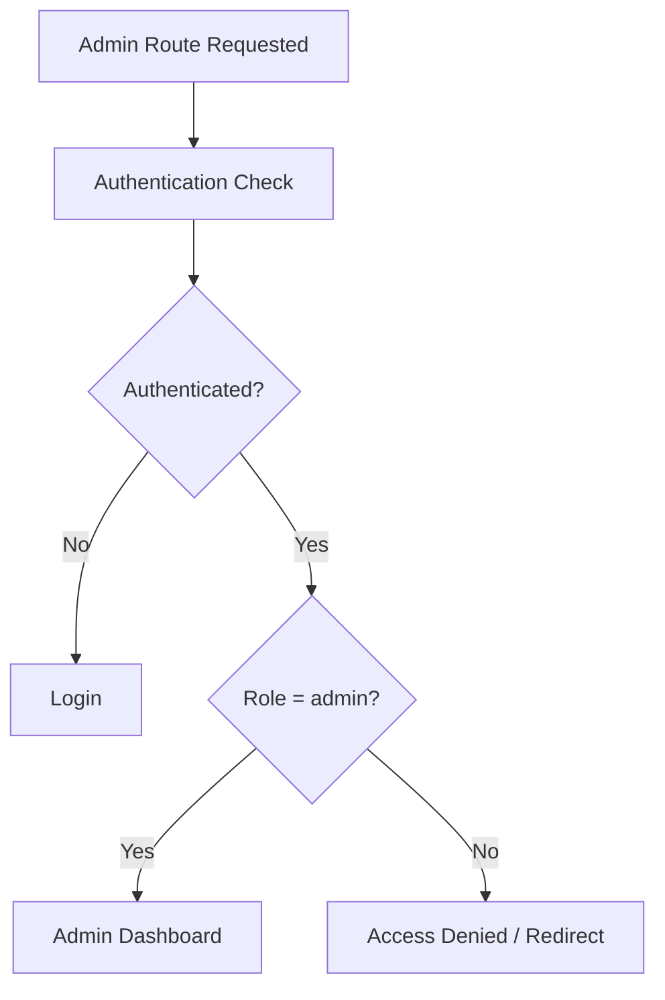

---

## 🎨 UI / UX Design Direction

SignSpeak's interface follows a modern AI/SaaS-inspired learning-platform aesthetic:

- Dark interface surfaces
- Cyan/accent highlights
- Clean typography hierarchy
- High-contrast data visualization
- Compact metric cards
- Clear, persistent navigation
- Responsive layouts
- Status badges
- Progress indicators
- Chart-driven reports
- Large, actionable practice areas
- Accessible visual hierarchy

---

## 💡 Interface Design Principles

- Clarity over decoration
- Actionable learner feedback
- Visible learning progress
- Consistent navigation
- Reusable components
- Responsive layouts
- Accessible contrast
- Data-first dashboards
- Minimal interaction friction
- Clear success/error states
- Explainable AI feedback

---

## 🧩 Component Architecture

```mermaid
flowchart TD
    APP[Application]

    APP --> LAY[Layout]
    LAY --> LAY1[Navbar]
    LAY --> LAY2[Sidebar]
    LAY --> LAY3[Topbar]
    LAY --> LAY4[Breadcrumb]
    LAY --> LAY5[Footer]

    APP --> UI[UI]
    UI --> UI1[Button]
    UI --> UI2[Input]
    UI --> UI3[Textarea]
    UI --> UI4[Select]
    UI --> UI5[Card]
    UI --> UI6[Badge]
    UI --> UI7[Modal]
    UI --> UI8[Spinner]
    UI --> UI9[EmptyState]
    UI --> UI10[ErrorState]

    APP --> CARDS[Cards]
    CARDS --> C1[CourseCard]
    CARDS --> C2[LessonCard]
    CARDS --> C3[StatCard]

    APP --> CHARTS[Charts]
    CHARTS --> CH1[LineChart]
    CHARTS --> CH2[BarChart]
    CHARTS --> CH3[PieChart]

    APP --> PRAC[Practice]
    PRAC --> PR1[CameraPanel]
    PRAC --> PR2[ConfidenceMeter]
    PRAC --> PR3[FeedbackPanel]
```

---

## 🧱 Reusable UI Components

| Component | Purpose | Example Usage |
|---|---|---|
| `Button` | Primary interactive action element | Submit forms, trigger actions |
| `Card` | Container for grouped content | Course tiles, dashboard panels |
| `Badge` | Small status/label indicator | Role tags, notification types |
| `Input` | Single-line text entry | Login, profile fields |
| `Textarea` | Multi-line text entry | Bio, feedback text |
| `Select` | Dropdown selection | Filters, preferences |
| `Modal` | Overlay dialog | Confirmations, forms |
| `Spinner` | Loading indicator | Async data fetches |
| `EmptyState` | No-data placeholder | Empty course list, no notifications |
| `ErrorState` | Error placeholder with messaging | Failed API request |
| `StatCard` | Metric display card | Accuracy, sessions, XP |
| `CourseCard` | Course preview tile | Course catalogue |
| `LessonCard` | Lesson preview tile | Lesson list within a course |

Reusable components maintain visual consistency across the application and reduce duplicated styling/logic.

---

## 🖼️ Application Layout

```
┌────────────────────────────────────────────────────────────┐
│                        TOPBAR                                │
├───────────────┬────────────────────────────────────────────┤
│               │ Breadcrumb                                  │
│               ├────────────────────────────────────────────┤
│   SIDEBAR     │                                              │
│               │              PAGE CONTENT                    │
│               │                                              │
│               │                                              │
├───────────────┴────────────────────────────────────────────┤
│                         FOOTER                                │
└────────────────────────────────────────────────────────────┘
```

---

## 🔐 Authentication UI

Frontend authentication areas: Login, Registration, Protected Pages, Logout, Password Recovery, and Authenticated User State.

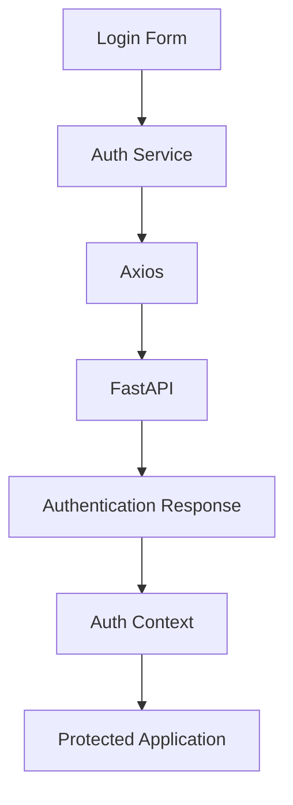

---

## 🧠 Authentication Context

`AuthContext` manages authenticated user state across the application.

```
Application
   │
   ▼
AuthProvider
   │
   ▼
Current User
   │
   ├── Dashboard
   ├── Courses
   ├── Practice
   ├── Reports
   ├── Profile
   └── Protected Routes
```

Successful authentication or profile updates refresh the shared user state, keeping every consuming component in sync without prop drilling.

---

## 🔌 Frontend Service Layer

API logic is separated from page components through dedicated service modules, keeping components focused on rendering rather than request handling.

| Service | Responsibility |
|---|---|
| `authService` | Login, registration, logout, token refresh |
| `profileService` | Viewing and updating user profile data |
| `courseService` | Course catalogue and enrollment |
| `lessonService` | Lesson content and progress |
| `practiceService` | Practice session lifecycle and persistence |
| `assessmentService` | Assessment retrieval, submission, results |
| `reportService` | Learner analytics and reporting data |
| `notificationService` | Notification retrieval and state changes |
| `adminService` | Administrative user management |
| `mlService` | ML prediction and learning-plan requests |
| `settingsService` | Account/security settings updates |

---

## 🔄 API Client Flow

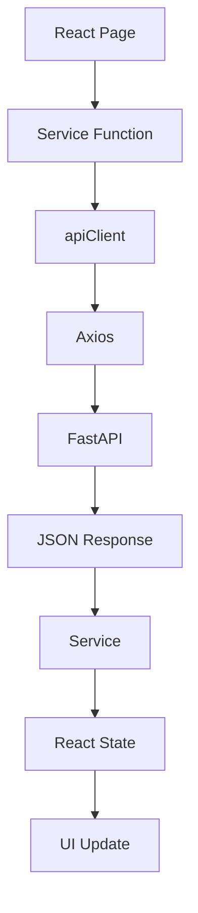

Routing API calls through a service layer keeps page components declarative and testable — components describe *what* they need, services handle *how* to get it.

---

## 🌐 Frontend ↔ Backend Communication

| Environment | URL |
|---|---|
| Frontend (dev) | `http://localhost:5173` |
| Backend (dev) | `http://localhost:8000` |
| API client base URL | `http://localhost:8000/api` |

The frontend communicates exclusively through REST APIs over HTTP(S). The backend's CORS configuration explicitly allows the Vite development origin so browser requests are not blocked.

---

## 📊 Learner Dashboard

The dashboard is the learner's intelligence center, surfacing:

- Performance metrics
- Weekly activity
- Daily goal
- Personalized recommendations
- Priority signs
- Strong signs
- Enrolled courses
- Recent activity
- Next actions

Dashboard information is sourced from real backend services rather than static placeholder cards.

---

## 🗃️ Dashboard Data Sources

| Dashboard Area | Data Source |
|---|---|
| Profile | Profile API |
| Enrolled Courses | Course API |
| Practice Activity | Practice API |
| Accuracy | Accuracy Report |
| Assessments | Assessment Report |
| Progress | Progress Report |
| Priority / Strong Signs | Sign Performance Report |
| Personalized Recommendation | Learning Plan API |

---

## 🔀 Dashboard Data Flow

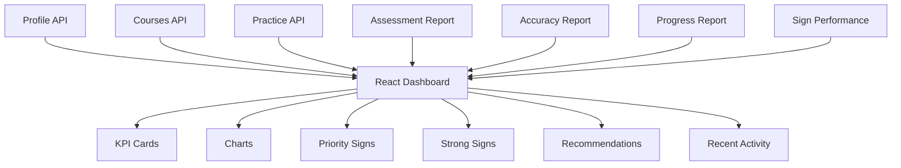

---

## 🖥️ Dashboard Wireframe

```
┌──────────────────────────────────────────────────────────────┐
│ SignSpeak                                     🔔  Profile     │
├───────────────┬──────────────────────────────────────────────┤
│ Dashboard     │ Welcome Back                                  │
│ Courses       │                                                │
│ Practice      │ ┌────────┬────────┬────────┬───────────────┐ │
│ Assessments   │ │Accuracy│Sessions│Lessons │Assessment Avg │ │
│ Reports       │ └────────┴────────┴────────┴───────────────┘ │
│               │                                                │
│               │ Weekly Activity          Daily Goal            │
│               │                                                │
│               │ Priority Signs           Strong Signs          │
│               │                                                │
│               │ AI Recommended Focus                           │
│               │                                                │
│               │ Enrolled Courses         Recent Activity       │
└───────────────┴──────────────────────────────────────────────┘
```

*Wireframe content is illustrative.*

---

## 📚 Courses

Covers course catalogue browsing, enrolled courses, search, filtering, enrollment, course cards, and course progress.

```
Courses API
      │
      ▼
React Courses Page
      │
      ▼
Catalogue / Enrolled
      │
      ▼
   Course Card
      │
      ▼
Enroll / Continue
```

---

## 🗂️ Course Wireframe

```
┌────────────────────────────────────────────────────────────┐
│                     Explore Courses                        │
├────────────────────────────────────────────────────────────┤
│ Search...                  [All] [Beginner] [Intermediate] │
├──────────────────┬──────────────────┬──────────────────────┤
│ Course Card      │ Course Card      │ Course Card           │
│ Beginner ASL     │ Daily Signs      │ Conversation           │
│ Progress         │ Progress         │ Progress               │
│ [Continue]       │ [Enroll]         │ [Enroll]               │
└──────────────────┴──────────────────┴──────────────────────┘
```

---

## 🎓 Lesson Experience

Lessons combine lesson content, learning objectives, video learning, lesson navigation, AI practice, and completion controls.

```
   Course
      │
      ▼
   Lesson
      │
      ▼
Video / Content
      │
      ▼
  AI Practice
      │
      ▼
Complete Lesson
      │
      ▼
Next Lesson
```

---

## 🎥 Video Learning

SignSpeak lesson pages support YouTube-embedded videos, direct video sources where available, and fallback states when video content is unavailable.

```
Lesson video URL
      │
      ▼
Video Type Detection
      │
      ├── YouTube → iframe embed
      └── Direct Video → HTML5 video
```

---

## 🎬 Lesson Wireframe

```
┌─────────────────────────────────────────────────────────────┐
│ Course > Lesson                                              │
├─────────────────────────────────────┬───────────────────────┤
│                                     │ Lessons                │
│           VIDEO PLAYER              │                        │
│                                     │ Introduction           │
│                                     │ Alphabet A-F           │
├─────────────────────────────────────┤ Alphabet G-L           │
│ Lesson Explanation                  │ ...                    │
│                                     │                        │
├─────────────────────────────────────┤                        │
│ AI Practice                         │                        │
│ [Practice This Sign]                │                        │
├─────────────────────────────────────┤                        │
│ [Previous]       [Complete] [Next]  │                        │
└─────────────────────────────────────┴───────────────────────┘
```

---

## 🤟 AI Practice Workspace

The practice page combines camera access, target sign selection, frame capture, ML prediction, confidence display, correct/incorrect comparison, feedback, recommendation, and practice persistence into a single focused workflow.

---

## 📷 Camera Workflow

```
Start Camera
      │
      ▼
Browser getUserMedia
      │
      ▼
Video Stream
      │
      ▼
Camera Ready
      │
      ▼
Capture Frame
      │
      ▼
Canvas/Image Conversion
      │
      ▼
Image File
      │
      ▼
    ML API
```

The frontend analyzes individual captured frames sent on demand — this is **not** continuous backend video streaming.

---

## 🔄 AI Practice Flow

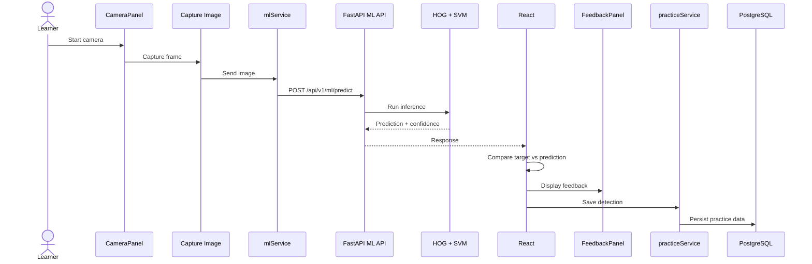

---

## 📷 Practice Workspace Wireframe

```
┌──────────────────────────────────────────────────────────────┐
│                     Practice Sign: A                          │
├───────────────────────────────────┬──────────────────────────┤
│                                   │ AI Analysis                │
│                                   │                            │
│          CAMERA PANEL             │ Predicted Sign: A          │
│                                   │ Confidence: 91%            │
│                                   │ Result: Correct            │
│                                   │                            │
├───────────────────────────────────┼──────────────────────────┤
│ [Start Camera] [Analyze Sign]     │ Feedback                   │
│                                   │ Recommendation             │
└───────────────────────────────────┴──────────────────────────┘
```

*Prediction values are illustrative.*

---

## 🧩 Practice Components

```
Practice Page
      │
      ├── CameraPanel
      ├── ConfidenceMeter
      └── FeedbackPanel
```

| Component | Purpose |
|---|---|
| `CameraPanel` | Manages camera access, video preview, and frame capture |
| `ConfidenceMeter` | Visualizes the ML model's prediction confidence |
| `FeedbackPanel` | Displays correctness, feedback text, and recommendations |

---

## 🔁 Practice Session State

```
 No Session
      │
      ▼
Start Practice
      │
      ▼
Session Created
      │
      ▼
Prediction Attempt
      │
      ▼
Detection Added
      │
      ▼
Session Updated
      │
      ▼
Next Attempt / Finish
```

Practice results are persisted through `practiceService`, which handles session creation, detection updates, and completion.

---

## 🎚️ Confidence vs Correctness

The UI must clearly distinguish **prediction confidence** from **prediction correctness** — these are not the same thing.

> **Target:** A
> **Predicted:** M
> **Confidence:** 93.33%
> **Result:** Incorrect

A high-confidence result can still be wrong. The interface presents both values explicitly so learners aren't misled by a large confidence number alone.

---

## 💬 AI Practice Feedback

Feedback communicates: prediction, confidence, correct/incorrect result, learning status, a feedback message, and a practice recommendation.

> This feedback is generated by **rule-based logic** applied to prediction results — it is not generative AI.

---

## 📝 Assessments

```
Assessment List
      │
      ▼
Start Assessment
      │
      ▼
Timed Questions
      │
      ▼
Answer Selection
      │
      ▼
   Submit
      │
      ▼
Backend Scoring
      │
      ▼
 Results Page
```

Question categories: `multiple_choice`, `true_false`, `gesture_recognition`.

> Gesture-recognition-style assessment prompts are currently handled as standard assessment questions and are **not** a fully camera-driven ML assessment flow.

---

## 📋 Assessment Wireframe

```
┌──────────────────────────────────────────────────────────────┐
│ ASL Assessment                                 12:42          │
├──────────────────────────────────────────────────────────────┤
│ Question 08 of 25                                              │
│                                                                │
│ Which sign represents ... ?                                    │
│                                                                │
│ ○ Option A                                                     │
│ ○ Option B                                                     │
│ ○ Option C                                                     │
│ ○ Option D                                                     │
│                                                                │
│ [Previous]                                      [Next]         │
└──────────────────────────────────────────────────────────────┘
```

---

## 🏆 Assessment Results

Result data includes: Final Score, Points Earned, Total Points, Pass Mark, Passed/Retry status, and Assessment History.

```
┌──────────────────────────────────────────────┐
│              Assessment Result                │
├──────────────────────────────────────────────┤
│ Final Score            76%                    │
│ Points Earned          19 / 25                │
│ Pass Mark              70%                    │
│ Status                 Passed                 │
├──────────────────────────────────────────────┤
│ [Back to Assessments]   [View Reports]        │
└──────────────────────────────────────────────┘
```

*State values are illustrative.*

---

## 📈 Performance Reports

The reports experience surfaces: overall accuracy, practice sessions, confidence, assessment average, weekly activity, sign accuracy, priority signs, strong signs, confusion pairs, detailed sign performance, and assessment summary — visualized primarily through **Recharts**.

---

## 🔀 Reports Data Flow

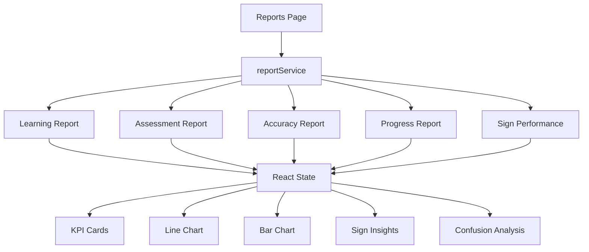

---

## 📊 Reports Wireframe

```
┌──────────────────────────────────────────────────────────────┐
│                  PERFORMANCE ANALYTICS                        │
├────────────┬────────────┬────────────┬──────────────────────┤
│ Accuracy   │ Sessions   │ Confidence │ Assessment Average    │
├────────────┴────────────┴────────────┴──────────────────────┤
│ Weekly Activity                │ Sign Accuracy                │
│      Line Chart                │     Bar Chart                │
├────────────────────────────────┼─────────────────────────────┤
│ Priority Signs                 │ Strong Signs                 │
├────────────────────────────────┼─────────────────────────────┤
│ Confusion Pairs                │ Assessment Summary            │
└────────────────────────────────┴─────────────────────────────┘
```

---

## 🎯 Personalized Learning Experience

The frontend displays: recommended focus, priority signs, strong signs, next accuracy target, and a practice recommendation.

```
   Analytics
      │
      ▼
Learning Plan API
      │
      ▼
   Dashboard
      │
      ▼
Recommended Focus
      │
      ▼
Next Practice Action
```

> Recommendations shown here are **performance-based** — derived from learner accuracy data, not generated by a language model.

---

## 👤 Learner Profile

The profile UI includes: learner identity, role, learning level, preferred language, location, bio, learning goals, XP, streak, performance summary, enrolled courses, and assessment summary — sourced through the real profile API.

---

## 🪪 Profile Wireframe

```
┌──────────────────────────────────────────────────────────────┐
│                     LEARNER PROFILE                            │
├──────────────────────────────────────────────────────────────┤
│ Avatar    Name                                                  │
│           Student • Beginner • ASL                              │
│                                           [Edit Profile]        │
├────────────┬────────────┬────────────┬──────────────────────┤
│ XP         │ Streak     │ Lessons    │ Practice Sessions      │
├────────────┴────────────┴────────────┴──────────────────────┤
│ About                        │ Learning Profile                │
├──────────────────────────────┼───────────────────────────────┤
│ Performance                  │ Enrolled Courses                │
└──────────────────────────────┴───────────────────────────────┘
```

---

## ✏️ Edit Profile

Editable fields: full name, avatar URL, location, bio, preferred language, learning level, learning goals.

Email is treated as account information and displayed read-only where appropriate.

---

## ⚙️ Account Settings

The settings experience focuses on account/security management: account summary, edit-profile shortcut, notifications shortcut, change password, and security guidance.

```
Current Password
New Password
Confirm Password
      │
      ▼
  Validation
      │
      ▼
Settings Service
      │
      ▼
   Backend
      │
      ▼
Password Updated
```

---

## 🔔 Notification Center

The notification UI provides **All / Unread / Read** filters, along with search, refresh, mark-one-as-read, mark-all-as-read, delete, and relative timestamps.

Notification types: `info`, `success`, `warning`, `achievement`, `course`.

---

## 🔕 Notification Wireframe

```
┌──────────────────────────────────────────────────────────────┐
│ Notifications                              3 Unread            │
│                                [Refresh] [Mark All Read]       │
├──────────────────────────────────────────────────────────────┤
│ [All 12] [Unread 3] [Read 9]       Search notifications...    │
├──────────────────────────────────────────────────────────────┤
│ ● Course Progress                                              │
│   You completed a lesson...                      2m ago        │
│                                           [Mark Read] [×]       │
├──────────────────────────────────────────────────────────────┤
│   Achievement                                                   │
│   New learning milestone...                     1h ago          │
└──────────────────────────────────────────────────────────────┘
```

*Content is illustrative.*

---

## 🧑‍💼 Administration UI

The admin interface supports dashboard statistics, user listing, search, staff creation, role changes, and account activation/deactivation — communicating with protected admin APIs.

---

## 🗂️ Admin Wireframe

```
┌──────────────────────────────────────────────────────────────┐
│                      ADMIN CONTROL                              │
├────────────┬────────────┬────────────┬──────────────────────┤
│ Users      │ Students   │ Staff      │ Active Accounts         │
├────────────┴────────────┴────────────┴──────────────────────┤
│ Search Users...                         [+ Create Staff]       │
├──────────────────────────────────────────────────────────────┤
│ Name      Email       Role       Status        Actions         │
│ ----------------------------------------------------------- │
│ User      ...         Student    Active        Manage           │
└──────────────────────────────────────────────────────────────┘
```

---

## 📊 Data Visualization

| Chart | Used For |
|---|---|
| `LineChart` | Trends and weekly activity |
| `BarChart` | Sign performance and comparisons |
| `PieChart` | Distribution-style analytics where appropriate |

Built using **Recharts**, integrated directly into report and dashboard components.

---

## ⏳ UI State Handling

```
API Request
      │
      ▼
  Loading
      │
      ├── Success → Render Data
      ├── Empty   → EmptyState
      └── Failure → ErrorState
```

Consistent `Spinner`, `EmptyState`, and `ErrorState` components ensure the interface never leaves the learner looking at a blank or ambiguous screen.

---

## 💬 User Feedback System

`ToastContext` provides short-lived UI feedback for actions such as successful updates, errors, enrollment confirmations, profile changes, password updates, and notification actions.

> **Toasts** (transient UI feedback) are distinct from **Notifications** (persistent, backend-stored messages viewable in the Notification Center).

---

## 📱 Responsive Experience

The frontend is designed for responsive layouts across desktop, tablet, and mobile.

**Desktop**
```
┌───────────────────────────────┐
│ Sidebar │ Main Content         │
└───────────────────────────────┘
```

**Tablet**
```
┌───────────────────────┐
│ Nav                    │
├───────────────────────┤
│ Main Content            │
└───────────────────────┘
```

**Mobile**
```
┌───────────────┐
│ Header         │
├───────────────┤
│ Content        │
├───────────────┤
│ Actions        │
└───────────────┘
```

> Responsive layout support is a design goal across common breakpoints — perfect support across every device/browser combination is not claimed.

---

## ♿ Accessibility Considerations

Design considerations include: clear contrast, readable typography, visible focus states, semantic labels, button clarity, error messaging, keyboard-friendly controls, responsive layouts, and large camera/practice actions.

> These are current design considerations, not a claim of formal WCAG certification.

---

## 🔐 Frontend Security Considerations

- Protected routes gated behind authentication state
- Authenticated API requests carrying the current session token
- Role-aware navigation (e.g. admin links hidden from non-admins)
- Safe API error handling that avoids leaking internals
- No hard-coded credentials
- Environment-based API configuration

> Frontend route protection improves UX but does **not** constitute security on its own — authorization is ultimately enforced by the backend on every request.

---

## ⚙️ Environment Configuration

```
VITE_API_BASE_URL=http://127.0.0.1:8000/api/v1
```

The API client may fall back to a local default URL depending on build configuration. Never include secrets in frontend environment variables — anything in a Vite `VITE_*` variable is bundled into the client-side build and is publicly visible.

---

## 🚀 Running the Frontend

```bash
cd frontend

npm install

npm run dev
```

Development URL: **`http://localhost:5173`**

The FastAPI backend should also be running for any API-driven pages to function correctly.

---

## 📦 Production Build

```bash
npm run build
```

```
React Source
      │
      ▼
   Vite Build
      │
      ▼
Optimized Assets
      │
      ▼
    dist/
```

The project currently builds successfully into static assets. Production hosting/deployment of this build is not currently configured.

---

## 🏗️ Build Architecture

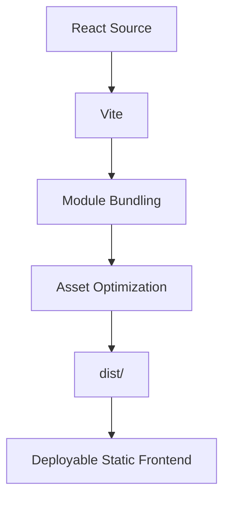

---

## ⚡ Frontend Performance Note

The production build can produce a relatively large JavaScript bundle, driven by charts, animations, dashboard features, multiple feature modules, the AI practice UI, and general application dependencies.

Future optimization directions:

- Route-based code splitting
- Lazy loading
- Manual chunking
- Dependency review
- Chart lazy loading

> No specific bundle-size benchmarks are claimed here — measure locally with the Vite build output if needed.

---

## 🧭 Learner Journey

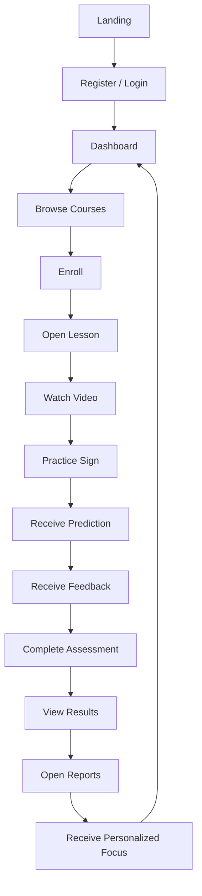

---

## 🔄 Frontend Data Journey

```
User Interaction
      │
      ▼
React Component
      │
      ▼
  Page State
      │
      ▼
   Service
      │
      ▼
   Axios
      │
      ▼
  FastAPI
      │
      ▼
Database / ML
      │
      ▼
JSON Response
      │
      ▼
React State Update
      │
      ▼
Visual Feedback
```

---

## 🧠 AI Interaction Journey

```
   Camera
      │
      ▼
Frame Capture
      │
      ▼
 Image File
      │
      ▼
  mlService
      │
      ▼
FastAPI ML API
      │
      ▼
 Prediction
      │
      ▼
React Comparison
      │
      ▼
 Confidence
      │
      ▼
  Feedback
      │
      ▼
practiceService
      │
      ▼
 Persistence
      │
      ▼
  Reports
      │
      ▼
 Dashboard
```

---

## ✅ Frontend Feature Matrix

| Feature | UI | Backend Connected | Status |
|---|---|---|---|
| Authentication | ✅ | ✅ | Integrated |
| Dashboard | ✅ | ✅ | Integrated |
| Courses | ✅ | ✅ | Integrated |
| Lessons | ✅ | ✅ | Integrated |
| Video Learning | ✅ | ✅ | Integrated |
| AI Practice | ✅ | ✅ | Integrated |
| Camera Capture | ✅ | ✅ | Integrated |
| ML Prediction | ✅ | ✅ | Integrated |
| Practice Persistence | ✅ | ✅ | Integrated |
| Assessments | ✅ | ✅ | Integrated |
| Assessment Results | ✅ | ✅ | Integrated |
| Reports | ✅ | ✅ | Integrated |
| Personalized Learning | ✅ | ✅ | Integrated |
| Profile | ✅ | ✅ | Integrated |
| Edit Profile | ✅ | ✅ | Integrated |
| Settings | ✅ | ✅ | Integrated |
| Notifications | ✅ | ✅ | Integrated |
| Admin Dashboard | ✅ | ✅ | Integrated |

---

## 📌 Frontend Status

| Module | Status |
|---|---|
| React + Vite | ✅ |
| Tailwind UI | ✅ |
| Authentication UI | ✅ |
| Protected Navigation | ✅ |
| Learner Dashboard | ✅ |
| Courses | ✅ |
| Lessons | ✅ |
| Video Learning | ✅ |
| Camera Practice | ✅ |
| ML Prediction UI | ✅ |
| Practice Persistence | ✅ |
| Assessments | ✅ |
| Assessment Results | ✅ |
| Reports | ✅ |
| Sign Analytics | ✅ |
| Personalized Learning | ✅ |
| Profile | ✅ |
| Edit Profile | ✅ |
| Settings | ✅ |
| Notifications | ✅ |
| Admin Dashboard | ✅ |
| Production Build | ✅ |
| Advanced Bundle Optimization | 🔜 Future |

---

## ⚠️ Current Frontend Limitations

- The AI practice experience analyzes captured frames rather than continuous backend video streaming
- ML prediction quality depends on the current prototype recognition model
- High model confidence does not guarantee correctness
- Gesture-recognition assessment questions are not yet fully connected to camera-based ML assessment
- Some advanced responsive/accessibility refinement can continue
- Production bundle optimization can be improved
- Cloud frontend deployment is future work

---

## 🗺️ Frontend Roadmap

> Clearly marked as future enhancements, not current functionality:

- Route-based lazy loading
- Advanced code splitting
- Progressive Web App support
- Mobile-first refinements
- Offline learning content
- Real-time WebSocket practice
- Continuous gesture feedback
- Camera-guided hand positioning
- MediaPipe landmark overlays
- Advanced accessibility improvements
- Instructor dashboards
- Learning streak visualization
- Advanced analytics filters
- Theme customization
- Internationalization
- Multilingual sign-language UI
- Automated frontend testing

---

## 🛤️ Future UI Architecture

> **Future Direction — Not Current Implementation**

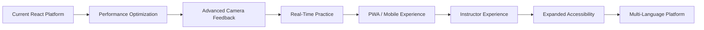

---

## 💡 Frontend Engineering Principles

- Reusable components
- Service-based API communication
- Separation of UI and data access
- Centralized authentication state
- Consistent loading/error states
- Responsive layouts
- Explainable AI feedback
- Data-driven dashboards
- Reusable analytics components
- Backend-enforced authorization
- Environment-based configuration
- Clear learner actions

---

## 🧪 Frontend Testing Strategy

```
              End-to-End
          Integration Tests
       Component / UI Tests
    Utility / Service-Level Tests
```

Validation areas: Authentication flow, Routing, API integration, Course enrollment, Lesson navigation, Camera start/stop, Image capture, ML prediction display, Practice persistence, Assessment submission, Reports, Profile updates, Password updates, Notifications, Admin operations, Production build.

> Full automated test coverage is not claimed.

---

## 🔗 Core AI Integration Path

```
   Camera
      │
      ▼
   React
      │
      ▼
   ML API
      │
      ▼
 Prediction
      │
      ▼
Frontend Comparison
      │
      ▼
 Practice API
      │
      ▼
 PostgreSQL
      │
      ▼
  Reports
      │
      ▼
 Dashboard
```

This represents the main end-to-end frontend AI practice workflow, validated across the camera → prediction → persistence → analytics chain.

---

## 🗂️ Frontend Architecture Summary

```
┌─────────────────────────────────────────────────────────────┐
│                    SIGNSPEAK FRONTEND                        │
├─────────────────────────────────────────────────────────────┤
│                                                               │
│ EXPERIENCE                                                    │
│ Dashboard • Courses • Lessons • Practice • Assessments        │
│ Reports • Profile • Notifications • Admin                     │
│                         │                                      │
│                         ▼                                      │
│ COMPONENTS                                                     │
│ Layout • UI • Cards • Charts • Camera • Feedback                │
│                         │                                      │
│                         ▼                                      │
│ STATE                                                           │
│ Auth Context • Page State • UI State                            │
│                         │                                      │
│                         ▼                                      │
│ SERVICES                                                        │
│ Auth • Course • Practice • ML • Reports • Notifications          │
│                         │                                      │
│                         ▼                                      │
│ API                                                              │
│ Axios → FastAPI                                                  │
│                                                                  │
└─────────────────────────────────────────────────────────────┘
```

---

## 📚 Related Documentation

| Documentation | Purpose |
|---|---|
| [Root README](../README.md) | Complete SignSpeak overview |
| [Backend README](../backend/README.md) | Backend architecture |
| [Analytics README](../analytics/README.md) | Learner analytics |
| [ML README](../ml/README.md) | Machine learning |
| [Docker README](../docker/README.md) | Docker deployment |
| [Power BI README](../powerbi/README.md) | Power BI analytics |
| [Docs README](../docs/README.md) | Technical documentation hub |

---

## 📌 Important Technical Distinctions

- **React frontend** = user experience and application interface.
- **FastAPI backend** = API, business logic, persistence, and authorization.
- **HOG + Linear SVM** = backend sign prediction model.
- **CNN + Data Augmentation** = separate ML experiment.
- **CameraPanel** = browser camera interface that captures frames for analysis. It is **not** continuous server-side video streaming.
- **Prediction confidence ≠ prediction correctness.**
- **Personalized learning** = performance-based recommendation logic. It is **not** a generative AI model.
- **Power BI** = a separate analytics visualization layer, not embedded into the core React runtime.

---

## ✅ UI Honesty Notes

- No UI element is described as functional if it is only a conceptual future feature
- No real-time video streaming is implemented or claimed
- No fully camera-based assessment flow is implemented or claimed
- Multilingual sign-language learning is not currently supported — the current focus is ASL
- Certificate generation is not a current frontend capability
- Production deployment is not claimed
- Perfect accessibility compliance is not claimed
- Perfect mobile support is not claimed
- All wireframe values throughout this document are illustrative, not live data

---

<div align="center">

### ✨ SignSpeak Frontend

*"Where intelligent sign-language learning becomes an interactive experience."*

**React • Vite • Tailwind CSS • AI Practice • Analytics**

</div>