<div align="center">

# 🧠 SignSpeak Machine Learning

### *Computer vision and machine-learning pipelines powering AI-assisted sign-language practice.*

**Computer Vision • HOG • Linear SVM • CNN • Model Evaluation • Inference**


</div>

---

## ⚠️ Scope Notice

This module is a **prototype / research implementation** of image-based ASL sign recognition. It must not be described, understood, or presented as a production-grade sign-language recognition system. Controlled evaluation accuracy is strong; real-world generalization is not yet established — this document is explicit about that distinction throughout.

---

## 🧠 Machine Learning Overview

The SignSpeak ML module explores image-based classification of American Sign Language hand signs using two independent modeling strategies.

### Classical ML Pipeline

```
Image
  ↓
Preprocessing
  ↓
HOG Feature Extraction
  ↓
Linear SVM
  ↓
Predicted Sign
```

### Deep Learning Pipeline

```
Image
  ↓
Preprocessing
  ↓
Data Augmentation
  ↓
CNN
  ↓
Predicted Sign
```

The classical **HOG + Linear SVM** model is currently selected for backend inference because it provides a compact deployment artifact while maintaining approximately 91% controlled test accuracy. The CNN remains a separate deep-learning experiment used for comparison.

---

## 🏗️ ML System Architecture

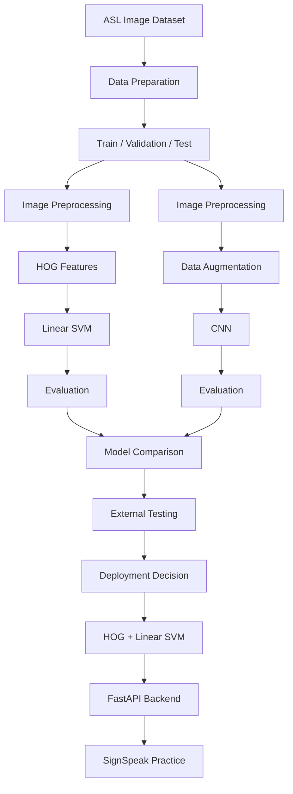

---

## 🎯 ML Objective

**Given an image containing a hand sign, predict the corresponding ASL sign class.**

| | |
|---|---|
| **Input** | Hand sign image |
| **Output** | Predicted ASL class + prediction confidence |

```
f(image) → sign_class
```

The classifier operates on **individual captured images**. The current backend model is not continuous sign-language video recognition.

---

## 📁 ML Workspace

```
ml/
│
├── data/
│   └── datasets / prepared data
│
├── models/
│   └── trained model artifacts
│
├── notebooks/
│   └── experiments and training notebooks
│
├── reports/
│   └── evaluation reports
│
├── results/
│   └── model outputs and evaluation results
│
├── src/
│   └── reusable ML pipeline code
│
└── README.md
```

| Directory | Responsibility |
|---|---|
| `data/` | Dataset storage and prepared data splits |
| `models/` | Serialized trained model artifacts |
| `notebooks/` | Experimentation, training, and evaluation notebooks |
| `reports/` | Evaluation summaries and analysis documents |
| `results/` | Raw model outputs, metrics, and prediction exports |
| `src/` | Reusable pipeline code (preprocessing, training, inference) |

Virtual environments (`cnn_venv/`), notebook checkpoints (`.ipynb_checkpoints/`), and generated cache directories (`__pycache__/`) are development artifacts rather than part of the ML architecture and are intentionally excluded above.

---

## 🔄 Machine Learning Lifecycle

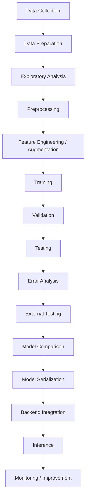

| Stage | Purpose |
|---|---|
| Data Collection | Gather labeled sign-image data |
| Data Preparation | Organize, clean, and structure the dataset |
| Exploratory Analysis | Understand class distribution and image characteristics |
| Preprocessing | Normalize images into a consistent representation |
| Feature Engineering / Augmentation | Extract HOG features or apply CNN augmentation |
| Training | Fit model parameters on the training set |
| Validation | Monitor generalization during development |
| Testing | Estimate final in-distribution performance |
| Error Analysis | Study confusion patterns and misclassifications |
| External Testing | Evaluate on images outside the training distribution |
| Model Comparison | Compare classical vs. deep-learning approaches |
| Model Serialization | Persist the selected trained model to disk |
| Backend Integration | Load the artifact into the FastAPI inference service |
| Inference | Serve real-time predictions to the learner |
| Monitoring / Improvement | Identify future data and modeling improvements |

---

## 🗂️ Dataset Architecture

SignSpeak experiments use labeled sign-language image data for supervised classification.

```
Dataset
│
├── Sign A
├── Sign B
├── Sign C
├── ...
└── Sign Classes
```

Each **image** is an input sample; each **folder / class label** is the target class. Exact dataset composition (image counts, signer counts, dataset size, train/test sample counts) is intentionally not stated here to avoid overstating what is documented.

---

## 🔄 Data Pipeline

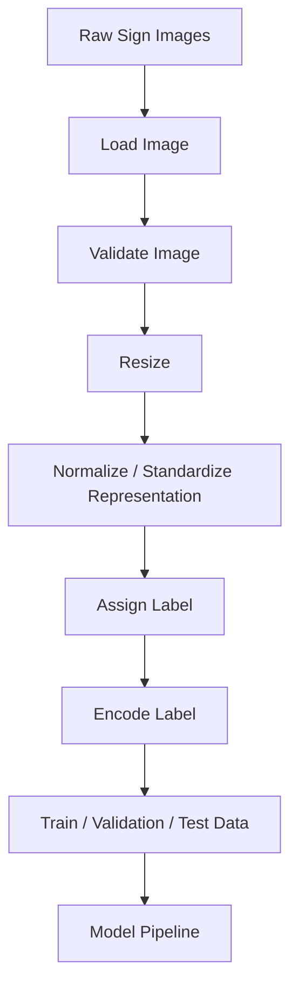

Both the classical ML and CNN approaches ultimately depend on consistent image preprocessing — inconsistent input representation is one of the most common sources of unreliable model behavior.

---

## 🧹 Data Preparation

Key computer-vision preparation steps:

- Image loading
- Image resizing to consistent dimensions
- Label extraction from folder/file structure
- Label encoding
- Train / validation / test organization
- Pixel normalization where required
- Input validation

Consistent input representation matters because both HOG extraction and CNN training assume a uniform image format — inconsistent sizing or color handling can silently degrade model quality. Exact image dimensions used are not stated here beyond what is documented in the pipeline code.

---

## 🧪 Dataset Splits

| Split | Role |
|---|---|
| **Training Set** | Learns model parameters |
| **Validation Set** | Evaluates model behavior during development |
| **Test Set** | Estimates final in-distribution performance |

```
Dataset
├── Training
│     ↓
│   Learn
│
├── Validation
│     ↓
│   Tune / Observe
│
└── Test
      ↓
    Final Evaluation
```

Test data is kept separate from training so that the reported test accuracy reflects genuine generalization within the dataset's distribution, rather than memorization.

---

# 🔬 HOG + Linear SVM Pipeline

The compact classical computer-vision approach used for the **current SignSpeak backend inference model**.

```
Image
  ↓
Preprocessing
  ↓
HOG Feature Extraction
  ↓
Feature Vector
  ↓
Linear SVM
  ↓
Encoded Class
  ↓
Label Encoder
  ↓
ASL Sign
```

---

## 🧬 Histogram of Oriented Gradients — HOG

HOG represents local shape and edge orientation information within an image, rather than raw pixel intensities.

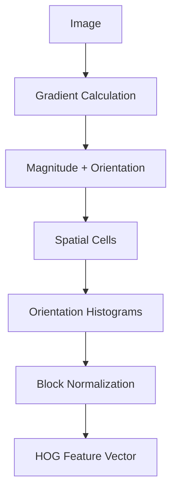

### HOG Intuition

```
Original Hand Image
        ↓
Edge / Gradient Structure
        ↓
┌────┬────┬────┐
│ ↗  │ ↑  │ ↖  │
├────┼────┼────┤
│ →  │ ↗  │ ↑  │
├────┼────┼────┤
│ ↘  │ →  │ ↗  │
└────┴────┴────┘
        ↓
Orientation Histograms
        ↓
Numerical Feature Vector
```

The SVM receives this numerical **HOG feature vector**, not the original image pixels directly.

### HOG Mathematical Concept

```
Gx = horizontal gradient
Gy = vertical gradient

Gradient magnitude:
G = √(Gx² + Gy²)

Gradient orientation:
θ = atan2(Gy, Gx)
```

Local orientation distributions computed this way are accumulated into histograms across spatial cells, then normalized across blocks to form the final feature vector.

### ✋ Why HOG?

**Advantages:**
- Captures shape structure
- Captures edge direction
- Compact feature representation
- Computationally lighter than large deep networks
- Works well for structured image-classification problems
- Suitable for compact backend deployment

**Limitations:**
- Sensitive to domain changes
- Background variation
- Lighting
- Hand orientation
- Scale
- Signer variation

---

## 📐 Linear Support Vector Machine

After HOG extraction, the resulting feature vectors are classified using a **Linear SVM**.

```
HOG Features
  ↓
Feature Space
  ↓
Linear Decision Boundaries
  ↓
Predicted Class
```

Multiclass sign classification is handled through the classifier's multiclass strategy.

### SVM Concept Visual

```
Feature Space

        Class A
      ● ● ● ●

------------------------- Decision Boundary

              ▲ ▲ ▲ ▲
               Class B
```

Real SignSpeak classification involves many sign classes, not just two — the diagram above illustrates the core linear-separation concept only.

### SVM Training Pipeline

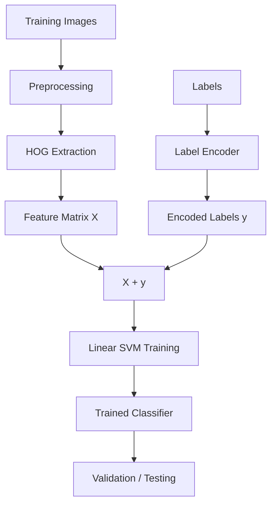

---

## 🏷️ Label Encoding

ASL labels such as `A`, `B`, `C`, ... are represented internally in a machine-readable form.

```
"A" → encoded class
"B" → encoded class
"C" → encoded class
```

During inference:

```
Predicted Encoded Class
  ↓
Label Encoder
  ↓
Human-Readable Sign
```

Exact integer mappings are not documented here to avoid stating unverified implementation detail.

---

## 📊 HOG + Linear SVM Results

| Metric | Result |
|---|---:|
| Validation Accuracy | 91.14% |
| Test Accuracy | 91.09% |

These figures represent performance on the **controlled validation/test distribution** only.

---

# 🧠 CNN + Data Augmentation

SignSpeak also experimented with a Convolutional Neural Network to learn image features directly from sign images.

```
Image
  ↓
Preprocessing
  ↓
Data Augmentation
  ↓
CNN
  ↓
Feature Learning
  ↓
Classification
  ↓
Predicted Sign
```

The CNN is an **experimental model** — it is **not** the compact model currently used by the backend inference API.

---

## 🧠 How the CNN Learns

```
Input Image
  ↓
Convolution
  ↓
Feature Maps
  ↓
Activation
  ↓
Pooling
  ↓
Deeper Features
  ↓
Classification Layer
  ↓
ASL Class
```

| Depth | Learns |
|---|---|
| Early layers | Edges and simple patterns |
| Middle layers | Local hand structures |
| Deeper layers | Higher-level discriminative patterns |

Exact layer counts, filter sizes, and parameter counts are not documented here.

### CNN Architecture Diagram

> *Conceptual CNN architecture — exact implementation may vary.*

```
┌──────────────┐
│ Input Image  │
└──────┬───────┘
       ↓
┌──────────────┐
│ Convolution  │
└──────┬───────┘
       ↓
┌──────────────┐
│ Activation   │
└──────┬───────┘
       ↓
┌──────────────┐
│ Pooling      │
└──────┬───────┘
       ↓
      ...
       ↓
┌──────────────┐
│ Dense /      │
│ Classifier   │
└──────┬───────┘
       ↓
  Predicted Sign
```

---

## 🔄 Data Augmentation

Augmentation can include controlled transformations such as small rotations, translations, zoom, and brightness variation — exposing the CNN to controlled visual variation while preserving the semantic meaning of the sign. Not every augmentation type listed is necessarily used in every training run; this section describes the general concept rather than a fixed configuration.

### Why Augmentation Matters

```
Original Training Image
  ↓
Controlled Variations
├── Slight Rotation
├── Position Shift
├── Scale Variation
└── Lighting Variation
  ↓
CNN Training
  ↓
Improved Robustness Goal
```

Augmentation attempts to reduce overfitting and improve robustness, but it does **not** automatically guarantee real-world generalization — a point reinforced later in the external testing results.

---

## 📊 CNN Results

| Metric | Result |
|---|---:|
| Validation Accuracy | 91.62% |
| Test Accuracy | 90.98% |

---

# ⚖️ Model Comparison

| Model | Validation Accuracy | Test Accuracy | Backend Deployment |
|---|---:|---:|---|
| HOG + Linear SVM | 91.14% | 91.09% | ✅ Current |
| CNN + Data Augmentation | 91.62% | 90.98% | Experimental |

The difference in controlled accuracy is small. Model selection is **not** based only on the highest validation number — it also considers model size, runtime complexity, deployment simplicity, inference requirements, generalization behavior, and maintainability. On that basis, the compact HOG + Linear SVM model was selected for backend deployment.

### Model Performance Visual

```
Controlled Evaluation

HOG + Linear SVM
Validation  ██████████████████  91.14%
Test        ██████████████████  91.09%

CNN + Augmentation
Validation  ██████████████████  91.62%
Test        ██████████████████  90.98%
```

*Bars are illustrative visualizations of the reported percentages.*

---

## 📈 Training History

CNN training history is analyzed via epoch, training accuracy, validation accuracy, training loss, and validation loss.

```
Accuracy
  ^
  |                train
  |             __/----
  |          __/
  |      ___/     validation
  |_____/__________________> Epoch

Loss
  ^
  |\
  | \
  |  \____
  |       \____
  |________________________> Epoch
```

*ASCII curves above are conceptual, not exact plotted results.*

The `cnn_training_history.csv` analytics dataset supports training accuracy curves, validation accuracy curves, training loss curves, validation loss curves, epoch-level analysis, and Power BI visualization.

---

## 🧪 Evaluation Framework

```
Training
  ↓
Validation
  ↓
Test
  ↓
Confusion Analysis
  ↓
External Testing
  ↓
Deployment Decision
```

Evaluation considers accuracy, class-level performance, confusion analysis, validation behavior, test behavior, external testing, and prediction confidence — not accuracy in isolation.

---

## 🔀 Confusion Analysis

A confusion occurs when **Actual Sign ≠ Predicted Sign**.

```
Actual:     W
Predicted:  V
Result:     W → V
```

Confusion analysis reveals class pairs the model struggles to distinguish.

### Observed Model Confusions

| Actual | Predicted | Count |
|---|---|---:|
| W | V | 39 |
| V | U | 24 |
| N | M | 22 |
| V | W | 19 |
| U | V | 17 |
| U | R | 15 |
| Y | X | 14 |
| X | V | 13 |
| B | E | 11 |

These are **model-evaluation confusion observations** — not a specific learner's confusion history.

### Confusion Workflow

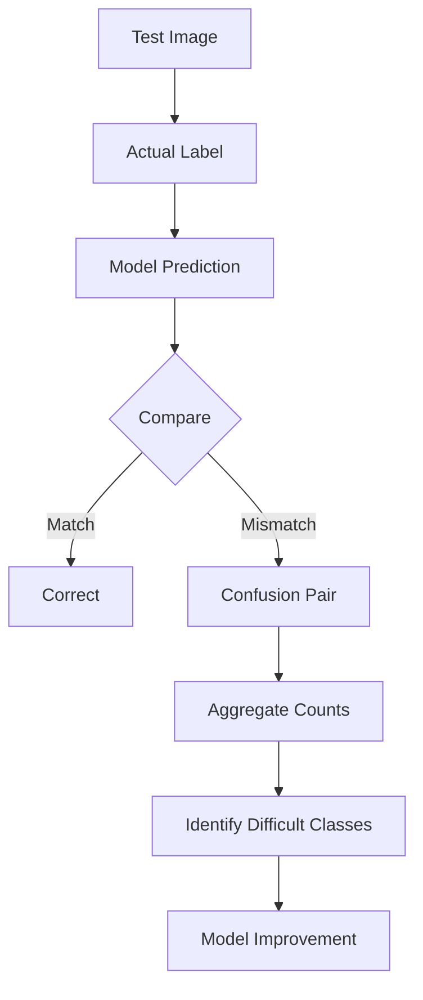

### 🧩 Why Similar Signs Can Be Difficult

Possible visual similarity factors include finger configuration, hand orientation, small shape differences, spatial position, and image perspective. Observed confusion pairs can help identify where additional data or preprocessing may be useful. No linguistic claims about ASL sign relationships beyond visual similarity are made here.

---

# 🌍 External Generalization Testing

Controlled validation/test accuracy alone is not enough to judge real-world robustness. A very small custom external image set was tested.

| Expected | Predicted | Confidence |
|---|---|---:|
| A | N | 46.04% |
| B | E | 43.37% |
| C | O | 56.65% |
| L | Q | 82.06% |
| V | K | 57.06% |

**External sample accuracy: 0% on this tiny custom external sample set.**

## ⚠️ Important Interpretation

This must **not** be read as "the model has 0% real-world accuracy." Instead: the small custom external sample set produced no correct classifications, indicating a **significant domain/generalization gap** between the controlled dataset and the tested external images.

Because the external sample is tiny, it is not a statistically sufficient benchmark for universal real-world performance. However, it is an important warning that the model is **not currently robust enough for production-level sign recognition.**

### Generalization Gap

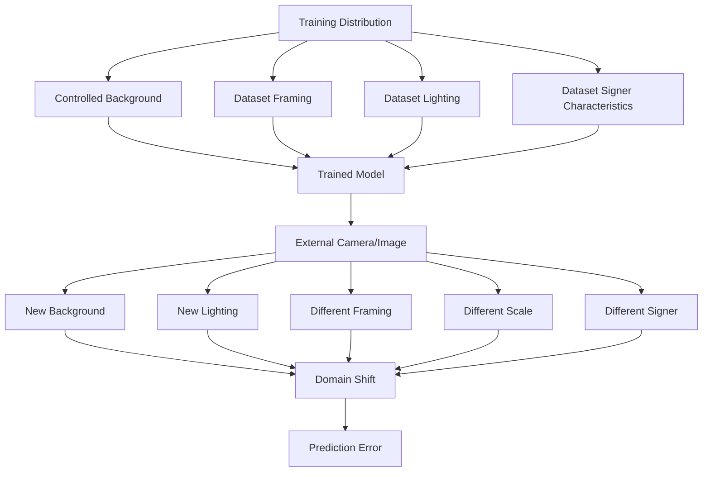

*These factors are presented as possible causes, not proven causes.*

---

## 🎚️ Confidence ≠ Correctness

| Field | Value |
|---|---|
| Expected | L |
| Predicted | Q |
| Confidence | 82.06% |

The classifier can be **highly confident while still being incorrect**. Therefore:

```
Prediction Confidence ≠ Prediction Accuracy
```

This distinction matters for learner feedback (don't imply certainty the model doesn't have), analytics (don't treat confidence as a correctness proxy), model evaluation (report both metrics separately), and production readiness (high average confidence is not evidence of readiness).

---

## Live Camera Generalization

Real camera input may differ substantially from the training dataset.

```
Learner Performs A
  ↓
Camera Frame
  ↓
Model
  ↓
Prediction M
  ↓
High Confidence
  ↓
Incorrect Result
```

This pattern can indicate **model-domain mismatch** rather than a camera integration failure — and should not be read as the learner having performed the sign incorrectly.

---

# ⚠️ Current ML Limitations

- Poor external generalization
- Sensitivity to lighting
- Background variation
- Camera framing
- Signer variation
- Hand position
- Scale differences
- Visually similar classes
- Confidence calibration
- Static-image classification limitations
- Limited external evaluation sample

The current model should be considered a **Prototype / Research Model**, and **not** a Production-Grade Recognition System.

---

## 🚀 Model Improvement Strategy

- Larger real-world dataset
- Multiple signers
- Multiple cameras
- Lighting variation
- Background variation
- Camera-domain augmentation
- Hand-region extraction
- MediaPipe hand landmarks
- Hand normalization
- Transfer learning
- Confidence calibration
- Signer-independent evaluation
- Cross-domain validation
- Hard-example mining
- Confusion-pair targeted training

---

## MediaPipe Future Pipeline

```
Camera Frame
  ↓
MediaPipe Hands
  ↓
Hand Detection
  ↓
Landmarks / Hand ROI
  ↓
Normalization
  ↓
Classifier
  ↓
Prediction
```

*This is a future improvement direction and should not be described as the current deployed HOG + SVM inference pipeline.*

---

## 🎞️ Static vs Sequential Recognition

The current pipeline performs **image-based / static** classification.

**Current:**
```
Single Image
  ↓
Classifier
  ↓
Sign
```

**Future:**
```
Video Frames
  ↓
Temporal Features
  ↓
Sequence Model
  ↓
Dynamic Sign
```

Future model families under consideration: LSTM, Transformer, Temporal CNN — all clearly future research directions, not current implementation.

---

## 📦 Model Artifacts

The deployed backend artifacts:

| Artifact | Purpose |
|---|---|
| `hog_linear_svm.joblib` | Serialized trained classifier |
| `label_encoder.joblib` | Class-label conversion |

```
Training Pipeline
  ↓
Trained Model
  ↓
Serialization
  ↓
.joblib
  ↓
Backend
  ↓
Inference
```

---

## 💾 Model Serialization

Trained models are serialized to:

- Avoid retraining on every backend startup
- Provide a portable inference artifact
- Maintain a consistent prediction pipeline
- Simplify FastAPI integration

Formal model versioning infrastructure is not currently implemented.

---

# ⚡ ML → FastAPI Deployment

```
ML Training Workspace
  ↓
Trained HOG + SVM
  ↓
hog_linear_svm.joblib + label_encoder.joblib
  ↓
Backend Models Directory
  ↓
FastAPI ML Service
  ↓
POST /api/v1/ml/predict
  ↓
Frontend Practice
```

---

## 🔮 Inference Pipeline

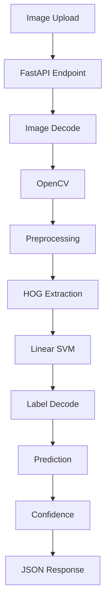

---

## ML Prediction API

**`POST /api/v1/ml/predict`**

Receives a sign image and returns prediction information.

```json
{
  "predicted_sign": "A",
  "confidence": 91.42
}
```

*Response values shown are illustrative.*

---

## 🤟 Learner → ML Flow

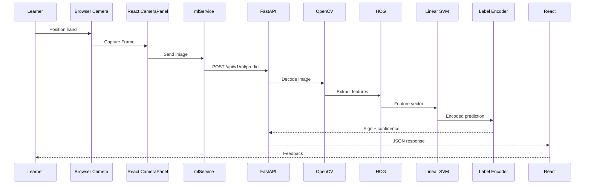

---

## 🔗 ML Practice Integration

```
ML Prediction
  ↓
Frontend receives: Predicted Sign, Confidence
  ↓
Frontend knows: Target Sign
  ↓
Compare
  ↓
Correct / Incorrect
  ↓
Generate Practice Feedback
  ↓
Save Detection
  ↓
Practice Analytics
```

The ML model itself does **not** determine whether the learner's attempt is correct — that judgment requires comparing the prediction against the known target sign, which happens in the practice layer, not inside the model.

---

## 📊 ML Analytics Integration

```
ML Prediction
  ↓
Detection Record
├── Target
├── Prediction
├── Confidence
└── Correct
  ↓
Practice Session
  ↓
Reports
  ↓
Sign Performance
  ↓
Weak Signs / Strong Signs / Confusions
  ↓
Dashboard
```

---

## Model Confusion vs. Learner Confusion

| Concept | Meaning |
|---|---|
| Model Confusion | Error observed during ML model evaluation |
| Learner Practice Confusion | Target/prediction mismatch recorded during learner practice |

These are **not** the same dataset and should never be merged or compared directly.

---

## 🧠 ML Prediction vs. Personalized Learning

| System | Responsibility |
|---|---|
| HOG + SVM | Predict sign from image |
| Practice Engine | Compare target and prediction |
| Analytics Engine | Aggregate learner performance |
| Learning Plan | Recommend what learner should practice |
| Dashboard | Display learner intelligence |

The personalized learning engine is **performance-based / rule-based logic**. It is **not** the sign-recognition model, and it is **not** a generative AI model.

---

## 🧪 Experiment Documentation

Each ML experiment records: model name, preprocessing method, feature extraction, training configuration, validation accuracy, test accuracy, confusion patterns, external testing results, artifact location, and deployment status.

| Experiment | Approach | Validation | Test | Deployment |
|---|---|---:|---:|---|
| Classical CV | HOG + Linear SVM | 91.14% | 91.09% | Backend |
| Deep Learning | CNN + Augmentation | 91.62% | 90.98% | Experimental |

---

# 📋 Model Card — HOG + Linear SVM

| Field | Detail |
|---|---|
| **Model Purpose** | Static ASL image classification |
| **Input** | Single sign image |
| **Output** | Predicted sign + confidence |
| **Feature Representation** | HOG |
| **Classifier** | Linear SVM |
| **Validation Accuracy** | 91.14% |
| **Test Accuracy** | 91.09% |
| **Deployment** | FastAPI backend |

**Strengths:** compact, fast relative to larger deep models, simple deployment, strong controlled dataset performance.

**Limitations:** external generalization, background sensitivity, lighting sensitivity, signer variation, static-image limitation.

**Intended Use:** SignSpeak prototype AI practice.

**Not Intended For:** production-critical sign-language interpretation, medical/legal communication, real-time continuous sign-language translation.

---

# 📋 Model Card — CNN + Augmentation

| Field | Detail |
|---|---|
| **Purpose** | Static ASL image classification (experimental) |
| **Input** | Single sign image |
| **Output** | Predicted sign + confidence |
| **Training Approach** | CNN with data augmentation |
| **Validation Accuracy** | 91.62% |
| **Test Accuracy** | 90.98% |
| **Deployment** | Experimental / not the current backend inference model |

**Strengths:** learns features directly from raw pixels, competitive controlled accuracy, useful comparison baseline for future deep-learning work.

**Limitations:** larger artifact than HOG+SVM, comparatively higher deployment complexity, external generalization not separately validated beyond the shared external sample set.

---

## 🔁 Reproducible Experiment Workflow

```
Prepare Dataset
  ↓
Create Environment
  ↓
Run Preprocessing
  ↓
Train Model
  ↓
Save Metrics
  ↓
Evaluate
  ↓
Analyze Confusions
  ↓
Test External Images
  ↓
Serialize Selected Model
  ↓
Integrate With Backend
```

*Specific script filenames or commands are not stated here beyond what is documented elsewhere in the workspace.*

---

## 📓 Notebook Workflow

Notebooks support data exploration, model experimentation, training, visual evaluation, confusion analysis, and external testing. A recommended notebook progression (as a documentation convention, not a claim of exact existing filenames):

```
01 — Data Exploration
02 — Preprocessing
03 — HOG + SVM
04 — CNN
05 — Model Evaluation
06 — External Testing
```

---

## 📑 ML Reports

The `reports/` area can contain model comparison summaries, evaluation summaries, training history analysis, confusion analysis, external testing writeups, and generalization observations.

## 📊 Results Artifacts

The `results/` area can contain metrics, predictions, confusion data, training curves, evaluation exports, and external predictions — outputs that can feed analytics documentation, Power BI, technical reports, and model comparison work.

---

## 📊 ML → Power BI

Prepared analytics files:

```
cnn_training_history.csv
external_predictions.csv
model_performance.csv
sign_confusions.csv
sign_performance.csv
```

```
ML Experiments
  ↓
Evaluation Results
  ↓
CSV Analytics
  ↓
Power BI
  ↓
Model Performance Dashboard
```

| Dataset | Purpose |
|---|---|
| `cnn_training_history.csv` | Training/validation learning curves |
| `external_predictions.csv` | External generalization analysis |
| `model_performance.csv` | SVM vs. CNN comparison |
| `sign_confusions.csv` | Model confusion analysis |
| `sign_performance.csv` | Sign-level performance analysis |

### Power BI ML Wireframe

> *Wireframe is conceptual.*

```
┌──────────────────────────────────────────────────────────────┐
│                 ML PERFORMANCE ANALYTICS                     │
├──────────────┬──────────────┬───────────────────────────────┤
│ SVM Test      │ CNN Test      │ External Generalization       │
│ 91.09%        │ 90.98%        │ Requires Improvement          │
├──────────────┴──────────────┴───────────────────────────────┤
│ Training History                  │ Model Comparison           │
│        Line Chart                 │       Bar Chart             │
├───────────────────────────────────┼───────────────────────────┤
│ Sign Performance                  │ Confusion Analysis         │
│        Bar Chart                  │       Matrix                │
└───────────────────────────────────┴───────────────────────────┘
```

Full BI documentation: [`../powerbi/README.md`](../powerbi/README.md)

---

## 🧹 ML Data Quality Considerations

Class balance, duplicate images, background bias, lighting bias, signer diversity, image quality, incorrect labels, data leakage, train/test similarity, and external-domain differences all affect evaluation reliability. High controlled test accuracy can still coexist with poor external performance precisely because these factors are not fully controlled for outside the training distribution.

### 🚫 Data Leakage Awareness

Train/test leakage can make evaluation overly optimistic. Precautions include keeping train/test data separate, avoiding duplicate samples across splits, using signer-independent splitting where possible, and avoiding preprocessing fitted using test information. *No leakage problem has been identified — this section describes general awareness, not a diagnosed issue.*

### 📉 Overfitting Awareness

```
Training Performance Improves
  ↓
Validation Stops Improving
  ↓
Potential Overfitting
```

Mitigation techniques include augmentation, regularization, early stopping, more diverse data, simpler models, and validation monitoring. Not all of these are necessarily active in the current training configuration.

### ⚖️ Class Balance

Sign-class imbalance can bias classifiers toward more common classes. Future evaluation could incorporate precision, recall, F1-score, macro F1, and per-class recall. No current metric values beyond overall accuracy are claimed here.

### 📏 Why Accuracy Alone Is Not Enough

91% overall accuracy can hide poor performance on specific signs, class imbalance effects, systematic confusion pairs, external generalization problems, and confidence calibration issues. SignSpeak therefore also considers confusions, external predictions, sign-level performance, and the validation/test gap.

---

## ⚖️ Responsible ML Considerations

Sign-language technology should be developed carefully because sign languages are real human languages, and users may depend on system feedback. This means: avoid overstating model capability, communicate uncertainty, test with diverse users, avoid treating confidence as correctness, evaluate signer diversity, protect user camera data, avoid production-critical interpretation without sufficient validation, and involve sign-language experts in future development. Expert validation has **not** already occurred — this is stated as a future need, not a completed step.

## 🔐 Camera & Image Privacy

```
Browser Camera
  ↓
Frame Capture
  ↓
Prediction Request
  ↓
Backend Inference
```

Privacy-conscious future development should minimize unnecessary storage of raw camera imagery. No guarantee about raw image storage or formal privacy certification is claimed here.

---

## ⚡ ML Performance Considerations

Relevant performance factors include image decoding, image resizing, HOG extraction, SVM inference, model loading, API serialization, and network transfer. The compact HOG + SVM model is convenient for lightweight backend inference. **Formal production inference benchmarking has not yet been completed** — no latency numbers are stated.

---

## 🐳 ML Deployment Architecture

```
Browser
  ↓
React
  ↓
Dockerized FastAPI
  ↓
ML Service
  ↓
HOG + Linear SVM
  ↓
Prediction
  ↓
React Feedback
```

Model training happens separately from the Dockerized inference runtime — training is a development-time activity, inference is a runtime activity.

### Training vs. Inference

| Training | Inference |
|---|---|
| Learns model parameters | Uses trained parameters |
| Uses dataset | Uses learner image |
| Computational experiment | Runtime prediction |
| ML workspace | FastAPI backend |
| Produces model artifact | Loads model artifact |
| Happens separately | Happens during practice |

---

## Complete ML Architecture

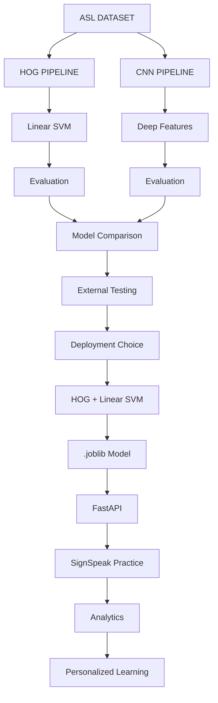

### ML Architecture Summary

```
┌──────────────────────────────────────────────────────────────┐
│                   SIGNSPEAK MACHINE LEARNING                 │
├──────────────────────────────────────────────────────────────┤
│                                                                │
│ DATA                                                          │
│ ASL Images → Labels → Train / Validation / Test               │
│                          │                                     │
│              ┌───────────┴───────────┐                         │
│              ▼                       ▼                         │
│ CLASSICAL ML                    DEEP LEARNING                  │
│ Image                           Image                          │
│   ↓                               ↓                            │
│ HOG                           Augmentation                     │
│   ↓                               ↓                            │
│ Linear SVM                    CNN                              │
│   ↓                               ↓                            │
│ 91.09% Test                   90.98% Test                      │
│              └───────────┬───────────┘                         │
│                          ▼                                     │
│                    EVALUATION                                  │
│           Confusions • External Testing                        │
│                          │                                     │
│                          ▼                                     │
│                     DEPLOYMENT                                 │
│          HOG + SVM → FastAPI → Practice                        │
│                                                                │
└──────────────────────────────────────────────────────────────┘
```

---

## 📌 ML Implementation Status

| Capability | Status |
|---|---|
| Image Dataset Pipeline | ✅ |
| Image Preprocessing | ✅ |
| HOG Feature Extraction | ✅ |
| Linear SVM Training | ✅ |
| Label Encoding | ✅ |
| SVM Evaluation | ✅ |
| CNN Experiment | ✅ |
| Data Augmentation Experiment | ✅ |
| CNN Evaluation | ✅ |
| Model Comparison | ✅ |
| Confusion Analysis | ✅ |
| External Image Testing | ✅ |
| Model Serialization | ✅ |
| FastAPI Integration | ✅ |
| Dockerized Inference | ✅ |
| Learner Practice Integration | ✅ |
| Real-World Robustness | ⚠️ Improvement Required |
| MediaPipe Normalization | 🔜 Future |
| Continuous Sign Recognition | 🔜 Future |
| Model Monitoring | 🔜 Future |

---

# 🗺️ ML Roadmap *(Future Work)*

- Larger real-world ASL dataset
- Multiple signers
- Signer-independent testing
- Camera-domain dataset collection
- MediaPipe hand landmarks
- Hand ROI normalization
- Background removal
- Transfer learning
- MobileNet / EfficientNet
- Confidence calibration
- Ensemble models
- Hard-example mining
- Confusion-aware training
- Real-time inference
- Dynamic gesture recognition
- LSTM / Transformer
- Model versioning
- MLflow-style experiment tracking
- Model drift monitoring
- Automated evaluation pipeline

### Future ML Roadmap Diagram

> *Future ML Direction — Not Current Implementation*

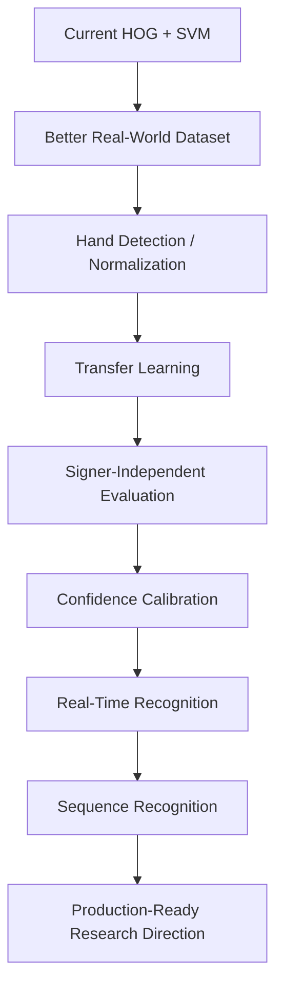

### 📶 Model Maturity

```
Research
   ↓
Prototype              ← Current SignSpeak
   ↓
Robust Validation
   ↓
Real-World Pilot
   ↓
Production
```

SignSpeak currently sits at the **prototype** stage: it has completed research and controlled evaluation, but has not yet undergone the robust, signer-independent, real-world validation required to progress further.

---

## 💡 ML Engineering Principles

Evaluate beyond training accuracy • Keep test data separate • Analyze class-level errors • Track confusion pairs • Test outside the training domain • Never treat confidence as correctness • Separate training from inference • Serialize reproducible model artifacts • Keep model logic separate from learner analytics • Document limitations transparently • Prefer measurable evidence over claims

---

## 🧪 ML Testing Strategy

```
              Real-World Testing
             External Evaluation
            Controlled Test Set
           Validation Evaluation
        Pipeline / Preprocessing Tests
```

Testing spans input validation, preprocessing consistency, HOG output consistency, model loading, label decoding, prediction format, controlled test evaluation, external testing, and backend inference integration.

### End-to-End ML Validation

```
Dataset
  ↓
Train Model
  ↓
Save Artifact
  ↓
Load in FastAPI
  ↓
Send Image
  ↓
Generate Prediction
  ↓
Frontend Receives Prediction
  ↓
Practice Session Saves Result
  ↓
Reports Consume Detection
```

This validates **integration** — it does not, by itself, prove real-world model robustness.

---

## 🧾 Research Summary

**HOG + Linear SVM**
Validation: 91.14% · Test: 91.09% · Deployment: Current backend inference

**CNN + Augmentation**
Validation: 91.62% · Test: 90.98% · Deployment: Experimental

**External Custom Images**
Observed correct classifications: **0%** on the tiny custom sample set

**Conclusion:** Controlled dataset performance is strong, but external testing demonstrates that real-world generalization requires substantial improvement.

---

## Important Technical Distinctions

| Term | Definition |
|---|---|
| HOG | Feature extraction |
| Linear SVM | Classifier |
| Label Encoder | Converts class representation to human-readable sign label |
| CNN | Separate deep-learning experiment |
| FastAPI | Serves inference |
| Practice Engine | Compares target with prediction |
| Analytics | Aggregates learner performance |
| Personalized Learning | Performance-based recommendation logic |
| Power BI | Analytics visualization |

These responsibilities are never mixed within the system.

---

## 🚫 Claims Explicitly Avoided in This Documentation

This README does **not** claim:

- The model understands sign language like a human
- The model translates full ASL conversations
- The current model recognizes continuous signing
- The current model is production-ready
- The current model has 91% real-world accuracy
- The model has universally 0% real-world accuracy
- The CNN is the deployed backend model
- MediaPipe is the current inference pipeline
- LSTM is currently deployed
- Transformers are currently deployed
- The system performs live server-side video streaming
- The system replaces professional sign-language interpreters

---

## 📚 Related Documentation

- [`../README.md`](../README.md) — Complete project overview
- [`../frontend/README.md`](../frontend/README.md) — React application
- [`../backend/README.md`](../backend/README.md) — FastAPI backend
- [`../analytics/README.md`](../analytics/README.md) — Learner analytics
- [`../powerbi/README.md`](../powerbi/README.md) — Power BI analytics
- [`../docker/README.md`](../docker/README.md) — Docker deployment
- [`../docs/README.md`](../docs/README.md) — Technical documentation

---

<div align="center">

### 🧠 SignSpeak Machine Learning

*"From visual features to intelligent learning feedback."*

**Computer Vision • HOG • SVM • CNN • Evaluation • Inference**

</div>