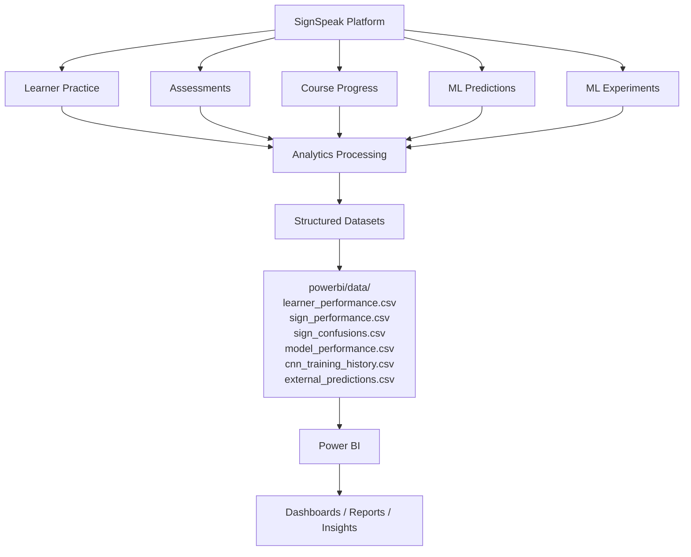
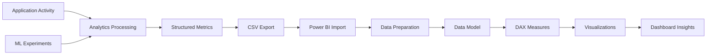
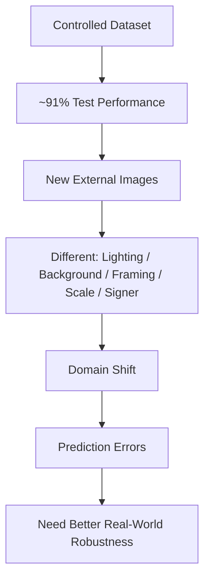
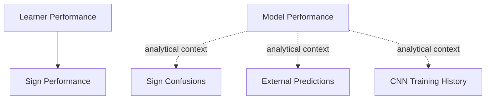
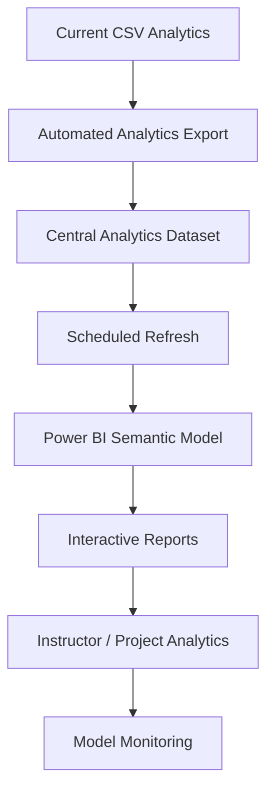
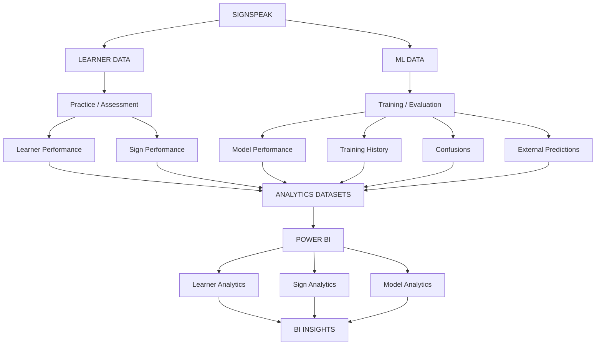

<div align="center">

# 📊 SignSpeak Power BI Analytics

### *Transforming learner performance and machine-learning results into actionable visual intelligence.*

**Business Intelligence • Learner Analytics • ML Analytics • Performance Insights**


</div>

---

## ⚠️ Scope Notice

The Power BI module of SignSpeak provides **structured, analytics-ready CSV datasets** derived from platform activity and machine-learning experiments. This README documents the analytics pipeline, dataset catalog, KPI framework, and **recommended / conceptual** dashboard designs for those datasets.

**No production Power BI dashboard is currently deployed.** Every dashboard layout in this document is explicitly labeled a **Recommended Power BI Dashboard Design** or **Conceptual Dashboard Wireframe**, and all illustrative values within them are examples, not live data.

---

## 📊 Power BI Overview

SignSpeak prepares structured analytics datasets so that learner and machine-learning outcomes can be explored through Business Intelligence tooling. The BI layer sits **downstream** of the application and ML pipeline — it visualizes what has already happened, it does not drive live application behavior.

The BI layer connects two major analytics domains:

**Learner Intelligence** — practice performance, accuracy, confidence, weak signs, strong signs, progress, learning activity.

**Model Intelligence** — SVM performance, CNN performance, training history, sign confusions, external predictions, generalization behavior.

```
SignSpeak Data
      ↓
Analytics Preparation
      ↓
CSV Datasets
      ↓
Power BI
      ↓
┌──────────────────────────────┐
│ Learner Intelligence         │
│ Model Intelligence           │
│ Sign Intelligence            │
│ Training Intelligence        │
└──────────────────────────────┘
```

---

## 🏗️ Business Intelligence Architecture



---

## 🧩 Role of Power BI in the SignSpeak Ecosystem

| Layer | Responsibility |
|---|---|
| React Dashboard | Live, learner-facing application analytics |
| FastAPI Reports | Backend analytics aggregation served over REST |
| PostgreSQL | Application data persistence (source of truth) |
| ML Pipeline | Model training, evaluation, and prediction |
| Analytics Layer | Derives structured performance information from raw activity |
| **Power BI** | **Extended BI visualization and analytical exploration** |

Power BI **complements** the React learner dashboard and FastAPI analytics reports — it does not replace them. It exists as a separate, deeper analytical environment for exploring learner and model performance beyond what the live application surfaces.

---

## 📁 Power BI Workspace Structure

```
powerbi/
│
├── data/
│   ├── cnn_training_history.csv
│   ├── external_predictions.csv
│   ├── learner_performance.csv
│   ├── model_performance.csv
│   ├── sign_confusions.csv
│   └── sign_performance.csv
│
└── README.md
```

| File | Analytics Domain |
|---|---|
| `learner_performance.csv` | Learner Intelligence |
| `sign_performance.csv` | Sign Intelligence |
| `sign_confusions.csv` | Model Error Intelligence |
| `model_performance.csv` | Model Intelligence |
| `cnn_training_history.csv` | Training Intelligence |
| `external_predictions.csv` | Generalization Intelligence |

---

## 🗂️ Analytics Datasets

### 1. `learner_performance.csv`
**Purpose:** Learner-level performance and progress analytics.
**Supports:** learner accuracy, practice performance, learning progress, session activity, learner KPI trends.

---

### 2. `sign_performance.csv`
**Purpose:** Sign-level performance analytics.
**Supports:** accuracy by sign, attempt distribution, correctness, confidence, priority signs, strong signs.

---

### 3. `sign_confusions.csv`
**Purpose:** Analyze actual vs. predicted sign confusion patterns.
**Supports:** confusion pairs, error frequency, difficult sign classes, model-error investigation.

---

### 4. `model_performance.csv`
**Purpose:** Compare ML model performance across:
- HOG + Linear SVM
- CNN + Data Augmentation

**Supports:** validation accuracy, test accuracy, model comparison, deployment discussion.

---

### 5. `cnn_training_history.csv`
**Purpose:** Analyze CNN training behavior across epochs.
**Supports:** training accuracy, validation accuracy, training loss, validation loss, learning curves, overfitting analysis.

---

### 6. `external_predictions.csv`
**Purpose:** Analyze model behavior on custom external images.
**Supports:** expected sign, predicted sign, prediction confidence, correct/incorrect result, external generalization analysis.

---

## 📚 Dataset Catalog

| Dataset | Domain | Primary Purpose | Recommended Visuals |
|---|---|---|---|
| `learner_performance.csv` | Learner | Learner KPI analysis | Cards, line charts, bar charts |
| `sign_performance.csv` | Sign | Per-sign performance | Bar chart, matrix, conditional table |
| `sign_confusions.csv` | ML Errors | Confusion analysis | Matrix, heatmap-style visual, bar chart |
| `model_performance.csv` | ML Models | Model comparison | Clustered columns, KPI cards |
| `cnn_training_history.csv` | Training | Learning curves | Line charts |
| `external_predictions.csv` | Generalization | External prediction analysis | Table, bar chart, KPI |

---

## 🔄 BI Data Pipeline



**Application analytics** (learner practice, assessments, progress) and **ML experiment analytics** (training, evaluation, external testing) are processed independently before converging into the same BI layer — they must never be interpreted as the same category of data.

---

## 🎓 Learner Analytics Pipeline

```
Learner
  ↓
Practice
  ↓
Detection History
  ↓
Accuracy / Confidence
  ↓
Sign Performance
  ↓
Learner Performance Dataset
  ↓
Power BI
  ↓
Learner Dashboard
```

```
Assessments
  ↓
Performance Analytics
```

```
Course Progress
  ↓
Learning Analytics
```

---

## 🤖 ML Analytics Pipeline

```
ASL Dataset
  ↓
Model Training
  ↓
HOG + SVM / CNN
  ↓
Evaluation
  ↓
Metrics
  ↓
Confusion Analysis
  ↓
External Testing
  ↓
Analytics CSVs
  ↓
Power BI
  ↓
Model Intelligence
```

---

## 🧠 Analytics Domains

| Domain | Guiding Question |
|---|---|
| **Learner Intelligence** | How is the learner performing? |
| **Sign Intelligence** | Which signs are strong, weak, or frequently confused? |
| **Model Intelligence** | How well do the recognition models perform? |
| **Training Intelligence** | How did the CNN behave during training? |

```
┌────────────────────┬────────────────────┐
│ Learner Intelligence│ Sign Intelligence  │
├────────────────────┼────────────────────┤
│ Model Intelligence  │ Training Intelligence│
└────────────────────┴────────────────────┘
```

---

## 📈 KPI Framework

| KPI | Domain | Meaning | Recommended Visual |
|---|---|---|---|
| Learner Accuracy | Learner | Correct attempts ÷ total attempts | KPI Card |
| Practice Sessions | Learner | Count of practice sessions | KPI Card |
| Total Attempts | Learner | Total sign attempts recorded | KPI Card |
| Successful Attempts | Learner | Correct sign attempts | KPI Card |
| Average Confidence | Learner | Mean model confidence during practice | KPI Card / Bar |
| Weak Signs | Sign | Signs below the priority threshold | KPI Card / Table |
| Strong Signs | Sign | Signs at or above the strong threshold | KPI Card / Table |
| Assessment Average | Learner | Mean assessment score | KPI Card |
| Course Progress | Learner | Completion percentage | Gauge / Card |
| SVM Validation Accuracy | Model | HOG+SVM validation performance | KPI Card |
| SVM Test Accuracy | Model | HOG+SVM held-out test performance | KPI Card |
| CNN Validation Accuracy | Model | CNN validation performance | KPI Card |
| CNN Test Accuracy | Model | CNN held-out test performance | KPI Card |
| External Correct Predictions | Generalization | Correct predictions on external samples | KPI Card |
| Confusion Frequency | Model | Count of actual→predicted confusion events | Bar / Matrix |

---

## 🎓 Recommended Learner Performance Dashboard

> **Conceptual dashboard wireframe — values are illustrative.**

```
┌──────────────────────────────────────────────────────────────┐
│                SIGNSPEAK LEARNER ANALYTICS                   │
├──────────────┬──────────────┬──────────────┬────────────────┤
│ Accuracy     │ Sessions     │ Confidence   │ Progress       │
│    78%       │     24       │     86%      │     72%        │
├──────────────┴──────────────┴──────────────┴────────────────┤
│ Learner Progress                    │ Practice Activity      │
│          LINE CHART                 │      BAR CHART         │
├────────────────────────────────────┼────────────────────────┤
│ Sign Performance                    │ Priority Signs         │
│          BAR CHART                  │ A • M • V              │
├────────────────────────────────────┼────────────────────────┤
│ Strong Signs                        │ Assessment Performance │
│ B • C • L                           │      KPI / CHART       │
└────────────────────────────────────┴────────────────────────┘
```

---

## 👤 Learner Performance Analysis

Learner performance can be visualized through KPI cards, accuracy trends, session trends, practice volume, confidence, progress, assessment performance, and sign mastery. Learner analytics should prioritize **actionable learning insight** — e.g., which signs to practice next — rather than only displaying raw totals.

---

## 🎯 Learner Accuracy

**Concept:**

```
Learner Accuracy (%) = Correct Attempts / Total Attempts × 100
```

Accuracy represents **correctness**, not model confidence.

**Illustrative example:**

| Metric | Value |
|---|---:|
| Correct Attempts | 18 |
| Total Attempts | 24 |
| Accuracy | 75% |

*(Illustrative values only.)*

---

## 🎚️ Confidence ≠ Accuracy

| Term | Meaning |
|---|---|
| **Confidence** | How strongly the model prefers its predicted class |
| **Accuracy** | Whether predictions are correct relative to the expected sign |

**Illustrative example:**

| Field | Value |
|---|---|
| Target | A |
| Prediction | M |
| Confidence | 93.33% |
| Result | Incorrect |

A high-confidence prediction can still be wrong. A Power BI dashboard should **never** treat confidence as a proxy for accuracy — the two must always be displayed as distinct measures.

---

## ✋ Recommended Sign Performance Dashboard

> **Conceptual dashboard wireframe.**

```
┌──────────────────────────────────────────────────────────────┐
│                    SIGN INTELLIGENCE                         │
├──────────────┬──────────────┬──────────────┬────────────────┤
│ Signs Tested │ Weak Signs   │ Strong Signs │ Avg Accuracy   │
├──────────────┴──────────────┴──────────────┴────────────────┤
│ Accuracy by Sign                    │ Attempts by Sign       │
│          BAR CHART                  │      BAR CHART         │
├────────────────────────────────────┼────────────────────────┤
│ Confidence by Sign                  │ Sign Status            │
│          BAR CHART                  │ Priority / Developing  │
│                                      │ Strong                 │
└────────────────────────────────────┴────────────────────────┘
```

---

## 🤟 Sign-Level Analytics

Signs can be evaluated using attempts, correct attempts, accuracy, and average confidence.

**Illustrative table:**

| Sign | Attempts | Correct | Accuracy | Avg Confidence |
|---|---:|---:|---:|---:|
| A | 8 | 5 | 62.5% | 84% |
| B | 10 | 9 | 90% | 91% |
| V | 6 | 4 | 66.7% | 79% |

*(All values illustrative.)*

---

## ⚠️ Weak Sign Analysis

**Rule:** `attempts >= 1` **AND** `accuracy < 70%`

```
Sign Performance
  ↓
Accuracy < 70%?
├── No  → Continue Tracking
└── Yes
      ↓
   Weak Sign
      ↓
Priority Practice
```

Weak-sign analytics helps identify which signs should receive additional learner attention.

---

## ✅ Strong Sign Analysis

**Rule:** `attempts >= 1` **AND** `accuracy >= 80%`

```
Sign Performance
  ↓
Accuracy >= 80%?
├── No  → Developing
└── Yes
      ↓
  Strong Sign
      ↓
Mastery Insight
```

---

## Sign Performance Zones

| Performance Zone | Accuracy | Meaning |
|---|---:|---|
| Priority | < 70% | Needs additional practice |
| Developing | 70–79% | Improving |
| Strong | ≥ 80% | Performing well |

These zones can support conditional formatting in Power BI.

---

## 🎨 Recommended Conditional Formatting

| Zone | Indicator |
|---|---|
| Priority | Warning indicator |
| Developing | Neutral / progress indicator |
| Strong | Positive indicator |

Exact colors are not prescribed — conditional formatting should **improve interpretation**, not decorate the dashboard.

---

## 🔀 Sign Confusion Analytics

**Actual Sign vs. Predicted Sign**

Example: `W → V` means Actual = `W`, Predicted = `V`.

Confusion analysis can reveal visually difficult sign pairs, systematic model errors, areas requiring additional training data, and possible learner-practice challenges.

### Observed Model Confusions

| Actual Sign | Predicted Sign | Count |
|---|---|---:|
| W | V | 39 |
| V | U | 24 |
| N | M | 22 |
| V | W | 19 |
| U | V | 17 |
| U | R | 15 |
| Y | X | 14 |
| X | V | 13 |
| B | E | 11 |

These are **model evaluation confusions** — distinct from any individual learner's personal practice-confusion history.

---

## 🔀 Recommended Confusion Dashboard

> **Conceptual dashboard wireframe.**

```
┌──────────────────────────────────────────────────────────────┐
│                    CONFUSION ANALYSIS                        │
├───────────────────────┬──────────────────────────────────────┤
│ Top Confusion         │ Total Confusion Events               │
│ W → V                 │ (illustrative)                       │
├───────────────────────┴──────────────────────────────────────┤
│                     CONFUSION MATRIX                          │
├────────────────────────────────┬─────────────────────────────┤
│ Top Confusion Pairs            │ Confusion Frequency          │
│ W → V                          │        BAR CHART             │
│ V → U                          │                               │
│ N → M                          │                               │
└────────────────────────────────┴─────────────────────────────┘
```

### Confusion Matrix Concept

```
        Predicted
        A   B   C  ...
Actual
A       ✓
B           ✓
C               ✓
...
```

**Diagonal** = correct predictions. **Off-diagonal** = confusions. *(A full confusion matrix with invented values is intentionally not shown here — only the documented confusion pairs above are known.)*

---

## 🤖 Recommended ML Model Dashboard

> **Conceptual dashboard wireframe.**

```
┌──────────────────────────────────────────────────────────────┐
│                  MODEL PERFORMANCE                           │
├──────────────────┬──────────────────┬───────────────────────┤
│ SVM Test         │ CNN Test         │ Deployment Model       │
│ 91.09%           │ 90.98%           │ HOG + Linear SVM       │
├──────────────────┴──────────────────┴───────────────────────┤
│ Model Comparison                  │ Validation vs Test        │
│       COLUMN CHART                │       BAR CHART            │
├───────────────────────────────────┼──────────────────────────┤
│ Confusion Analysis                │ External Testing          │
│       MATRIX / BAR                │       TABLE                │
└───────────────────────────────────┴──────────────────────────┘
```

### Model Performance Data

| Model | Validation Accuracy | Test Accuracy |
|---|---:|---:|
| HOG + Linear SVM | 91.14% | 91.09% |
| CNN + Data Augmentation | 91.62% | 90.98% |

- **HOG + Linear SVM** — current backend inference model.
- **CNN + Data Augmentation** — experimental deep-learning model.

---

## ⚖️ Model Comparison

Model selection should consider more than maximum accuracy, including:

- Controlled accuracy
- Model complexity
- Artifact size
- Runtime requirements
- Deployment simplicity
- External generalization
- Maintainability

The compact **HOG + Linear SVM** model is currently used for backend inference, favoring simplicity and deployment efficiency over the marginal validation-accuracy edge of the CNN.

### Model Comparison Visual

```
Validation Accuracy
HOG + SVM      ██████████████████ 91.14%
CNN            ██████████████████ 91.62%

Test Accuracy
HOG + SVM      ██████████████████ 91.09%
CNN            ██████████████████ 90.98%
```

*ASCII bars provide a visual representation of the reported metrics.*

---

## 📈 CNN Training Analytics

`cnn_training_history.csv` supports analysis of model behavior across training epochs, including epoch, training accuracy, validation accuracy, training loss, and validation loss.

## 🧠 Recommended CNN Training Dashboard

> **Conceptual dashboard wireframe.**

```
┌──────────────────────────────────────────────────────────────┐
│                     CNN TRAINING                             │
├──────────────────────┬───────────────────────────────────────┤
│ Final Validation      │ Final Test                            │
│ 91.62%                │ 90.98%                                │
├──────────────────────┴───────────────────────────────────────┤
│ Training vs Validation Accuracy                               │
│                      LINE CHART                                │
├──────────────────────────────────────────────────────────────┤
│ Training vs Validation Loss                                    │
│                      LINE CHART                                │
└──────────────────────────────────────────────────────────────┘
```

### Training Curves *(Conceptual illustration — not an exact plotted result)*

```
Accuracy
^
|                  Training
|              ___-------
|          ___/
|      ___/       Validation
|_____/
+--------------------------------> Epoch

Loss
^
|\
| \
|  \____
|       \____
|             ----
+--------------------------------> Epoch
```

---

## 📉 Training vs Validation Interpretation

Power BI training curves can help identify **underfitting**, **healthy convergence**, **possible overfitting**, and **training instability**.

**Pattern:** Training accuracy improves while validation accuracy worsens → may indicate **potential overfitting**.

This pattern is described conceptually — the SignSpeak CNN should only be described as overfitting if demonstrated by the actual training history data, not assumed.

---

## 🌍 External Generalization Analytics

`external_predictions.csv` captures model behavior on a small, custom external image sample.

**Observed examples:**

| Expected | Predicted | Confidence |
|---|---|---:|
| A | N | 46.04% |
| B | E | 43.37% |
| C | O | 56.65% |
| L | Q | 82.06% |
| V | K | 57.06% |

None of these five documented custom examples were classified correctly.

## ⚠️ Important Generalization Note

Controlled model results are approximately **91%**. The tiny custom external sample set above produced **0% correct predictions**.

This should **not** be interpreted as "the model has universally 0% real-world accuracy." Rather, it demonstrates a significant **generalization / domain gap** on the specific tested samples. The external sample is far too small to serve as a universal real-world benchmark — but it does indicate that the current model should not yet be considered production-grade.

---

## 🌍 Recommended External Testing Dashboard

> **Conceptual dashboard wireframe, based on the five documented custom examples.**

```
┌──────────────────────────────────────────────────────────────┐
│                 EXTERNAL MODEL TESTING                       │
├────────────────────┬────────────────────┬────────────────────┤
│ Samples Tested      │ Correct             │ Incorrect          │
│       5              │       0             │        5           │
├────────────────────┴────────────────────┴────────────────────┤
│ Expected vs Predicted                                          │
│                     TABLE                                       │
├────────────────────────────────┬─────────────────────────────┤
│ Prediction Confidence           │ Error Distribution           │
│      BAR CHART                  │       BAR CHART               │
└────────────────────────────────┴─────────────────────────────┘
```

### Generalization Gap Visual



*Lighting, background, framing, scale, and signer variation are presented as possible contributing factors, not confirmed root causes.*

---

## 📊 Recommended SignSpeak Executive Dashboard

> **Conceptual Power BI dashboard design.**

```
┌────────────────────────────────────────────────────────────────┐
│                    SIGNSPEAK INTELLIGENCE                      │
├─────────────┬─────────────┬─────────────┬──────────────────────┤
│ Learner Acc │ SVM Test    │ CNN Test    │ Weak Signs            │
├─────────────┴─────────────┴─────────────┴──────────────────────┤
│ Learner Performance                 │ Model Performance          │
│       TREND CHART                    │      COLUMN CHART          │
├────────────────────────────────────┼────────────────────────────┤
│ Sign Performance                     │ Confusion Analysis         │
│       BAR CHART                      │      MATRIX                │
├────────────────────────────────────┼────────────────────────────┤
│ CNN Training                         │ External Predictions       │
│       LINE CHART                     │      TABLE                 │
└────────────────────────────────────┴────────────────────────────┘
```

## 🖥️ Recommended Power BI Pages

| Page | Content |
|---|---|
| 1 — Executive Overview | High-level learner and model KPIs |
| 2 — Learner Performance | Practice, accuracy, confidence, progress |
| 3 — Sign Intelligence | Sign-level performance, weak/strong signs |
| 4 — Confusion Analysis | Actual vs. predicted errors |
| 5 — Model Comparison | SVM vs. CNN |
| 6 — CNN Training | Accuracy/loss learning curves |
| 7 — External Testing | Custom-image generalization |

### Recommended Navigation Wireframe

```
┌──────────────────────────────────────────────────────────────┐
│ SignSpeak BI                                                  │
├──────────────────────────────────────────────────────────────┤
│ Overview | Learners | Signs | Confusions | Models | Training  │
│ External                                                       │
├──────────────────────────────────────────────────────────────┤
│                                                                │
│                    ACTIVE REPORT PAGE                          │
│                                                                │
└──────────────────────────────────────────────────────────────┘
```

---

## 📊 Visualization Strategy

| Insight | Recommended Visual | Why |
|---|---|---|
| Overall Accuracy | KPI Card | Single-value summary |
| Learner Progress | Line Chart | Trend over time |
| Accuracy by Sign | Bar Chart | Categorical comparison |
| Attempts by Sign | Bar Chart | Categorical comparison |
| Weak/Strong Status | Conditional Table | Zone-based interpretation |
| Model Comparison | Clustered Column Chart | Side-by-side comparison |
| Training History | Line Chart | Trend across epochs |
| Confusion | Matrix | Actual vs. predicted structure |
| External Predictions | Table | Row-level detail |
| Confidence | Bar Chart | Categorical comparison |

### Visual Selection Principles

- Use **cards** for single values.
- Use **lines** for trends over time / epochs.
- Use **bars** for category comparisons.
- Use **matrices** for confusion structures.
- Use **tables** for detailed external predictions.
- Avoid pie charts for high-cardinality sign categories.
- Avoid excessive visuals per dashboard page.
- Prioritize interpretability over decoration.

---

## 🔗 Recommended BI Data Model

The prepared CSV files represent different analytical domains. Relationships should only be modeled where compatible keys genuinely exist — no database-style relationships are invented between unrelated files.

```
Learner Performance
        │
        └──── Sign Performance

Model Performance
        │
        ├──── Sign Confusions
        │
        ├──── External Predictions
        │
        └──── CNN Training History
```



*Diagram represents analytical grouping, not guaranteed relational foreign keys.*

---

## 📖 Data Dictionary

For every dataset: purpose, typical fields, field meaning, data type category, recommended aggregation, and recommended visualization are described conceptually. Exact column names are not invented where not explicitly documented — uncertain fields are described as analytical concepts.

### `learner_performance.csv`
Concepts: learner identifier, practice activity, accuracy, confidence, progress, assessment performance. Likely used for learner-facing KPI cards and trend charts. No fabricated learner names are used anywhere in this documentation.

### `sign_performance.csv`
Concepts: sign, attempts, correct attempts, accuracy, average confidence, performance classification (where available). Aggregation should average accuracy/confidence per sign rather than summing them.

### `sign_confusions.csv`
Concepts: actual sign, predicted sign, confusion count. `Actual + Predicted` together form the confusion pair used as the matrix key.

### `model_performance.csv`
Concepts: model name, validation accuracy, test accuracy, model type, deployment context (where represented). Known metrics are used directly in the explanatory tables above.

### `cnn_training_history.csv`
Concepts: epoch, training accuracy, validation accuracy, training loss, validation loss. **Do not sum** accuracy or loss values — plot each metric against epoch instead.

### `external_predictions.csv`
Concepts: expected sign, predicted sign, confidence, correctness (where represented). Correctness can be derived as `Expected Sign = Predicted Sign` if not already present as a column.

---

## 🧮 Recommended DAX Measures

> The measures below are **recommended BI measures**, not measures that already exist in a deployed report. Table and column names must be matched to the actual imported CSV schema before use.

- Total Attempts
- Correct Attempts
- Learner Accuracy %
- Average Confidence %
- Weak Sign Count
- Strong Sign Count
- Total Confusions
- Validation Accuracy
- Test Accuracy
- External Correct Predictions
- External Accuracy %

### Sample Conceptual DAX

```dax
Learner Accuracy % =
DIVIDE(
    [Correct Attempts],
    [Total Attempts],
    0
) * 100

Weak Sign Count =
CALCULATE(
    DISTINCTCOUNT(SignPerformance[Sign]),
    SignPerformance[Accuracy] < 70
)

Strong Sign Count =
CALCULATE(
    DISTINCTCOUNT(SignPerformance[Sign]),
    SignPerformance[Accuracy] >= 80
)

Total Confusions =
SUM(SignConfusions[Count])

External Accuracy % =
DIVIDE(
    [External Correct Predictions],
    [External Samples],
    0
) * 100
```

Applied to the current documented sample, `External Accuracy %` would evaluate to **0%**, consistent with the five observed external examples.

---

## 🎛️ Recommended Filters & Slicers

Learner, Sign, Model, Performance Zone, Correct/Incorrect, Epoch range, Expected Sign, Predicted Sign.

Slicers should only be implemented for fields that genuinely exist in the imported schema.

## 🔍 Recommended Drill-Down

```
Overall Accuracy → Sign Performance → Individual Sign → Attempts → Confusion Pairs
Model → Validation / Test → Sign Confusions → External Predictions
```

## Cross-Filtering (Recommended Interaction Design)

```
Select sign: V
  ↓ filters
Accuracy by Sign
Confusion Pairs
Attempts
Confidence
```

---

## 🧠 Dashboard Storytelling

**Learner questions the dashboard should answer:**
How am I performing? Which signs need practice? Which signs are strong? Is performance improving?

**ML questions the dashboard should answer:**
Which model performs better? Which signs are confused most often? How did the CNN train? Does the model generalize externally?

---

## Learner Analytics vs. Model Analytics

| Learner Analytics | Model Analytics |
|---|---|
| Learner practice history | ML evaluation dataset |
| Learner correctness | Classifier correctness |
| Learner weak signs | Model difficult classes |
| Learner confusion history | Model confusion matrix |
| Learner progress | Model training/evaluation |
| Personalized learning | Model improvement |

These two categories must never be mixed in a single visual — they answer fundamentally different questions.

---

## 🎯 BI & Personalized Learning

```
Learner Performance
  ↓
Weak Signs
  ↓
Priority Signs
  ↓
Learning Plan
  ↓
Recommended Practice
```

Power BI **visualizes** these concepts. The live SignSpeak personalization logic is handled by the application/backend — **Power BI does not generate the live learning plan.**

---

## ⚖️ Power BI vs. SignSpeak Dashboard

| React Dashboard | Power BI |
|---|---|
| Learner-facing | Analytical / project insight |
| Live application UI | BI analysis layer |
| Uses REST APIs | Uses prepared datasets |
| Personalized actions | Deeper analytical exploration |
| Integrated into SignSpeak | Separate BI environment |
| Operational interface | Analytical interface |

## Power BI vs. FastAPI Reports

| FastAPI Reports | Power BI |
|---|---|
| Computes/serves application analytics | Visualizes analytics datasets |
| REST API | BI report |
| Used by React | Used for analytical exploration |
| Operational | Analytical |
| Backend runtime | Separate BI layer |

## Power BI vs. Machine Learning

| Machine Learning | Power BI |
|---|---|
| Trains/predicts | Visualizes |
| Produces model outputs | Consumes analytical outputs |
| HOG / SVM / CNN | Charts / KPIs / matrices |
| Prediction engine | BI engine |
| Model evaluation | Model performance reporting |

---

## 🔄 Data Refresh Strategy

**Current conceptual workflow:**

```
Application / ML Results
  ↓
Analytics Export
  ↓
CSV Files
  ↓
Power BI Import / Refresh
  ↓
Updated Dashboard
```

The current workflow is dataset/export based. There is **no real-time streaming, automatic cloud refresh, DirectQuery, or live PostgreSQL–Power BI connection** in the current implementation.

### Future Automated Refresh — *Future Architecture, Not Current Implementation*

```
PostgreSQL / Analytics Service
  ↓
Scheduled Data Pipeline
  ↓
Power BI Dataset
  ↓
Automated Refresh
  ↓
Dashboard
```

---

## 🧹 Data Quality

Considerations before dashboard interpretation:

- Missing values
- Duplicate rows
- Zero-attempt practice sessions
- Invalid confidence ranges
- Incorrect sign labels
- Inconsistent model names
- Small external sample size
- Limited learner history
- Training-history completeness

### Zero-Attempt Sessions

```
Practice Session
  ↓
Attempts > 0?
├── Yes → Include in meaningful activity analysis
└── No  → Treat carefully / exclude from activity KPI
```

### ⚠️ Sample Size Awareness

Metrics can mislead when a sign has only one attempt, a learner has little history, or an external test contains very few samples.

**Example:** 1 attempt, 1 correct = 100% accuracy — but this does not establish mastery. Attempt count should always be shown alongside accuracy.

### 📏 KPI Interpretation Rules

- Never show accuracy without context.
- Show attempt count alongside sign accuracy.
- Do not treat confidence as correctness.
- Do not interpret tiny samples as robust evidence.
- Separate controlled ML accuracy from external testing.
- Separate learner performance from model performance.

---

## 🧪 BI Validation Strategy

```
Source Data
  ↓
CSV Export
  ↓
Schema Validation
  ↓
Power BI Import
  ↓
Measure Validation
  ↓
Visual Validation
  ↓
Cross-Check Against Source
  ↓
Dashboard Ready
```

### Validation Checklist

- [ ] CSV files load successfully
- [ ] Headers are recognized
- [ ] Numeric columns use correct types
- [ ] Percentage fields are interpreted correctly
- [ ] No accidental summing of percentages
- [ ] Confusion counts match source data
- [ ] Model metrics match experiment results
- [ ] External sample size is displayed
- [ ] Accuracy and confidence are separated
- [ ] Wireframes are not presented as deployed dashboards

---

## 🔢 Recommended Data Types

| Field Category | Type |
|---|---|
| Sign / Model | Text |
| Attempts / Count / Epoch | Whole Number |
| Accuracy / Confidence / Loss | Decimal Number |
| Correct | Boolean (where applicable) |

Percentage fields may need reformatting depending on whether the source stores values as `0–1` or `0–100`. Take care not to accidentally multiply an already percentage-scaled value again.

---

## ♿ Dashboard Accessibility

Recommended: clear chart titles, readable labels, sufficient contrast, not relying only on color, tooltips, visible values, consistent terminology, descriptive page names. *(No formal accessibility certification is claimed.)*

---

## 🎨 BI Design Principles

Insight before decoration • Consistent KPI definitions • Limited visuals per page • Clear visual hierarchy • Actionable learner metrics • Transparent ML metrics • Readable labels • Meaningful comparisons • Appropriate chart selection • Minimal clutter • Consistent filters • Honest uncertainty communication

### Recommended Professional Layout

```
Top:     KPI cards
Middle:  Trend and comparison visuals
Bottom:  Detailed tables and diagnostic analytics
Left:    Navigation and filters
```

This structure supports top-down analytical exploration — summary first, detail on demand.

---

## ⚠️ ML Generalization Limitation

| Model | Validation | Test |
|---|---:|---:|
| HOG + Linear SVM | 91.14% | 91.09% |
| CNN + Data Augmentation | 91.62% | 90.98% |

**Tiny custom external sample:** 0% correct classifications.

Controlled evaluation is strong. External testing exposed a substantial domain/generalization gap. The model should therefore be described as a **Prototype / Research Implementation**, not as **Production-Grade Sign Recognition**.

---

## 📌 Power BI Implementation Status

| Capability | Status |
|---|---|
| Analytics Folder | ✅ |
| Power BI Data Directory | ✅ |
| Learner Performance Dataset | ✅ Prepared |
| Sign Performance Dataset | ✅ Prepared |
| Sign Confusion Dataset | ✅ Prepared |
| Model Performance Dataset | ✅ Prepared |
| CNN Training History Dataset | ✅ Prepared |
| External Prediction Dataset | ✅ Prepared |
| Dashboard Architecture | 📐 Designed / Documented |
| KPI Framework | 📐 Designed / Documented |
| Data Model Guidance | 📐 Designed / Documented |
| Power BI Desktop Dashboard | ⚠️ Not Claimed as Deployed |
| Automated Data Refresh | 🔜 Future |
| Live Database Connection | 🔜 Future |
| Cloud BI Deployment | 🔜 Future |

---

## 🗺️ Power BI Roadmap *(Future Work)*

- Interactive Power BI report
- Automated CSV generation
- Scheduled refresh
- PostgreSQL analytics connection
- Learner cohort analysis
- Instructor dashboards
- Time-series learning trends
- Sign mastery dashboard
- Assessment drill-down
- Model drift analytics
- Confidence calibration analysis
- Real-world model monitoring
- Advanced DAX measures
- Power BI Service publication
- Role-based BI access

### Future BI Architecture — *Future Direction, Not Current Implementation*



### 📶 BI Maturity

```
Raw Data
   ↓
Structured CSV Data        ← Current foundation
   ↓
Interactive Dashboard
   ↓
Automated Refresh
   ↓
Advanced Analytics
   ↓
Operational BI
```

SignSpeak currently has the **analytics-ready data foundation** needed to build the BI layer — dashboards, refresh automation, and advanced analytics remain future work.

---

## 🏛️ Complete BI Architecture



### BI Architecture Summary

```
┌──────────────────────────────────────────────────────────────┐
│                    SIGNSPEAK POWER BI                        │
├──────────────────────────────────────────────────────────────┤
│ DATA SOURCES                                                  │
│ Learner • Practice • Signs • Models • CNN • External Tests    │
│                          │                                     │
│                          ▼                                     │
│ DATASETS                                                       │
│ learner_performance.csv                                        │
│ sign_performance.csv                                           │
│ sign_confusions.csv                                             │
│ model_performance.csv                                           │
│ cnn_training_history.csv                                         │
│ external_predictions.csv                                          │
│                          │                                     │
│                          ▼                                     │
│ BUSINESS INTELLIGENCE                                            │
│ KPIs • Trends • Comparisons • Confusions • Diagnostics           │
│                          │                                     │
│                          ▼                                     │
│ INSIGHTS                                                         │
│ Learner Intelligence • Sign Intelligence • Model Intelligence   │
└──────────────────────────────────────────────────────────────┘
```

---

## ❓ Questions the BI Layer Can Answer

**Learner:** How accurate is learner practice? Which signs need more practice? Which signs are performing strongly? How active is the learner? How is performance changing?

**Sign:** Which signs have the lowest accuracy? Which signs are attempted most? Which signs are frequently confused?

**Model:** Which model performs better on controlled test data? Which sign pairs cause the most errors? How does CNN training progress? How does the model behave on external images?

**Engineering:** Where are the largest model weaknesses? Which classes should receive targeted model improvement?

---

## 🎤 Recommended Presentation Flow

1. **Executive Overview** — overall SignSpeak intelligence
2. **Learner Analytics** — learner performance and sign-level insights
3. **Confusion Analysis** — difficult sign pairs
4. **Model Comparison** — SVM vs. CNN
5. **CNN Training** — training/validation behavior
6. **External Testing** — the generalization gap
7. **Conclusion** — how analytics supports both learner improvement and model improvement

---

## Technical Distinctions

| Term | Definition |
|---|---|
| Power BI | Analytics visualization |
| FastAPI | Application/backend API |
| PostgreSQL | Application database |
| React Dashboard | Live learner-facing UI |
| HOG + Linear SVM | Current backend sign classifier |
| CNN | Experimental ML model |
| Analytics Engine | Calculates learner insights |
| Personalized Learning | Performance-based recommendation logic |

**Power BI does NOT perform sign prediction. Power BI does NOT train the ML model. Power BI does NOT generate the live personalized learning plan.**

---

## 🚫 Claims Explicitly Avoided in This Documentation

This README does **not** claim:

- A Power BI dashboard is deployed
- Power BI is embedded in the SignSpeak web app
- Power BI automatically connects to PostgreSQL
- Power BI refreshes in real time
- Power BI trains the ML model
- Power BI performs AI predictions
- Power BI provides the live learner recommendation engine
- The ML model is production-ready
- The ML model has 91% real-world accuracy
- The model has universally 0% real-world accuracy

This README does **not** invent:

- Dataset row counts
- Learner counts
- Power BI refresh frequency
- A cloud workspace
- A Power BI Service URL
- Already-implemented DAX measures
- Relationships not supported by the data
- Business metrics not present in SignSpeak

---

## 📚 Related Documentation

- [`../README.md`](../README.md) — Complete SignSpeak overview
- [`../analytics/README.md`](../analytics/README.md) — Learner analytics architecture
- [`../ml/README.md`](../ml/README.md) — Machine learning experiments
- [`../backend/README.md`](../backend/README.md) — FastAPI backend
- [`../frontend/README.md`](../frontend/README.md) — React application
- [`../docker/README.md`](../docker/README.md) — Container deployment
- [`../docs/README.md`](../docs/README.md) — Technical documentation hub

---

## 💡 BI Engineering Principles

Define KPIs clearly • Separate learner analytics from model analytics • Validate metrics against source data • Never confuse confidence with accuracy • Show sample size with performance • Use appropriate visualizations • Avoid misleading aggregation • Document limitations • Keep dashboard pages focused • Prefer actionable insights • Maintain transparent model reporting • Do not hide external generalization problems

---

<div align="center">

### 📊 SignSpeak Power BI Analytics

*"Transforming learning and model data into visual intelligence."*

**Business Intelligence • Learner Analytics • ML Analytics • Performance Insights**

</div>